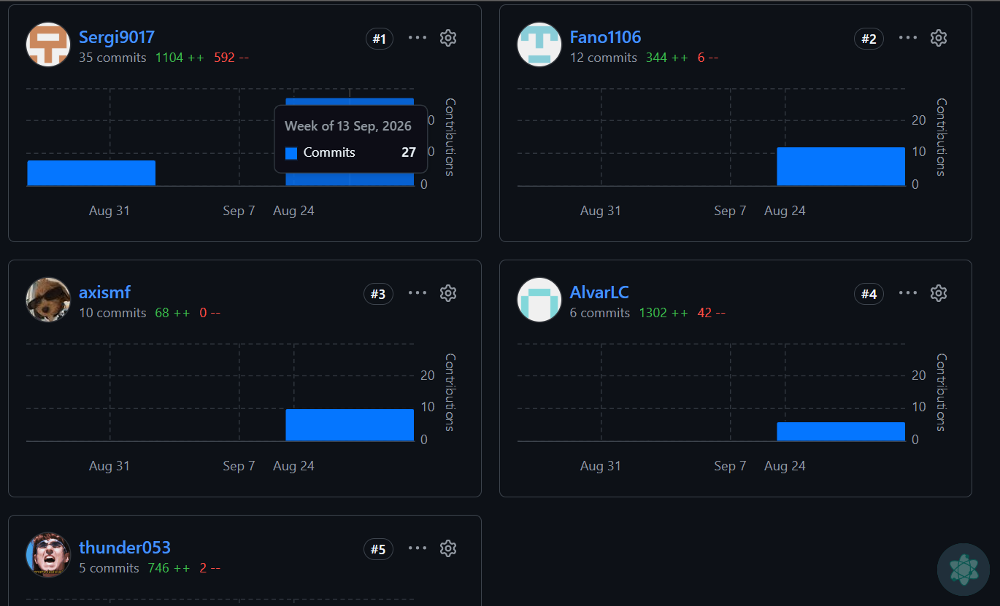

  

**Universidad Peruana de Ciencias Aplicadas**

Carrera de Ingeniería de Software

**1ASI0730**

**Aplicaciones web**

NRC:
**8074**

**Informe del Trabajo Final**

Docente:
**Sánchez Ponce, Alex Humberto**

Equipo: **ApexCode**

Proyecto: **EasyPark**

**Integrantes**

<table style="width: auto; border-collapse: collapse; text-align: center;">
  <thead>
    <tr>
      <th style="padding: 8px; border: 1px solid #666; text-align: center;">Código</th>
      <th style="padding: 8px; border: 1px solid #666; text-align: center;">Apellidos y Nombres</th>
    </tr>
  </thead>
  <tbody>
    <tr>
      <td style="padding: 8px; border: 1px solid #666; text-align: center;">U202211295</td>
      <td style="padding: 8px; border: 1px solid #666; text-align: center;">Evangelista Ygnacio, Sergio Joaquin</td>
    </tr>
    <tr>
      <td style="padding: 8px; border: 1px solid #666; text-align: center;">U202517482</td>
      <td style="padding: 8px; border: 1px solid #666; text-align: center;">Negrón Muñoz, Cayo Manuel Stefano</td>
    </tr>
    <tr>
      <td style="padding: 8px; border: 1px solid #666; text-align: center;">U202515871</td>
      <td style="padding: 8px; border: 1px solid #666; text-align: center;">Martin Farro, Alexis Sebastian</td>
    </tr>
    <tr>
      <td style="padding: 8px; border: 1px solid #666; text-align: center;">U202324461</td>
      <td style="padding: 8px; border: 1px solid #666; text-align: center;">Córdova, Alvar Lucas</td>
    </tr>
    <tr>
      <td style="padding: 8px; border: 1px solid #666; text-align: center;">U202312447</td>
      <td style="padding: 8px; border: 1px solid #666; text-align: center;">Saravia Huaricancha, Arturo Axel</td>
    </tr>
  </tbody>
</table>

**Período 2026-02**

**Setiembre 2026**

---

# Registro de versiones del informe
| Entregable | Versión | Fecha      | Autor    | Descripción de modificación |
|------------|---------|------------|----------|--------------------------------------------------------------------------------------------------------------------------------------------------------------------------------------------------------------------------------------------------------------------------------------------------------------------------------------------------------------------------------------------------------------------------------|
| AV1 | 1.0.0 | 18/09/2026 | ApexCode | Carátula. Registro de Versiones del Informe. Project Report Collaboration Insights. Contenido. Student Outcome. Capítulo I: Introducción. Capítulo II: Requirements Elicitation & Analysis. Capítulo III: Requirements Specification. Capítulo IV: Product Design. Capítulo V: Product Implementation, Validation & Deployment. **5.1. Software Configuration Management:** 5.1.1. Software Development Environment Configuration, 5.1.2. Source Code Management, 5.1.3. Source Code Style Guide & Conventions, 5.1.4. Software Deployment Configuration. **5.2. Landing Page, Services & Applications Implementation:** Sprint 1 (Planning, Aspect Leaders and Collaborators, Sprint Backlog, Development Evidence, Execution Evidence, Services Documentation, Software Deployment, Team Collaboration Insights). Conclusiones. Bibliografía. Anexos. |

# Project Report Collaboration Insights

El repositorio público del informe se encuentra alojado en la organización de GitHub del equipo y está estructurado de acuerdo con la convención de nombres indicada en el enunciado del trabajo final. La documentación ha sido desarrollada en formato **Markdown**, utilizando `README.md` como archivo principal y organizando el contenido mediante carpetas correspondientes a cada capítulo.

**Repositorio del informe:**
https://github.com/upc-pre-202620-1asi0730-8074-ApexCode/easypark-report

Para la gestión y control de versiones del proyecto se emplea **GitFlow**, mientras que los mensajes de commit siguen las convenciones establecidas por **Conventional Commits**.

**AV1**

## AV1 – Sprint Review (Semana 4)

Durante la elaboración de la entrega **AV1**, el equipo se organizó distribuyendo los capítulos y secciones del informe de acuerdo con las responsabilidades de cada integrante. Se realizaron sesiones de coordinación y revisión conjunta para consolidar los avances del proyecto y preparar la presentación final. Cada integrante participó tanto en el desarrollo de la documentación como en la presentación oral de las partes asignadas.

| **Integrantes** | **Actividades realizadas en el informe y presentación** |
| --------------------------------------------------- | ------------------------------------------------------------------------------------------------------------------------------------------------------------------------------------------------------------------------------------------------------------------------------------------------------------------------------------------------------------------------------------------------------------------------------------------------------------------------------------------------------------------------------------------------------------------------------------------------ |
| **Evangelista Ygnacio, Sergio Joaquin** | Desarrolló el **Capítulo I: Introduction**, participó en la elaboración del **Capítulo V: Product Implementation, Validation & Deployment** y en el desarrollo del **Landing Page**. Durante la presentación del AV1, expuso los contenidos correspondientes al Capítulo I y participó junto con el equipo en la comunicación de los avances y resultados del proyecto. |
| **Negrón Muñoz, Cayo Manuel Stefano** | Desarrolló y presentó los contenidos relacionados con el **Capítulo V: Product Implementation, Validation & Deployment**, explicando los aspectos correspondientes a la implementación, validación y despliegue del producto. |
| **Martin Farro, Alexis Sebastian** | Desarrolló y presentó los contenidos correspondientes al **Capítulo II: Requirements Elicitation & Analysis**, explicando los resultados obtenidos durante el levantamiento y análisis de requerimientos. |
| **Córdova, Alvar Lucas** | Participó en el desarrollo de los **Capítulos II: Requirements Elicitation & Analysis** y **III: Requirements Specification**, además de presentar y explicar los contenidos correspondientes durante la exposición del AV1. |
| **Saravia Huaricancha, Arturo Axel** | Desarrolló el **Capítulo IV: Product Design** y participó en la elaboración del **Landing Page**. Durante la presentación, explicó los aspectos relacionados con el diseño del producto y la propuesta visual desarrollada. |

# Tabla de contenidos

**Registro de versiones del informe**

**Project Report Collaboration Insights**

**Tabla de contenidos**

**Student Outcome**

Capítulo I: Introducción

1.1. Startup Profile  
1.1.1. Descripción del startup  
1.1.2. Perfiles de integrantes del equipo  
1.2. Solution Profile  
1.2.1. Antecedentes y problemática  
1.2.2. Lean UX Process  
1.2.2.1. Lean UX Problem Statements  
1.2.2.2. Lean UX Assumptions  
1.2.2.3. Lean UX Hypothesis Statements  
1.2.2.4. Lean UX Canvas  
1.3. Segmentos objetivo

Capítulo II: Requirements Elicitation & Analysis  
2.1. Competidores  
2.1.1. Análisis competitivo  
2.1.2. Estrategias y tácticas frente a competidores  
2.2. Entrevistas  
2.2.1. Diseño de entrevistas  
2.2.2. Registro de entrevistas  
2.2.3. Análisis de entrevistas  
2.3. Needfinding  
2.3.1. User Personas  
2.3.2. User Task Matrix  
2.3.3. User Journey Mapping  
2.3.4. Empathy Mapping  
2.4. Big Picture EventStorming  
2.5. Ubiquitous Language

Capítulo III: Requirements Specification  
3.1. User Stories  
3.2. Impact Mapping  
3.3. Product Backlog

Capítulo IV: Product Design
4.1. Style Guidelines  
4.1.1. General Style Guidelines  
4.1.2. Web Style Guidelines  
4.2. Information Architecture  
4.2.1. Organization Systems  
4.2.2. Labeling Systems  
4.2.3. SEO Tags and Meta Tags  
4.2.4. Searching Systems  
4.2.5. Navigation Systems  
4.3. Landing Page UI Design  
4.3.1. Landing Page Wireframe  
4.3.2. Landing Page Mock-up  
4.4. Web Applications UX/UI Design  
4.4.1. Web Applications Wireframes  
4.4.2. Web Applications Wireflow Diagrams  
4.4.3. Web Applications Mock-ups  
4.4.4. Web Applications User Flow Diagrams  
4.5. Web Applications Prototyping  
4.6. Domain-Driven Software Architecture  
4.6.1. Design-Level EventStorming  
4.6.2. Software Architecture Context Diagram  
4.6.3. Software Architecture Container Diagrams  
4.6.4. Software Architecture Components Diagrams  
4.7. Software Object-Oriented Design  
4.7.1. Class Diagrams  
4.8. Database Design  
4.8.1. Database Diagrams

Capítulo V: Product Implementation, Validation & Deployment  
5.1. Software Configuration Management  
5.1.1. Software Development Environment Configuration  
5.1.2. Source Code Management  
5.1.3. Source Code Style Guide & Conventions  
5.1.4. Software Deployment Configuration  
5.2. Landing Page, Services & Applications Implementation  
5.2.1. Sprint 1  
5.2.1.1. Sprint Planning 1  
5.2.1.2. Aspect Leaders and Collaborators  
5.2.1.3. Sprint Backlog 1  
5.2.1.4. Development Evidence for Sprint Review  
5.2.1.5. Execution Evidence for Sprint Review  
5.2.1.6. Services Documentation Evidence for Sprint Review  
5.2.1.7. Software Deployment Evidence for Sprint Review  
5.2.1.8. Team Collaboration Insights during Sprint

Conclusiones

Bibliografía  
Anexos

# Student Outcome

El curso contribuye al cumplimiento del Student Outcome ABET:

**ABET – EAC - Student Outcome 5**

**Criterio**: _La capacidad de funcionar efectivamente en un equipo cuyos miembros juntos proporcionan liderazgo, crean un entorno de colaboración e inclusivo, establecen objetivos, planifican tareas y cumplen objetivos._

En el siguiente cuadro se describe las acciones realizadas y enunciados de conclusiones por parte del grupo, que permiten sustentar el haber alcanzado el logro del ABET – EAC - Student Outcome 5.

| Criterio específico | Acciones realizadas | Conclusiones |
| --- | --- | --- |
| Trabaja en equipo para proporcionar liderazgo en forma conjunta | - **Evangelista Ygnacio, Sergio Joaquin**       **AV1**: En esta entrega preparé y conduje la reunión de Sprint Planning del 15/09/2026, donde el equipo definió el alcance del primer sprint y la distribución de las diez historias entre los integrantes. En la matriz de responsabilidades asumí el liderazgo del aspecto de Navegación entre Secciones y el rol de colaborador en estructura y diseño responsive, apoyando las decisiones de quienes lideraban esos aspectos. Desarrollé y expuse el Capítulo I: Introducción y participé en la elaboración del Capítulo V: Product Implementation, Validation & Deployment y del Landing Page.  - **Negrón Muñoz, Cayo Manuel Stefano**       **AV1**: Asumí la conducción del Capítulo V: Product Implementation, Validation & Deployment, que desarrollé y presenté durante el AV1, explicando la configuración del entorno, el control de versiones y el despliegue del producto. En la matriz de responsabilidades figuré como colaborador en los tres aspectos del Landing Page, acompañando a los líderes de estructura, navegación y responsive cuando lo necesitaban. Asimismo participé en la sesión de planning junto al resto del equipo para acordar el rumbo del sprint.  - **Martin Farro, Alexis Sebastian**       **AV1**: Desarrollé y expuse el Capítulo II: Requirements Elicitation & Analysis, haciendo de conductor de esa sección durante la presentación del AV1. En la matriz de responsabilidades trabajé como colaborador en estructura, navegación y diseño responsive, aportando en las tareas que lideraban mis compañeros. También integré la planificación del sprint como asistente de la reunión, en la que se definieron las responsabilidades de cada integrante.  - **Córdova, Alvar Lucas**       **AV1**: Lideré el aspecto de Diseño Responsive en la matriz de responsabilidades del Sprint 1, definiendo cómo se adaptaría la landing a distintos dispositivos y apoyando a los demás en la aplicación de ese criterio. En paralelo me hice cargo de los Capítulos II: Requirements Elicitation & Analysis y III: Requirements Specification, que presenté durante la exposición, articulando la parte de levantamiento de requerimientos con su especificación.  - **Saravia Huaricancha, Arturo Axel**       **AV1**: Dirigí el aspecto de Estructura del Landing Page, proponiendo la organización de secciones y el hilo narrativo del sitio, y colaboré en los aspectos de navegación y diseño responsive. Desarrollé el Capítulo IV: Product Design y lo expuse en el AV1 junto con la demostración de la primera versión del Landing Page, mostrando en vivo el resultado del trabajo del equipo. | - **AV1**: El liderazgo del sprint quedó distribuido de forma conjunta: cada aspecto del Landing Page tuvo un líder distinto  y el resto del equipo ocupó el rol de colaborador en los tres aspectos. Esa organización, sumada a la planificación, nos permitió avanzar sin que una sola persona cargara con todas las decisiones y entregar la primera versión de la landing para el AV1. |
| Crea un entorno colaborativo e inclusivo, establece metas, planifica tareas y cumple objetivos | - **Evangelista Ygnacio, Sergio Joaquin**       **AV1**: Preparé la reunión de Sprint Planning y dejé registrada la sesión con su fecha, los asistentes y el resumen de lo tratado, de modo que el equipo tuviera una referencia común de lo que había que hacer. Cargué en el tablero de Trello las historias que me correspondieron, la configuración del proyecto estático y el banner informativo, y las cerré dentro del plazo estimado. Como integrante del equipo participé también en la retrospectiva del sprint, donde acordamos mejorar la frecuencia de las revisiones entre pares.  - **Negrón Muñoz, Cayo Manuel Stefano**       **AV1**: Planifiqué mis dos historias del sprint, la sección de funcionamiento de reservas y las preguntas frecuentes, y las dejé en estado terminado según lo estimado en el tablero. Trabajé con el resto mediante GitFlow y las solicitudes de incorporación de GitHub, revisando los cambios antes de fusionarlos para evitar conflictos en el repositorio. Dejé documentado en el Capítulo V el proceso de configuración, control de versiones y despliegue, para que el trabajo del equipo quedara replicable por cualquier lector.  - **Martin Farro, Alexis Sebastian**       **AV1**: Participé en la sesión de planificación del 15/09/2026, en la que el equipo fijó como meta publicar la primera versión de la landing antes del AV1, y asumí las historias de la cuadrícula de funcionalidades y la vista previa del dashboard, ambas cerradas en tiempo y forma. Colaboré con los compañeros que necesitaban apoyo en sus secciones y dejé avances en el tablero para que el estado real del trabajo fuera visible para todos.  - **Córdova, Alvar Lucas**       **AV1**: Organicé mi trabajo del sprint en dos historias, la sección de beneficios para administradores y el pie de página, cumpliendo con las estimaciones acordadas en la planificación. Avisé oportunamente cuando una tarea necesitaba más tiempo del previsto, lo que permitió al equipo reorganizarse sin afectar la fecha de entrega. Colaboré además en las revisiones de las secciones lideradas por mis compañeros para que todas llegaran listas a la revisión.  - **Saravia Huaricancha, Arturo Axel**       **AV1**: Asistí a la reunión de planning donde definimos el alcance del primer sprint y me encargué de las historias de beneficios para conductores y de la barra de navegación, que quedaron terminadas dentro del plazo. Dejé el diseño de las secciones documentado en Figma como fuente compartida para todo el equipo, evitando que cada uno trabajara con una interpretación distinta. Colaboré en la revisión final de la landing junto con los demás integrantes antes de su publicación. | - **AV1**: Fijamos como meta del sprint publicar la primera versión de la Landing Page antes del AV1, la desglosamos en diez historias con responsable y estimación en Trello, y las cumplimos: las diez quedaron en estado terminado para la revisión. La planificación conjunta del 15/09/2026, el uso compartido de las herramientas y las revisiones entre pares nos permitieron trabajar en un ambiente donde todos aportaron y nadie quedó aislado; la retrospectiva reconoció como fortaleza justamente la buena distribución de tareas y la comunicación constante. |