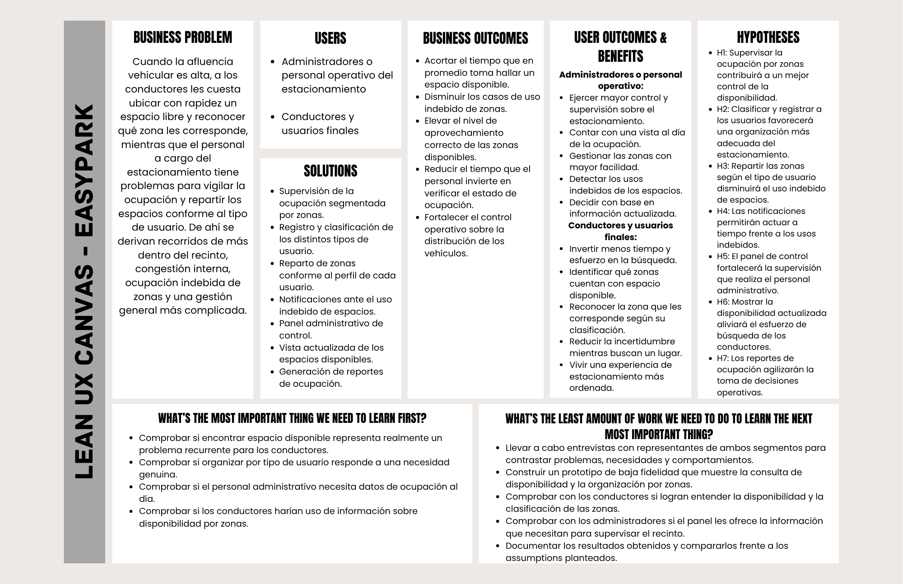

# Capítulo I: Introducción

## 1.1 Startup Profile

### 1.1.1 Descripcion de la Startup
ApexCode es una startup tecnológica enfocada en el desarrollo de soluciones digitales para la gestión inteligente de estacionamientos. Nos dedicamos a crear plataformas que conectan la operación de los establecimientos con información útil para optimizar el uso de los espacios y mejorar la experiencia de los conductores. En ApexCode, buscamos transformar procesos tradicionales en sistemas más eficientes, accesibles y escalables, integrando progresivamente tecnologías como el Internet de las Cosas (IoT) para construir soluciones capaces de adaptarse a las necesidades de la movilidad del futuro.

**Visión**

Convertirnos en una plataforma referente en la gestión digital de estacionamientos urbanos, contribuyendo a que conductores y administradores puedan utilizar los espacios disponibles de manera más organizada, eficiente y confiable.

**Misión**

Brindar una solución tecnológica accesible que facilite la administración de estacionamientos y reduzca el tiempo que los conductores dedican a buscar un espacio disponible, mediante información actualizada, procesos digitales simples y herramientas que permitan mejorar el control operativo de cada establecimiento.

**Propuesta de Valor**

_“No le des tantas vueltas, ten más control al administrar.”_

Buscamos conectar las necesidades de los conductores con las operaciones de los administradores dentro de una misma plataforma. Para los conductores, ofrece información que les permita encontrar espacios disponibles con mayor rapidez y reducir la incertidumbre antes de llegar al estacionamiento. Para los administradores, proporciona herramientas que facilitan el registro de vehículos, el control de la ocupación y la organización de los espacios disponibles.

### 1.1.2 Perfiles de integrantes del equipo

| Foto                                                   | Descripción                                                                                                                                                                                                                                                                                                                                                                       |
|--------------------------------------------------------|-----------------------------------------------------------------------------------------------------------------------------------------------------------------------------------------------------------------------------------------------------------------------------------------------------------------------------------------------------------------------------------|
|        | **Evangelista Ygnacio, Sergio Joaquin (U202211295)**  Estudiante de Ingeniería de Software, organizado, responsable y orientado a resultados. Apasionado por el aprendizaje continuo y la actualización constante en nuevas tecnologías, metodologías y buenas prácticas. Me adapto con facilidad a diferentes entornos y busco aportar soluciones eficientes y proactivas. |
|  | **Negrón Muñoz, Cayo Manuel Stefano (U202517482)**  Estudiante de Ingeniería de Software y Bachiller en Derecho. Interesado en complementar ambas áreas mediante el aprendizaje de lenguajes de programación y la resolución de problemas con herramientas digitales. Valoro la puntualidad, el compromiso y el trabajo en equipo.                                          |
|      | **Martin Farro, Alexis Sebastian**  Estudiante de Ingeniería de Software. Disciplinado y constante, cualidades desarrolladas a través de la natación que aplico para mantener el enfoque y superar obstáculos. Enfocado en resolver problemas de manera metódica y con atención al detalle.                                                                                 |
|        | **Córdova, Alvar Lucas (U202324461)**  Estudiante de Ingeniería de Software. Me considero una persona productiva y apasionada por el aprendizaje continuo de temas específicos a través de documentación y blogs técnicos. Actualmente especializándome en la tecnología .NET.                                                                                              |
|      | **Saravia Huaricancha, Arturo Axel**  Estudiante de Ingeniería de Software y desarrollador desde hace tres años. Apasionado por crear proyectos personales y brindar soluciones a comunidades que buscan mejorar u optimizar su administración.                                                                                                                             |

## 1.2 Solution Profile

### 1.2.1 Antecedentes y problemática

**Técnica 5W2H**

**1. ¿Quiénes están involucrados o afectados? (Who?)**

La problemática afecta principalmente a dos grupos. Por un lado, se encuentran los **Conductores (usuarios de estacionamientos)**, quienes necesitan encontrar un espacio disponible de manera rápida, conocer las condiciones del servicio y evitar perder tiempo buscando un lugar. Y por otro lado, están los **Administradores y el personal operativo de los estacionamientos**, responsables de controlar los ingresos y salidas, conocer la disponibilidad de espacios, gestionar los pagos y mantener organizada la operación. De manera indirecta, también se ven afectadas las empresas o instituciones propietarias de estos establecimientos, debido a que una mala gestión puede perjudicar la experiencia de sus clientes.

**2. ¿Qué ocurre o qué problema se presenta? (What?)**

En la actualidad, Lima es una ciudad con mayor tráfico y mayor uso de vehículos privados. Por ende, los estacionamientos con alta afluencia presentan dificultades ya sea por, los espacios disponibles, organizar adecuadamente el ingreso, su permanencia y salida de los vehículos. Muchos procesos todavía se realizan mediante cuadernos, tickets físicos u observación directa, lo que puede generar errores, información desactualizada y dificultades para controlar la ocupación. Como consecuencia, los conductores pierden tiempo buscando estacionamiento y los administradores tienen menor control sobre la operación.

**3. ¿Cuándo se presenta el problema? (When?)**

El problema se vuelve más evidente durante los periodos de mayor demanda como las hora pico, lugares de mucha afluencia, entre otros. Podemos observar que este problema se agrava cuando varios vehículos intentan ingresar, estacionar o se retiran en un mismo periodo de tiempo. Asimismo, otro factor determinante es el momento en el que el administrador necesita ausentarse, cuando existen fallas en los métodos de registro o cuando un conductor necesita encontrar estacionamiento rápidamente y no dispone de información sobre la disponibilidad.

**4. ¿Dónde sucede? (Where?)**

El problema ocurre principalmente en estacionamientos públicos o privados con un flujo frecuente de vehículos, como los ubicados en centros comerciales, universidades, oficinas, hospitales, zonas comerciales y otros establecimientos urbanos. La dificultad es mayor en aquellos estacionamientos que todavía dependen de procesos manuales para controlar la ocupación y los accesos.

**5. ¿Por qué ocurre? (Why?)**

El problema ocurre porque muchos estacionamientos todavía dependen de registros manuales, tickets físicos y observación directa para conocer su ocupación. Esto dificulta mantener información actualizada y consultar rápidamente qué vehículos ingresaron, cuánto tiempo permanecieron o cuántos espacios continúan disponibles. Además, los conductores no siempre cuentan con una fuente confiable que les permita conocer la disponibilidad en tiempo real antes de llegar al estacionamiento.

**6. ¿Cómo se manifiesta el problema? (How?)**

La problemática se manifiesta mediante registros incompletos o difíciles de consultar, errores en el control de horarios y pagos, desconocimiento de la cantidad real de espacios disponibles y dificultades para supervisar el estacionamiento. Para los conductores, se manifiesta en la necesidad de recorrer varias calles o estacionamientos buscando un espacio, en la incertidumbre provocada por información que no siempre refleja la disponibilidad real y sobre todo en la pérdida de tiempo en buscar un estacionamiento disponible.

**7. ¿Cuánto cuesta o cuál es la magnitud? (How Much?)**

La magnitud del problema depende de la demanda y del lugar. Se estima que los conductores pueden tardar entre 7 y 30 minutos buscando estacionamiento en zonas concurridas. Por lo que la búsqueda puede representar una pérdida considerable de tiempo, especialmente cuando la disponibilidad real de los espacios no se conoce con anticipación. Para los administradores, estimamos que cuentan con errores en registros, pagos o control de vehículos también pueden generar pérdidas económicas y dificultades para operar correctamente el negocio.

### 1.2.2 Lean UX Process
#### 1.2.2.1. Lean UX Problem Statements
Actualmente, la gestión de estacionamientos pequeños y medianos depende en gran medida de procesos manuales, como cuadernos, tickets físicos y observación directa, para controlar el ingreso, salida y disponibilidad de vehículos. Esta situación genera problemas como la falta de información actualizada sobre la ocupación del establecimiento, errores en el registro y menor control de la operación.

Las soluciones existentes no ofrecen una manera sencilla de conectar las necesidades de los conductores con la gestión diaria de estacionamientos pequeños y medianos. Como consecuencia, los conductores no logran conocer con anticipación la disponibilidad real de espacios, lo que los obliga a recorrer diferentes zonas hasta encontrar un lugar, generando pérdida de tiempo y congestión, especialmente durante periodos de alta demanda.

¿Cómo podríamos reducir la desorganización y la falta de información actualizada sobre la disponibilidad de espacios en estacionamientos pequeños y medianos, de manera que administradores y conductores puedan cumplir sus objetivos y sentirse satisfechos con el servicio?

#### 1.2.2.2. Lean UX Assumptions
**Business Assumptions**
- Creemos que existe una oportunidad de mercado desatendida entre estacionamientos pequeños y medianos que aún no cuentan con una solución digital especializada y accesible.
- Creemos que EasyPark puede diferenciarse de otras soluciones al atender, dentro de una misma plataforma, tanto las necesidades de los administradores como las de los conductores.
- Creemos que es técnicamente viable ofrecer una plataforma web que no requiera una inversión elevada en hardware o infraestructura especializada por parte de los estacionamientos, lo que facilitará su adopción.
- Creemos que contamos con la capacidad de construir y mantener una plataforma confiable que integre en tiempo real la información de disponibilidad, ingresos y salidas.
- Creemos que los administradores de estacionamientos estarán dispuestos a pagar una suscripción mensual o comisión por el uso de la plataforma, a cambio de mejorar el control de su operación.
- Creemos que existe una oportunidad de generar ingresos adicionales mediante funcionalidades premium (por ejemplo, reportes avanzados, reservas anticipadas o mayor visibilidad para los estacionamientos dentro de la app).
- Creemos que el equipo cuenta con las capacidades técnicas y de soporte necesarias para escalar la solución a más estacionamientos y ciudades conforme crezca la demanda.
- Creemos que es posible sostener un modelo de atención y soporte a administradores y conductores sin requerir una estructura operativa excesivamente grande en esta etapa inicial.

**Business Outcome Assumptions**
- Creemos que EasyPark logrará una alta tasa de retención de estacionamientos administradores una vez que adopten la plataforma, gracias al valor percibido en el control de su operación.
- Creemos que EasyPark podrá adquirir nuevos estacionamientos administrados a un costo de adquisición razonable mediante recomendaciones y crecimiento orgánico dentro de las zonas donde ya opera.
- Creemos que a medida que aumente el número de conductores activos en la plataforma, aumentará también el atractivo de EasyPark para nuevos estacionamientos administradores.
- Creemos que EasyPark podrá generar ingresos recurrentes sostenibles a partir de las suscripciones o comisiones cobradas a los administradores de estacionamientos.
- Creemos que un mayor uso de la plataforma por parte de los conductores (frecuencia de búsquedas y reservas) se traducirá en mayores ingresos para EasyPark a través de funcionalidades premium o comisiones.

**User Assumptions**
- Creemos que nuestros principales usuarios serán los administradores o personal operativo de estacionamientos y los conductores o usuarios finales.
- Creemos que los administradores necesitan controlar ingresos, salidas, ocupación y permanencia de vehículos durante su jornada de trabajo.
- Creemos que algunos administradores actualmente dependen de cuadernos, tickets físicos u observación directa para realizar estas actividades.
- Creemos que los conductores necesitan conocer la disponibilidad de espacios antes de dirigirse a un estacionamiento.
- Creemos que los conductores consideran importantes factores como disponibilidad, precio, ubicación y seguridad al elegir dónde estacionar.
- Creemos que ambos segmentos necesitan una plataforma web sencilla que pueda utilizarse desde diferentes dispositivos.

**User Outcome and Benefit Assumptions**

**Conductores (usuarios de estacionamientos)**
- Creemos que los conductores quieren encontrar estacionamiento con mayor rapidez.
- Creemos que quieren conocer la disponibilidad real antes de llegar al establecimiento.
- Creemos que quieren consultar información clara sobre precios, ubicación y condiciones del estacionamiento.
- Creemos que quieren reducir el estrés y la incertidumbre asociados con la búsqueda de un espacio.
- Creemos que valorarán la posibilidad de asegurar un espacio antes de dirigirse al estacionamiento.

**Administradores y el personal operativo de los estacionamientos**
- Creemos que los administradores quieren conocer rápidamente cuántos espacios se encuentran disponibles y ocupados.
- Creemos que quieren reducir los errores producidos por registros manuales de vehículos y horarios.
- Creemos que quieren supervisar el estacionamiento sin depender permanentemente de su presencia física.
- Creemos que quieren consultar información histórica y reportes que les ayuden a tomar mejores decisiones.
- Creemos que quieren mantener un mayor control sobre el tiempo de permanencia y uso de los espacios.

**Feature Assumptions**
- Creemos que una visualización de espacios disponibles y ocupados permitirá conocer con mayor facilidad el estado actual del estacionamiento.
- Creemos que un registro digital de ingresos y salidas reducirá la dependencia de cuadernos y tickets físicos.
- Creemos que la gestión de zonas y espacios según el tipo de usuario permitirá organizar mejor el uso del estacionamiento.
- Creemos que un sistema de alertas sobre tiempo de permanencia o situaciones irregulares ayudará a los administradores a detectar problemas con mayor rapidez.
- Creemos que un panel de control para administradores facilitará la supervisión de la operación y la consulta de información relevante.
- Creemos que la generación de reportes de ocupación y movimientos ayudará a los administradores a conocer mejor el funcionamiento de su negocio.
- Creemos que una función de reserva de espacios permitirá a los conductores reducir la incertidumbre de encontrar estacionamiento al llegar a su destino.

#### 1.2.2.3. Lean UX Hypothesis Statements

**Hipótesis 1:**

Creemos que lograremos reducir el tiempo dedicado a identificar espacios disponibles si los administradores o personal operativo pueden conocer rápidamente el estado de ocupación del estacionamiento mediante una visualización de espacios disponibles y ocupados.

Lo sabremos porque veremos una reducción en el tiempo promedio que toma verificar la disponibilidad (medido antes/después de usar la plataforma) y un aumento en la frecuencia diaria de consulta del panel de visualización.

**Hipótesis 2:**

Creemos que lograremos disminuir los errores asociados al registro manual si los administradores o personal operativo pueden controlar de manera organizada los movimientos de los vehículos mediante un registro digital de ingresos y salidas.

Lo sabremos porque veremos una reducción en el número de incidencias reportadas por registros incorrectos o inconsistentes (por ejemplo, vehículos sin salida registrada) en comparación con el método manual previo.

**Hipótesis 3:**

Creemos que lograremos mejorar la organización y aprovechamiento de los espacios si los administradores o personal operativo pueden distribuir adecuadamente los vehículos mediante una gestión de zonas y espacios según el tipo de usuario.

Lo sabremos porque veremos un aumento en el porcentaje de ocupación efectiva del estacionamiento y una reducción en el tiempo que los vehículos permanecen sin asignación de zona.

**Hipótesis 4:**

Creemos que lograremos mejorar la supervisión de la operación si los administradores o personal operativo pueden consultar información relevante de manera centralizada mediante un panel de control para administradores.

Lo sabremos porque veremos un aumento en la frecuencia de uso del panel de control por parte de los administradores y una reducción en el tiempo que dedican a supervisar la operación de forma presencial.

**Hipótesis 5:**

Creemos que lograremos reducir el tiempo y la incertidumbre asociados con la búsqueda de estacionamiento si los conductores y usuarios finales pueden asegurar previamente un espacio disponible mediante una función de reserva de espacios.

Lo sabremos porque veremos un aumento en el número de reservas realizadas antes de llegar al establecimiento y una reducción en el tiempo promedio que los conductores reportan haber tardado en encontrar estacionamiento.

#### 1.2.2.4. Lean UX Canvas

Link del canva: [https://canva.link/tmpird6tydk3ppn](https://canva.link/tmpird6tydk3ppn)

*Figura 1 (Lean UX Canvas)*

### 1.3. Segmentos objetivo

**Primer Segmento Objetivo - Conductores (usuarios de estacionamientos)**

- **Demográfico:** Hombres y mujeres comprendidos entre los 18 y 65 años, de ocupaciones variadas que posean y conduzcan un vehículo.

- **Psicográfico:** Valoren altamente su tiempo, la comodidad y puntualidad. Están orientados a la reducción del estrés en su rutina diaria y buscan experiencias fluidas que les eviten frustraciones y reduzcan su ansiedad antes de llegar a su destino como trabajo, citas, compras u ocio. Buscan seguridad para sus vehículos y predictibilidad.

- **Conductual:** Tienen un dominio elemental en el uso de smartphones y herramientas de navegación (como Waze o Google Maps). Frecuencia de uso recurrente, acuden a la plataforma cada vez que visitan distintos establecimientos. Buscan localizar con rapidez un espacio libre, disminuir el tiempo dedicado a la búsqueda y evitar quedar atrapados en el tráfico. Están dispuestos a adoptar nuevas aplicaciones si estas ofrecen un beneficio inmediato y claro.

- **Geográfico:** Residentes en Perú. Se desenvuelven principalmente en zonas urbanas de alta densidad poblacional y vehicular, centros comerciales, zonas empresariales y casos urbanos con conectividad plena a internet móvil.

**Segundo Segmento Objetivo - Administradores y el personal operativo de los estacionamientos**

- **Demográfico:** Representados por personal de seguridad, supervisores en campo y administradores de instalaciones. Hombres y mujeres de entre 18 y 60 años, con nivel educativo técnico o superior (dependiendo del cargo). Son los responsables directos de la operación, la seguridad y la rentabilidad del recinto.

- **Psicográfico:** Orientados al orden, la seguridad, la eficiencia operativa y el servicio al cliente. Valoran tener el control total de la capacidad del recinto y reducir las quejas de los usuarios. Buscan herramientas tecnológicas que minimicen el error humano, faciliten su trabajo diario y mejoren la imagen del establecimiento frente a los conductores.

- **Conductual:** Poseen un manejo básico o intermedio de herramientas digitales para la gestión de estacionamientos y el control de accesos. Recurren a la plataforma de manera constante a lo largo de su jornada laboral para registrar ingresos, monitorear la disponibilidad en tiempo real y administrar los espacios disponibles. Prefieren interfaces intuitivas que les permitan organizar mejor el recinto y controlar el flujo vehicular sin ralentizar la entrada y salida.

- **Geográfico:** Operan en zonas urbanas e infraestructuras comerciales o empresariales del Perú (como Lima Metropolitana y principales provincias). Trabajan en recintos que cuentan con puntos de control de acceso, garitas y una conexión a internet estable o redes locales.
