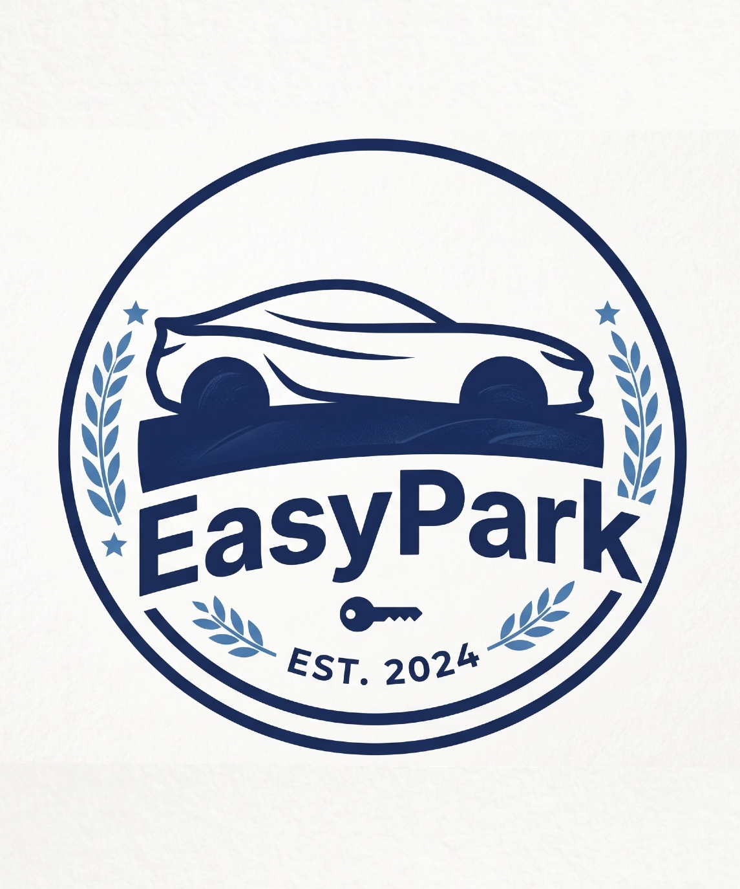
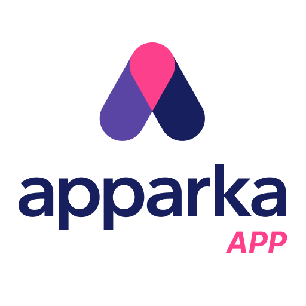
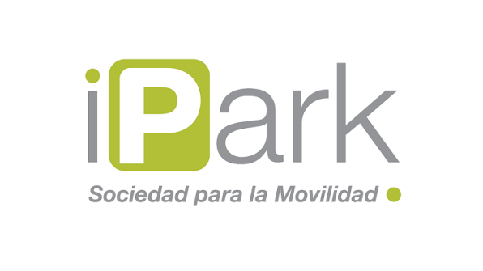
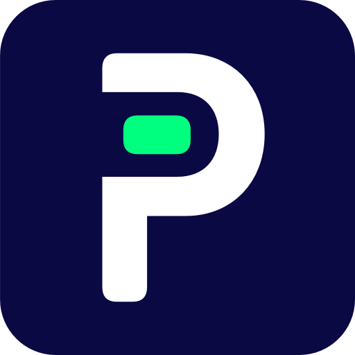

# Capítulo II: Requirements Elicitation & Analysis

## 2.1. Competidores

Para comprender el entorno competitivo de EasyPark, se identificaron tres soluciones digitales relacionadas con la búsqueda y gestión de estacionamientos. La selección considera competidores directos e indirectos que atienden necesidades similares de los conductores y administradores.

- **Apparka** es un competidor directo orientado principalmente a los conductores peruanos. Permite localizar estacionamientos de su red, pagar desde el celular, gestionar abonados y utilizar el reconocimiento de placas para facilitar el ingreso y la salida.

- **iPark** es un competidor directo para el segmento de administradores. Su solución en la nube está dirigida a estacionamientos pequeños y medianos e incluye herramientas para registrar vehículos, gestionar tarifas, controlar turnos, realizar cobros y consultar reportes.

- **Parkopedia** es un competidor indirecto y referente internacional. Proporciona información sobre ubicación, precios, horarios, características y disponibilidad de estacionamientos, además de integraciones con aplicaciones de navegación y fabricantes de vehículos.

Los competidores seleccionados permiten comparar EasyPark con una red peruana consolidada orientada al conductor, una solución local especializada en la operación de estacionamientos y una plataforma internacional centrada en información y servicios de movilidad.

### 2.1.1. Análisis competitivo

El análisis competitivo tiene como objetivo conocer cómo las soluciones existentes atienden las necesidades de los conductores y administradores de estacionamientos. Esta comparación permite reconocer sus fortalezas y limitaciones, identificar oportunidades del mercado y establecer una propuesta de valor diferenciada para EasyPark.

#### Competitive Analysis Landscape
<table>
  <tr>
    <th colspan="6">Competitive Analysis Landscape</th>
  </tr>
  <tr>
    <th colspan="2">¿Por qué llevar a cabo este análisis?</th>
    <td colspan="4">Buscamos responder la siguiente pregunta: ¿cómo puede EasyPark diferenciarse de las soluciones actuales para ofrecer, dentro de una misma plataforma, información confiable a los conductores y herramientas accesibles de gestión para los administradores de estacionamientos independientes?</td>
  </tr>
<tr>
  <th>Perfil</th>
  <th>Criterio</th>
  <th>
     
    <strong>EasyPark</strong> 
    <small>(propuesta académica)</small>
  </th>
  <th>
     
    <a href="https://apparka.pe/">Apparka</a>
  </th>
  <th>
     
    <a href="https://ipark.pe/staging/7006/propuesta/">iPark</a>
  </th>
  <th>
     
    <a href="https://business.parkopedia.com/home">Parkopedia</a>
  </th>
</tr>

  <tr>
    <th rowspan="2">Perfil</th>
    <th>Overview</th>
    <td>Startup universitario que desarrolla una plataforma web que conecta a conductores con estacionamientos independientes. Permite consultar disponibilidad, comparar alternativas, reservar espacios y administrar digitalmente la operación de cada establecimiento. La disponibilidad puede actualizarse manualmente y, posteriormente, mediante sensores IoT.</td>
    <td>Aplicación peruana de estacionamiento y movilidad urbana. Permite encontrar estacionamientos de su red, consultar tarifas, pagar desde el celular, gestionar abonados, reservar espacios e ingresar o salir mediante reconocimiento de placas.</td>
    <td>Solución de gestión de estacionamientos basada en la nube. Ofrece una aplicación Android para el personal operativo, un portal para administradores, pagos mediante códigos QR e integración con dispositivos IoT.</td>
    <td>Plataforma internacional de información y servicios de movilidad. Ayuda a encontrar y pagar estacionamientos, puntos de carga, combustible y peajes en miles de ciudades, además de integrarse con vehículos y sistemas de navegación.</td>
  </tr>
  <tr>
    <th>Ventaja competitiva: ¿qué valor ofrece a los clientes?</th>
    <td>Integra en una sola plataforma la búsqueda y reserva multioperador para conductores con herramientas de control operativo para administradores. Los establecimientos pueden comenzar sin sensores obligatorios e incorporar tecnología IoT progresivamente.</td>
    <td>Cuenta con una red de estacionamientos establecida, reconocimiento de marca y una experiencia integrada que incluye ubicación, pagos digitales, abonados y acceso automático mediante lectura de placas.</td>
    <td>Ofrece herramientas especializadas para digitalizar la operación mediante un modelo SaaS escalable, precios publicados, soporte local, facturación electrónica e integración opcional con equipos IoT.</td>
    <td>Posee una amplia cobertura internacional, aproximadamente 90 millones de espacios registrados e integraciones con fabricantes de vehículos, proveedores de mapas y plataformas de navegación.</td>
  </tr>

  <tr>
    <th rowspan="2">Perfil de marketing</th>
    <th>Mercado objetivo</th>
    <td>Conductores urbanos y administradores de estacionamientos independientes, principalmente pequeños y medianos establecimientos ubicados en zonas de alta demanda.</td>
    <td>Conductores, abonados, empresas y usuarios de los estacionamientos administrados o asociados a la red de Apparka.</td>
    <td>Propietarios, administradores y personal operativo de estacionamientos privados, estacionamientos municipales y servicios de valet parking.</td>
    <td>Conductores, fabricantes de vehículos, proveedores de navegación, operadores de estacionamientos, empresas de movilidad y servicios de última milla.</td>
  </tr>
  <tr>
    <th>Estrategias de marketing</th>
    <td>Incorporación progresiva de estacionamientos por zonas, alianzas con comercios y operadores independientes, promoción digital dirigida a conductores y demostraciones de las herramientas de gestión. El crecimiento de la red permitirá atraer más usuarios y viceversa.</td>
    <td>Promoción de rapidez, comodidad y seguridad mediante su aplicación, campañas digitales, beneficios, programas de fidelización, servicios corporativos y presencia física en su red de estacionamientos.</td>
    <td>Venta directa a empresas, demostraciones de la solución, soporte local y planes de suscripción diferenciados según la capacidad y cantidad de transacciones del estacionamiento.</td>
    <td>Alianzas con operadores, fabricantes de vehículos, proveedores de mapas y empresas tecnológicas. Distribuye sus servicios mediante aplicaciones, APIs, sistemas de navegación e integraciones incorporadas en vehículos.</td>
  </tr>

  <tr>
    <th rowspan="3">Perfil de producto</th>
    <th>Productos y servicios</th>
    <td>Búsqueda y comparación de estacionamientos, consulta de disponibilidad y tarifas, reservas, notificaciones y recordatorios. Para los administradores ofrece registro de ingresos y salidas, gestión de espacios y zonas, alertas, historial y reportes operativos.</td>
    <td>Aplicación móvil, búsqueda y reserva de estacionamientos, pagos digitales, Apparka Wallet, gestión de abonados, lectura de placas, administración de estacionamientos, consultoría, preventa de horas y soluciones tecnológicas.</td>
    <td>Aplicación móvil Android, portal administrativo, Web App para pagos mediante QR, plataforma en la nube e interfaz IoT para integrar cámaras, kioscos, cajas de pago y tótems.</td>
    <td>Información de estacionamientos, disponibilidad y tarifas, pagos desde el vehículo, datos de carga para vehículos eléctricos, mapas interiores, analítica e integración de datos mediante servicios empresariales.</td>
  </tr>
  <tr>
    <th>Precios y costos</th>
    <td>Acceso gratuito para los conductores. Se propone una suscripción mensual escalonada para los administradores según la capacidad y las funcionalidades requeridas. La incorporación de sensores IoT sería opcional y tendría un costo adicional.</td>
    <td>La aplicación es gratuita. Las tarifas de estacionamiento, planes de abonado y servicios corporativos dependen de la ubicación, el tiempo de permanencia y las condiciones contratadas.</td>
    <td>Plan Básico de US$150, Plan Intermedio de US$250 y Plan Avanzado de US$650 mensuales, más IGV. Los planes varían según la cantidad de espacios, transacciones y usuarios requeridos.</td>
    <td>Las tarifas de estacionamiento dependen de cada operador y ubicación. Los precios de sus soluciones empresariales, datos e integraciones no se muestran públicamente y requieren una cotización comercial.</td>
  </tr>
  <tr>
    <th>Canales de distribución (web y/o móvil)</th>
    <td>Landing Page y aplicación web responsive para conductores y administradores. La solución se complementará con un RESTful API y futuras integraciones con sensores IoT.</td>
    <td>Aplicaciones móviles para Android e iOS, sitio web, red física de estacionamientos y canales digitales de atención al cliente.</td>
    <td>Aplicación Android, portal web administrativo, Web App para clientes, códigos QR y atención comercial directa.</td>
    <td>Sitio web, aplicaciones móviles, sistemas de navegación, vehículos conectados, APIs e integraciones con fabricantes y operadores.</td>
  </tr>

  <tr>
    <td colspan="6"><strong>Análisis SWOT:</strong> las fortalezas deben apoyar las oportunidades y contribuir a la ventaja competitiva propuesta.</td>
  </tr>

  <tr>
    <th rowspan="4">Análisis SWOT</th>
    <th>Fortalezas</th>
    <td>Integra las necesidades de conductores y administradores, permite comparar distintos operadores, ofrece adopción progresiva, facilita el control de espacios y contempla integración futura con IoT.</td>
    <td>Marca conocida en el mercado peruano, red consolidada de estacionamientos, experiencia operativa, pagos digitales y acceso automatizado mediante reconocimiento de placas.</td>
    <td>Solución local especializada, arquitectura cloud, modelo SaaS escalable, precios transparentes, soporte local e integración con diferentes equipos tecnológicos.</td>
    <td>Amplia cobertura internacional, gran volumen de datos, presencia en vehículos conectados y alianzas con fabricantes, aplicaciones de navegación y operadores.</td>
  </tr>
  <tr>
    <th>Debilidades</th>
    <td>Es una propuesta nueva sin una red consolidada de usuarios ni estacionamientos. Inicialmente depende de registros manuales y todavía debe validar su modelo comercial, confiabilidad y futura integración con sensores.</td>
    <td>Su oferta está vinculada principalmente con los estacionamientos de su propia red, por lo que no funciona como un comparador neutral de múltiples operadores independientes.</td>
    <td>Se orienta principalmente a la gestión interna del estacionamiento y no ofrece una red amplia para que los conductores busquen y comparen establecimientos de diferentes operadores.</td>
    <td>Su enfoque global puede limitar la adaptación a las necesidades operativas de pequeños estacionamientos peruanos. Parte de la información depende de datos suministrados por terceros.</td>
  </tr>
  <tr>
    <th>Oportunidades</th>
    <td>Creciente necesidad de digitalización de estacionamientos independientes, mayor uso de pagos digitales, expansión de dispositivos IoT y demanda de información actualizada antes de dirigirse a un estacionamiento.</td>
    <td>Ampliar su red mediante nuevos operadores, mejorar la experiencia de su aplicación, fortalecer sus programas de fidelización e incorporar más servicios relacionados con la movilidad.</td>
    <td>Digitalizar estacionamientos pequeños y medianos, ampliar soluciones para municipalidades y valet parking e incorporar nuevos sistemas de pago y automatización.</td>
    <td>Crecimiento de los vehículos conectados y eléctricos, mayor demanda de pagos integrados desde el automóvil y expansión de servicios de movilidad basados en datos.</td>
  </tr>
  <tr>
    <th>Amenazas</th>
    <td>Competidores con mayor reconocimiento y recursos, resistencia de algunos operadores a cambiar procesos manuales, información desactualizada, riesgos de seguridad y privacidad y posible confusión con la empresa internacional que utiliza el nombre EasyPark.</td>
    <td>Aparición de plataformas multioperador, problemas técnicos que afecten la confianza de los usuarios y competidores que ofrezcan una comparación más amplia de estacionamientos.</td>
    <td>Ingreso de plataformas internacionales, sensibilidad de los pequeños establecimientos ante los costos mensuales y riesgos asociados con la disponibilidad, seguridad e integración de la plataforma.</td>
    <td>Competidores locales con relaciones directas con los operadores, diferencias regulatorias entre países, problemas en la exactitud de los datos y dependencia de fabricantes y proveedores tecnológicos.</td>
  </tr>
</table>

#### Resultado del análisis competitivo

El análisis demuestra que Apparka es el competidor más fuerte para atraer conductores debido a su reconocimiento, cobertura y experiencia integrada de pago. iPark es el competidor más cercano para el segmento de administradores, pues también atiende estacionamientos pequeños y medianos mediante una solución en la nube que no exige grandes inversiones iniciales. Por ello, EasyPark no debe presentar la ausencia de hardware obligatorio como su única ventaja frente a iPark.

Parkopedia destaca por su cobertura y capacidad de integrar información con vehículos y servicios de navegación. Sin embargo, su propuesta se concentra principalmente en datos, visibilidad y transacciones, sin encargarse directamente de la gestión operativa diaria de cada estacionamiento.

La principal oportunidad de diferenciación para EasyPark consiste en integrar una red abierta de estacionamientos independientes, la búsqueda y reserva para conductores y las herramientas de administración dentro de una sola plataforma. La disponibilidad se actualizará inicialmente mediante los registros de ingreso y salida efectuados por los operadores y podrá automatizarse progresivamente mediante sensores IoT.

Finalmente, se identificó la existencia de una empresa internacional que utiliza el nombre EasyPark y opera en más de veinte países. Aunque no se confirmó su presencia en Perú, representa un riesgo de identidad y posicionamiento. Por este motivo, antes de convertir la propuesta académica en un producto comercial, será necesario evaluar un nombre diferente y comprobar su disponibilidad legal.

### 2.1.2. Estrategias y tácticas frente a competidores

A partir del análisis competitivo, EasyPark plantea estrategias orientadas a aprovechar las necesidades que todavía no son atendidas completamente por Apparka, iPark y Parkopedia. La propuesta no basará su diferenciación únicamente en la ausencia de hardware obligatorio, debido a que iPark también ofrece una solución para pequeños y medianos estacionamientos sin grandes inversiones iniciales. En cambio, EasyPark buscará diferenciarse mediante la integración de una red multioperador, la conexión entre conductores y administradores, la confiabilidad de la disponibilidad y la adopción progresiva de tecnología.

#### Estrategia 1: desarrollar una red abierta de estacionamientos independientes

**Objetivo:** ampliar las alternativas disponibles para los conductores mediante la incorporación de estacionamientos pertenecientes a diferentes operadores.

Apparka facilita la búsqueda y el pago dentro de los establecimientos que forman parte de su red. Frente a este enfoque, EasyPark buscará convertirse en una plataforma multioperador donde pequeños y medianos estacionamientos independientes puedan publicar sus servicios y disponibilidad.

**Tácticas:**

1. Crear un proceso de incorporación que permita a los administradores registrar su estacionamiento, ubicación, horarios, tarifas, capacidad y características.
2. Verificar la información principal de cada establecimiento antes de mostrarlo públicamente.
3. Iniciar la incorporación de estacionamientos en zonas urbanas específicas con alta demanda para mantener una cobertura útil.
4. Permitir que los conductores comparen establecimientos según cercanía, disponibilidad, tarifa y características.
5. Establecer alianzas con comercios, clínicas, universidades y empresas que administren estacionamientos propios.
6. Ofrecer un periodo inicial de prueba para reducir la resistencia de los pequeños operadores.

**Resultados esperados:** mayor variedad de alternativas para los conductores, crecimiento progresivo de la cobertura y menor dependencia de una única red de estacionamientos.

#### Estrategia 2: integrar la experiencia del conductor con la gestión del administrador

**Objetivo:** ofrecer valor a los dos segmentos objetivo dentro de una misma plataforma.

Apparka se encuentra fuertemente orientada a la experiencia del conductor, mientras que iPark se concentra principalmente en la administración operativa. EasyPark buscará conectar ambas perspectivas, de manera que las acciones realizadas por los administradores se reflejen directamente en la información consultada por los conductores.

**Tácticas:**

1. Proporcionar a los conductores funciones de búsqueda, filtros, comparación y consulta de disponibilidad.
2. Permitir que los conductores reserven un espacio y consulten el estado de su reserva.
3. Proporcionar a los administradores herramientas para registrar ingresos, salidas, espacios, zonas y vehículos.
4. Sincronizar las reservas con la ocupación del estacionamiento para evitar la asignación duplicada de espacios.
5. Actualizar la disponibilidad después de cada ingreso, salida, reserva o cancelación registrada.
6. Mostrar confirmaciones y notificaciones que permitan a los usuarios conocer el resultado de las operaciones realizadas.

**Resultados esperados:** una experiencia conectada entre ambos segmentos, disminución de inconsistencias en las reservas y mayor utilidad de la plataforma para conductores y administradores.

#### Estrategia 3: garantizar información de disponibilidad confiable

**Objetivo:** reducir la incertidumbre de los conductores mediante información obtenida directamente de la operación del estacionamiento.

Parkopedia utiliza información proporcionada por operadores, sistemas de pago, sensores y modelos predictivos para estimar la disponibilidad. EasyPark priorizará datos operativos generados por los establecimientos afiliados, de modo que cada cambio de ocupación pueda reflejarse inmediatamente en la plataforma.

**Tácticas:**

1. Registrar cada ingreso y salida con fecha, hora, vehículo y espacio utilizado.
2. Actualizar automáticamente la cantidad de espacios disponibles después de cada movimiento.
3. Validar la disponibilidad antes de confirmar una reserva.
4. Impedir que un espacio ocupado o reservado sea asignado nuevamente.
5. Mostrar a los administradores alertas cuando existan registros incompletos o inconsistencias en la ocupación.
6. Conservar un historial de movimientos para revisar y corregir posibles errores.
7. Incorporar progresivamente sensores IoT en los establecimientos que requieran automatizar la actualización de sus espacios.

**Resultados esperados:** mayor precisión de la disponibilidad, reducción de reservas inconsistentes y aumento de la confianza de los conductores.

#### Estrategia 4: facilitar la adopción progresiva en estacionamientos pequeños y medianos

**Objetivo:** permitir que los establecimientos digitalicen su operación sin realizar cambios tecnológicos complejos desde el inicio.

Aunque iPark tampoco exige grandes inversiones en infraestructura, requiere una suscripción, un dispositivo Android y una impresora térmica Bluetooth para su operación con tickets. EasyPark buscará ofrecer una alternativa web que pueda comenzar a utilizarse con los dispositivos disponibles en el establecimiento y ampliar sus capacidades de manera progresiva.

**Tácticas:**

1. Ofrecer una aplicación web responsiva accesible desde computadoras, tabletas y teléfonos.
2. Permitir que los ingresos y salidas se registren digitalmente sin sensores ni equipamiento especializado.
3. Implementar un asistente inicial para configurar el estacionamiento, sus zonas, espacios, horarios y tarifas.
4. Proporcionar instrucciones breves para las tareas más frecuentes del personal operativo.
5. Diseñar planes escalables según la capacidad y las necesidades del establecimiento.
6. Permitir que cada operador incorpore sensores IoT únicamente cuando su volumen de operaciones lo justifique.
7. Ofrecer soporte durante la configuración y las primeras etapas de uso.

**Resultados esperados:** reducción de las barreras de adopción, incorporación de estacionamientos con distintos niveles de madurez tecnológica y menor resistencia del personal operativo.

#### Estrategia 5: fortalecer el control operativo mediante segmentación, alertas y reportes

**Objetivo:** ayudar a los administradores a organizar mejor sus espacios y tomar decisiones basadas en información operativa.

Apparka prioriza la experiencia de movilidad del conductor, mientras que iPark ya proporciona indicadores y reportes de ventas y transacciones. Para diferenciarse, EasyPark complementará los reportes con la organización de espacios por zonas y tipos de usuario, el seguimiento de permanencia y la supervisión remota.

**Tácticas:**

1. Permitir la creación de zonas dentro del estacionamiento.
2. Clasificar espacios para clientes, personal, abonados, visitantes u otros tipos de usuario.
3. Permitir la reasignación de vehículos cuando ocurran cambios operativos.
4. Generar alertas cuando un vehículo supere el tiempo establecido.
5. Mostrar la ocupación actual y el estado de cada espacio desde un panel de control.
6. Generar reportes de ocupación, ingresos, salidas y tiempos de permanencia.
7. Mantener un historial que permita revisar movimientos anteriores.
8. Permitir que el administrador supervise el establecimiento sin encontrarse físicamente en el lugar.

**Resultados esperados:** mejor aprovechamiento de la capacidad, reducción de conflictos en la asignación de espacios y mayor control sobre la operación diaria.

#### Estrategia 6: construir una identidad diferenciada y confiable

**Objetivo:** transmitir confianza a los usuarios y reducir el riesgo de confusión con otras soluciones del mercado.

Durante el análisis se identificó una empresa internacional que ya utiliza el nombre EasyPark y ofrece servicios de estacionamiento en más de veinte países. Aunque no se confirmó su operación en Perú, la coincidencia del nombre podría generar confusión si la propuesta académica se convierte posteriormente en un producto comercial.

**Tácticas:**

1. Utilizar la denominación “EasyPark propuesta académica” dentro del análisis competitivo para diferenciarla de la empresa internacional.
2. Comprobar la disponibilidad legal y digital del nombre antes de una posible comercialización.
3. Evaluar un nombre propio y diferenciable si el proyecto continúa fuera del ámbito académico.
4. Mantener una identidad visual y un mensaje orientados a la red peruana de estacionamientos independientes.
5. Publicar términos y condiciones, políticas de privacidad y medios de contacto accesibles.
6. Utilizar los resultados de pruebas piloto y validaciones con usuarios para demostrar la confiabilidad de la solución.

**Resultados esperados:** mayor claridad en el posicionamiento, reducción de posibles confusiones de marca y aumento de la confianza de conductores y administradores.

En conjunto, estas estrategias permiten que EasyPark compita mediante una propuesta centrada en la integración de ambos segmentos, la incorporación de diferentes operadores, la confiabilidad de los datos y la digitalización progresiva. Las tácticas planteadas convierten estas orientaciones generales en acciones que pueden desarrollarse y validarse durante la implementación del producto.

## 2.2. Entrevistas

### 2.2.1. Diseño de entrevistas

### 2.2.2. Registro de entrevistas

### 2.2.3. Análisis de entrevistas

A partir de las ocho entrevistas realizadas, se analizaron por separado los dos segmentos objetivo de EasyPark: administradores o personal operativo de estacionamientos y conductores o usuarios finales. Cada segmento estuvo conformado por cuatro entrevistados.

Para calcular la frecuencia de los hallazgos, cada entrevistado representa el 25 % de su segmento. Por lo tanto, una coincidencia entre dos entrevistados equivale al 50 %, entre tres al 75 % y entre los cuatro al 100 %. Estos porcentajes describen únicamente la muestra entrevistada y no pretenden representar a toda la población.

#### Primer segmento: Administradores o personal operativo de estacionamientos

Las entrevistas realizadas a Procopio, Diego Cuartas, Braulio y Arístides evidencian una alta dependencia de procedimientos manuales. Los cuatro utilizan cuadernos, tickets físicos, registros tipo Kardex u observación directa para controlar los vehículos, los pagos y la disponibilidad de espacios.

| Hallazgo | Entrevistados relacionados | Frecuencia | Porcentaje |
|---|---|---:|---:|
| Utilizan procesos manuales o no automatizados para controlar el estacionamiento | Procopio, Diego, Braulio y Arístides | 4 de 4 | 100 % |
| Presentan dificultades para conocer con precisión la ocupación y disponibilidad de espacios | Procopio, Diego, Braulio y Arístides | 4 de 4 | 100 % |
| Experimentan dificultades operativas durante los momentos de alta demanda | Procopio, Diego, Braulio y Arístides | 4 de 4 | 100 % |
| Presentan dificultades relacionadas con cobros, horarios o permanencia de vehículos | Procopio, Diego, Braulio y Arístides | 4 de 4 | 100 % |
| Necesitan reportes, estadísticas o registros históricos confiables | Diego, Braulio y Arístides | 3 de 4 | 75 % |
| Dependen de la supervisión presencial o necesitan controlar el establecimiento remotamente | Diego, Braulio y Arístides | 3 de 4 | 75 % |
| Consideran importantes la facilidad de uso, la capacitación o la adaptación de la solución al tamaño del negocio | Procopio, Braulio y Arístides | 3 de 4 | 75 % |
| Necesitan diferenciar espacios según el tipo de usuario | Diego y Arístides | 2 de 4 | 50 % |
| Manifiestan explícitamente disposición para invertir en la digitalización del negocio | Diego y Arístides | 2 de 4 | 50 % |

El 100 % de los entrevistados administra alguna parte importante de la operación mediante procedimientos manuales. Procopio y Braulio utilizan cuadernos; Diego emplea tickets de papel y observación directa; mientras que Arístides utiliza tickets y un registro tipo Kardex. Estos procedimientos pueden ocasionar errores, pérdida de información y dificultades para conocer la ocupación real.

Asimismo, el 100 % experimenta dificultades durante los periodos de alta demanda. En el caso de Procopio, se pierde el control de los espacios disponibles; Diego enfrenta atascamientos vehiculares; Braulio ha aceptado más vehículos de los que podía recibir; y Arístides presenta demoras al registrar tickets y realizar cobros.

El 75 % necesita información operativa más completa. Diego requiere estadísticas sobre ingresos, tipos de vehículos y tiempos de permanencia; Braulio necesita registros confiables de pagos e ingresos; y Arístides desea conocer la afluencia según los turnos y temporadas. El mismo porcentaje presenta dependencia de la supervisión presencial o valora la posibilidad de revisar remotamente el estado del establecimiento.

La adopción tecnológica también depende de la facilidad de uso. Procopio no comprendió una aplicación utilizada anteriormente, Braulio encontró una solución demasiado compleja y Arístides considera necesaria una capacitación antes de modernizar su operación. Por ello, EasyPark deberá ofrecer una experiencia sencilla y permitir una incorporación progresiva de sus funcionalidades.

En cuanto a sus características generales, los entrevistados administran estacionamientos privados y poseen entre aproximadamente ocho meses y diez años de experiencia. La muestra incluye tanto propietarios como administradores, con diferentes niveles de familiaridad tecnológica, pero con una necesidad común de mejorar el control, reducir errores y disponer de información confiable.

#### Segundo segmento: Conductores y usuarios finales

Las entrevistas realizadas a Esteban, Nicolay Soto, Joaquín y Kevin Romero muestran que la principal dificultad es la incertidumbre sobre la disponibilidad real de espacios. Esta situación ocasiona pérdida de tiempo, consumo innecesario de combustible, estrés y riesgo de llegar tarde al destino.

| Hallazgo | Entrevistados relacionados | Frecuencia | Porcentaje |
|---|---|---:|---:|
| Experimentan dificultades o pérdida de tiempo al buscar estacionamiento | Esteban, Nicolay, Joaquín y Kevin | 4 de 4 | 100 % |
| Consideran importante conocer la disponibilidad real antes de llegar | Esteban, Nicolay, Joaquín y Kevin | 4 de 4 | 100 % |
| Valoran la posibilidad de reservar un espacio anticipadamente | Esteban, Nicolay, Joaquín y Kevin | 4 de 4 | 100 % |
| Están dispuestos a pagar un monto adicional por asegurar un espacio | Esteban, Nicolay, Joaquín y Kevin | 4 de 4 | 100 % |
| Consideran importantes el precio y la transparencia de las tarifas | Esteban, Nicolay, Joaquín y Kevin | 4 de 4 | 100 % |
| Manifiestan preocupación por la seguridad del vehículo | Esteban, Nicolay, Joaquín y Kevin | 4 de 4 | 100 % |
| Han utilizado herramientas digitales que no resuelven completamente la búsqueda de estacionamiento | Esteban, Nicolay, Joaquín y Kevin | 4 de 4 | 100 % |
| Prefieren realizar pagos mediante tarjetas, aplicaciones o billeteras digitales | Esteban, Joaquín y Kevin | 3 de 4 | 75 % |
| Valoran recibir notificaciones relacionadas con el tiempo de estacionamiento | Esteban, Nicolay y Joaquín | 3 de 4 | 75 % |
| Dan vueltas o buscan otras alternativas cuando no encuentran disponibilidad | Esteban, Joaquín y Kevin | 3 de 4 | 75 % |

El 100 % de los entrevistados pierde tiempo o experimenta dificultades para encontrar estacionamiento. Esteban puede tardar entre 20 y 30 minutos, Nicolay entre 7 y 10 minutos y Kevin entre 5 y 15 minutos, dependiendo del horario. Joaquín también menciona pérdidas constantes de tiempo que afectan su puntualidad.

Todos consideran importante conocer la disponibilidad real y poder reservar anticipadamente. Los cuatro manifiestan disposición a pagar un monto adicional por asegurar un espacio. Joaquín, por ejemplo, estaría dispuesto a pagar entre 20 % y 30 % más cuando necesita garantizar su puntualidad.

El precio y la seguridad también son factores importantes para el 100 % de los entrevistados. Esteban, Joaquín y Kevin han experimentado cobros o tarifas diferentes a las anunciadas, mientras que Nicolay manifiesta preocupación por el incremento del precio cuando excede el tiempo previsto. Todos buscan reducir el riesgo de daños, robos o incidentes relacionados con el vehículo.

El 75 % prefiere utilizar tarjetas, aplicaciones o billeteras digitales para realizar los pagos. El mismo porcentaje valora recibir notificaciones sobre el tiempo restante, el vencimiento o el posible incremento de la tarifa. Kevin también muestra interés por recibir información sobre promociones, espacios disponibles y servicios complementarios.

Respecto a sus características generales, tres entrevistados son estudiantes de entre 20 y 22 años, lo que representa el 75 % de la muestra. Kevin tiene 31 años y trabaja como analista de ciberseguridad, ampliando el perfil hacia conductores profesionales. Todos son conductores habituales y utilizan herramientas digitales relacionadas con movilidad, ubicación o pagos.

#### Síntesis de los resultados

Los administradores necesitan sustituir o complementar sus procedimientos manuales con herramientas sencillas que permitan controlar la ocupación, registrar movimientos, supervisar remotamente y consultar reportes. Los conductores, por su parte, necesitan información confiable sobre disponibilidad, reservas anticipadas, tarifas transparentes, seguridad, pagos digitales y notificaciones.

Estos resultados servirán como fundamento para la elaboración de los User Personas, el User Task Matrix, los User Journey Maps, los Empathy Maps y los As-Is Scenario Maps de ambos segmentos.

## 2.3. Needfinding

El proceso de Needfinding de EasyPark se desarrolló a partir del análisis competitivo y de las ocho entrevistas realizadas a los dos segmentos objetivo. Su finalidad es comprender los comportamientos, necesidades, objetivos y frustraciones de los usuarios en la situación actual, antes de incorporar la solución propuesta.

En el segmento de administradores se identificaron problemas relacionados con los registros manuales, el desconocimiento de la ocupación real, los errores durante periodos de alta demanda y la falta de reportes y supervisión remota. En los conductores se encontraron dificultades vinculadas con la pérdida de tiempo, la incertidumbre sobre la disponibilidad, la falta de transparencia en las tarifas y la preocupación por la seguridad del vehículo.

Estos resultados se utilizarán para construir los User Personas, el User Task Matrix, los User Journey Maps, los Empathy Maps y los As-Is Scenario Maps. Los artefactos representarán la experiencia actual de cada segmento sin considerar todavía la existencia de EasyPark.

### 2.3.1. User Personas
**Segmento Objetivo - Administradores y el personal operativo de los estacionamientos**

Carlos Mendoza representa al segmento pragmático de administradores, con un tamaño de mercado del 75%. Se definió como un hombre de 45 años ubicado en Lima, reflejando el perfil de propietario y administrador de un estacionamiento privado pequeño que gestiona ingresos, salidas y cobros mediante cuadernos o tickets. Sus metas de digitalizar el registro de vehículos, visualizar espacios libres/ocupados en tiempo real, organizar clientes y consultar reportes responden a su necesidad de controlar el negocio sin depender de registros físicos ni de su presencia constante. Sus frustraciones sobre registros incompletos o perdidos, desconocimiento de espacios disponibles, congestión en horas punta, diferencias de cobro y aplicaciones complejas para grandes empresas reflejan la vulnerabilidad de una operación manual. Sus canales y tecnología incluyen smartphones, email, WhatsApp, website y plataformas multidispositivo (iOS, Windows), evidenciando un perfil dispuesto a incorporar tecnología de forma progresiva, accesible y orientada a la simplicidad operativa.

**Segmento Objetivo - Conductores (usuarios de estacionamientos)**

Luis Fernández representa al segmento de planificadores digitales, con un tamaño de mercado del 56%. Se definió como un hombre de 27 años ubicado en Lima, reflejando el perfil de un estudiante universitario y conductor habitual que se desplaza a zonas comerciales y de estudio, tardando entre 5 y 30 minutos en hallar estacionamiento. Sus metas de consultar la disponibilidad real antes de salir, comparar tarifas y distancias, reservar un espacio seguro con anticipación y realizar pagos mediante tarjetas o billeteras digitales responden a su motivación de llegar puntual y evitar dar vueltas innecesarias. Sus frustraciones por información desactualizada en apps, cobros diferentes a los anunciados, temor a robos o daños y falta de avisos antes de que incremente la tarifa reflejan la ineficiencia de la oferta actual. Sus canales y tecnología incluyen smartphones, website, WhatsApp e interacciones presenciales con soporte en dispositivos móviles (iOS y escritorio), evidenciando un perfil con alto dominio digital dispuesto a adoptar soluciones ágiles y transparentes.

### 2.3.2. User Task Matrix

El User Task Matrix presenta las tareas que realizan actualmente los User Personas de EasyPark para alcanzar sus objetivos, independientemente de la existencia de la solución propuesta. Se consideran los dos segmentos identificados: Carlos Mendoza, representante de los administradores de estacionamientos, y Luis Fernández, representante de los conductores.

La frecuencia e importancia de cada tarea se determinaron a partir de los hallazgos obtenidos en las ocho entrevistas. Para la evaluación se emplea la siguiente escala:

- **Alta:** la tarea se realiza constantemente o durante cada operación.
- **Media:** la tarea se realiza periódicamente o ante determinadas situaciones.
- **Baja:** la tarea se realiza ocasionalmente.
- **No aplica:** la tarea no corresponde al User Persona.

<table>
  <thead>
    <tr>
      <th rowspan="2">ID</th>
      <th rowspan="2">Tarea</th>
      <th colspan="2">Carlos Mendoza Administrador</th>
      <th colspan="2">Luis Fernández Conductor</th>
    </tr>
    <tr>
      <th>Frecuencia</th>
      <th>Importancia</th>
      <th>Frecuencia</th>
      <th>Importancia</th>
    </tr>
  </thead>
  <tbody>
    <tr>
      <td>UT-01</td>
      <td>Planificar el desplazamiento y estimar la hora de llegada al destino.</td>
      <td>No aplica</td>
      <td>No aplica</td>
      <td>Alta</td>
      <td>Media</td>
    </tr>
    <tr>
      <td>UT-02</td>
      <td>Buscar estacionamientos cercanos al lugar de destino.</td>
      <td>No aplica</td>
      <td>No aplica</td>
      <td>Alta</td>
      <td>Alta</td>
    </tr>
    <tr>
      <td>UT-03</td>
      <td>Comparar estacionamientos según distancia, tarifa y seguridad.</td>
      <td>No aplica</td>
      <td>No aplica</td>
      <td>Media</td>
      <td>Alta</td>
    </tr>
    <tr>
      <td>UT-04</td>
      <td>Comprobar la disponibilidad de espacios.</td>
      <td>Alta</td>
      <td>Alta</td>
      <td>Alta</td>
      <td>Alta</td>
    </tr>
    <tr>
      <td>UT-05</td>
      <td>Consultar o comunicar las tarifas y condiciones del estacionamiento.</td>
      <td>Alta</td>
      <td>Alta</td>
      <td>Alta</td>
      <td>Alta</td>
    </tr>
    <tr>
      <td>UT-06</td>
      <td>Contactar al estacionamiento para confirmar o solicitar la separación de un espacio.</td>
      <td>Baja</td>
      <td>Media</td>
      <td>Baja</td>
      <td>Alta</td>
    </tr>
    <tr>
      <td>UT-07</td>
      <td>Registrar el ingreso del vehículo y sus datos principales.</td>
      <td>Alta</td>
      <td>Alta</td>
      <td>No aplica</td>
      <td>No aplica</td>
    </tr>
    <tr>
      <td>UT-08</td>
      <td>Ubicar un espacio disponible y completar el estacionamiento del vehículo.</td>
      <td>Alta</td>
      <td>Alta</td>
      <td>Alta</td>
      <td>Alta</td>
    </tr>
    <tr>
      <td>UT-09</td>
      <td>Controlar el tiempo de permanencia del vehículo.</td>
      <td>Alta</td>
      <td>Alta</td>
      <td>Media</td>
      <td>Alta</td>
    </tr>
    <tr>
      <td>UT-10</td>
      <td>Determinar y verificar el monto correspondiente al tiempo utilizado.</td>
      <td>Alta</td>
      <td>Alta</td>
      <td>Alta</td>
      <td>Alta</td>
    </tr>
    <tr>
      <td>UT-11</td>
      <td>Realizar o recibir el pago por el servicio de estacionamiento.</td>
      <td>Alta</td>
      <td>Alta</td>
      <td>Alta</td>
      <td>Alta</td>
    </tr>
    <tr>
      <td>UT-12</td>
      <td>Completar la salida del vehículo y liberar el espacio utilizado.</td>
      <td>Alta</td>
      <td>Alta</td>
      <td>Alta</td>
      <td>Alta</td>
    </tr>
    <tr>
      <td>UT-13</td>
      <td>Organizar espacios o zonas según el tipo de usuario.</td>
      <td>Media</td>
      <td>Alta</td>
      <td>No aplica</td>
      <td>No aplica</td>
    </tr>
    <tr>
      <td>UT-14</td>
      <td>Resolver la falta de espacios, la congestión y otros incidentes operativos.</td>
      <td>Media</td>
      <td>Alta</td>
      <td>Media</td>
      <td>Alta</td>
    </tr>
    <tr>
      <td>UT-15</td>
      <td>Revisar registros de movimientos, pagos y ocupación.</td>
      <td>Media</td>
      <td>Alta</td>
      <td>No aplica</td>
      <td>No aplica</td>
    </tr>
    <tr>
      <td>UT-16</td>
      <td>Supervisar el estado general y la operación del estacionamiento.</td>
      <td>Alta</td>
      <td>Alta</td>
      <td>No aplica</td>
      <td>No aplica</td>
    </tr>
    <tr>
      <td>UT-17</td>
      <td>Buscar otra alternativa cuando el estacionamiento se encuentra lleno.</td>
      <td>No aplica</td>
      <td>No aplica</td>
      <td>Media</td>
      <td>Alta</td>
    </tr>
  </tbody>
</table>

#### Interpretación de la matriz

Para Carlos Mendoza, las tareas con mayor frecuencia e importancia son comprobar la disponibilidad, registrar los ingresos y salidas, controlar la permanencia, gestionar los pagos y supervisar la operación. Estas actividades se realizan repetidamente durante la jornada y actualmente dependen principalmente de cuadernos, tickets y observación directa.

Para Luis Fernández, las tareas más frecuentes e importantes son buscar estacionamientos, comprobar la disponibilidad, consultar las tarifas, estacionar, verificar el monto, pagar y retirar el vehículo. Aunque confirmar o separar un espacio presenta una frecuencia baja debido a que esta posibilidad no siempre se encuentra disponible, su importancia es alta porque reduce la incertidumbre antes de desplazarse.

Ambos User Personas coinciden en la importancia de conocer la disponibilidad, controlar el tiempo de permanencia, comprender las tarifas y completar adecuadamente el ingreso y la salida. Sin embargo, Carlos se concentra en mantener el control operativo y disponer de registros confiables, mientras que Luis busca reducir el tiempo de búsqueda, evitar costos inesperados y encontrar un espacio seguro.

Los resultados evidencian que los problemas de ambos segmentos están relacionados: la falta de información precisa en la administración genera incertidumbre para el conductor. Estas tareas servirán como base para representar la experiencia actual de cada User Persona en los User Journey Maps.

### 2.3.3. User Journey Mapping

**Segmento Objetivo - Administradores y el personal operativo de los estacionamientos**

El User Journey Map de Carlos Mendoza (Administrador) resume su experiencia operativa a lo largo de cinco etapas. En Preparar, busca dejar listos espacios, registros y caja, pero enfrenta la traba de depender de procesos manuales. En Registrar Ingreso, anota placas y entrega tickets manualmente con aprehensión a cometer errores o generar colas por la lentitud del registro. Durante Controlar Ocupación, cuenta espacios manualmente para saber la disponibilidad, sufriendo incertidumbre por conteos inexactos. En Supervisar, revisa tiempos y coordina al personal con temor por no contar con alertas automáticas. Finalmente, en Cobrar y Cerrar, calcula tarifas y cuadra caja buscando serenidad, aunque expuesto a diferencias de cobro; abriendo así la oportunidad de digitalizar zonas, automatizar tarifas y monitorear la ocupación en tiempo real.

**Segmento Objetivo - Conductores (usuarios de estacionamientos)**

El User Journey Map de Luis Fernández (Conductor) resume su experiencia en el proceso de estacionamiento a lo largo de sus cinco etapas. En Planificar, busca llegar puntual revisando rutas y cocheras conocidas con anticipación, enfrentando la falta de información sobre disponibilidad previa. En Buscar, compara opciones por distancia, precio y seguridad con aprehensión debido a datos dispersos o desactualizados. Durante Verificar, conduce al lugar y pregunta si hay sitio con temor a encontrar el local lleno. En Estacionar, recorre el establecimiento buscando un sitio libre con frustración por perder tiempo maniobrando. Finalmente, en Pagar y Salir, controla su tiempo y realiza el pago buscando serenidad, aunque expuesto a cobros inesperados y colas; evidenciando la oportunidad de centralizar información, permitir reservas anticipadas y habilitar pagos digitales.

### 2.3.4. Empathy Mapping

**Segmento Objetivo - Administradores y el personal operativo de los estacionamientos**

El Empathy Map de Carlos Mendoza refleja la experiencia de un administrador de estacionamiento enfocado en el control operativo y la precisión del flujo vehicular. En Think & Feel busca controlar el negocio sin perder datos, preocupado por errores al ausentarse o por la congestión en horas punta. En See nota un flujo vehicular constante gestionado con cuadernos y tickets manuales, evidenciando diferencias entre registros, ocupación real y caja. En Hear percibe preguntas sobre disponibilidad, quejas por demoras y recomendaciones para digitalizar el control. En Say afirma que "la libreta es la fuente de la verdad" y que su presencia es indispensable para evitar el caos. En Do registra placas a mano, recorre el local para contar espacios y cuadra la caja al final del día. Sus Pains clave son los errores manuales, la falta de ocupación en tiempo real y la dependencia de su presencia física; mientras que sus Gains principales son visualizar la ocupación en tiempo real, automatizar cobros, recibir alertas remotas y obtener reportes claros mediante una solución simple.

**Segmento Objetivo - Conductores (usuarios de estacionamientos)**

El Empathy Map de Luis Fernández refleja la experiencia de un conductor cuya prioridad es encontrar un estacionamiento seguro, llegar puntual y evitar la pérdida de tiempo. En Think & Feel busca llegar a tiempo sin dar vueltas, preocupado por la seguridad de su auto y la información desactualizada de tarifas. En See observa cocheras llenas, autos dando vueltas y datos en apps o mapas que no coinciden con la realidad. En Hear percibe recomendaciones sobre cocheras, comentarios sobre inseguridad e indicaciones de personal que cambian al llegar. En Say califica la búsqueda como "desesperante", expresando que estaría dispuesto a pagar más por asegurar un sitio. En Do planifica salidas, compara opciones en GPS y pierde entre 7 y 30 minutos dando vueltas. Sus Pains clave son la disponibilidad desactualizada, la pérdida de tiempo/combustible y la falta de reservas; mientras que sus Gains principales son conocer la disponibilidad en tiempo real, reservar espacio con anticipación, comparar opciones fácilmente y pagar digitalmente.

### 2.3.5. As-Is Scenario Mapping

El “As-is Scenario Mapping” nos permitirá obtener una visión clara del estado actual de la operación, identificando las principales brechas y áreas con potencial de optimización. A partir de este diagnóstico, podremos establecer prioridades y definir iniciativas concretas que nos acerquen a los resultados esperados.

**Segmento Objetivo - Administradores y el personal operativo de los estacionamientos**

En Preparar la operación, revisa el estado general del local para conocer los espacios disponibles antes de recibir vehículos, manteniéndose en atención. En Registrar el ingreso, toma los datos del vehículo y la hora exacta antes del acceso, operando con concentración para evitar problemas futuros en el cobro. Durante Controlar la ocupación, verifica ingresos y salidas para mantener una estimación de espacios libres, enfrentando preocupación en horas de alta demanda por la dificultad de actualizar la información. En Atender y supervisar, responde dudas sobre tarifas y disponibilidad mientras vigila el movimiento general, sintiendo presión por gestionar múltiples tareas simultáneas. Finalmente, en Gestionar cobro y salida, calcula el tiempo de permanencia, cobra el importe y registra la salida, experimentando alivio al liberar el espacio correctamente y cerrar la operación sin descuadres.

**Segmento Objetivo - Conductores (usuarios de estacionamientos)**

En Planificar el desplazamiento, calcula tiempos y posibles sitios donde aparcar sintiendo incertidumbre por no saber si hallará lugar. En Buscar estacionamiento, recorre calles cercanas usando mapas o referencias con preocupación por el tiempo perdido. Durante Evaluar alternativas, compara opciones por precio, distancia y seguridad con duda ante la falta de datos actualizados. En Confirmar disponibilidad, consulta de forma presencial la tarifa y cupos con tensión por el riesgo de encontrar el local lleno. Finalmente, en Estacionar y retirarse, aparca, realiza sus actividades y paga el servicio, sintiendo alivio al completar la salida sin demoras.

## 2.4. Big Picture EventStorming

## 2.5. Ubiquitous Language