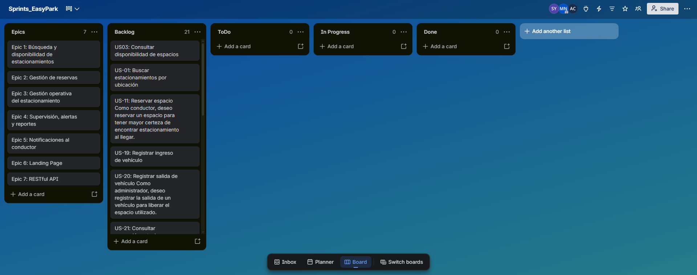

# Capítulo III: Requirements Specification

## 3.1. User Stories

### US01 - Buscar estacionamientos por ubicación

| Campo | Detalle |
|---|---|
| **User Story ID** | US01 |
| **Epic ID** | EP-01 |
| **Título** | Buscar estacionamientos por ubicación |
| **Descripción** | Como conductor, quiero buscar estacionamientos según una ubicación para encontrar alternativas cercanas a mi destino. |
| **Criterio de aceptación 1** | Dado que existen estacionamientos registrados, cuando proporciona una ubicación válida, entonces el sistema devuelve los estacionamientos correspondientes. |
| **Criterio de aceptación 2** | Dado que no existen coincidencias, cuando realiza la búsqueda, entonces el sistema informa que no existen resultados. |

### US02 - Consultar estacionamientos disponibles

| Campo | Detalle |
|---|---|
| **User Story ID** | US02 |
| **Epic ID** | EP-01 |
| **Título** | Consultar estacionamientos disponibles |
| **Descripción** | Como conductor, quiero consultar estacionamientos disponibles para reducir el tiempo dedicado a buscar un espacio. |
| **Criterio de aceptación 1** | Dado que existen estacionamientos disponibles, cuando realiza la consulta, entonces el sistema proporciona los establecimientos disponibles. |
| **Criterio de aceptación 2** | Dado que no existen establecimientos disponibles, cuando realiza la consulta, entonces el sistema informa dicha situación. |

### US03 - Consultar disponibilidad de espacios

| Campo | Detalle |
|---|---|
| **User Story ID** | US03 |
| **Epic ID** | EP-01 |
| **Título** | Consultar disponibilidad de espacios |
| **Descripción** | Como conductor, quiero conocer la disponibilidad de espacios para decidir si dirigirme al estacionamiento. |
| **Criterio de aceptación 1** | Dado un estacionamiento registrado, cuando consulta su disponibilidad, entonces el sistema proporciona la cantidad de espacios disponibles. |
| **Criterio de aceptación 2** | Dado que ocurre un ingreso o salida, cuando el movimiento se registra correctamente, entonces la disponibilidad se actualiza. |

### US04 - Consultar tarifas

| Campo | Detalle |
|---|---|
| **User Story ID** | US04 |
| **Epic ID** | EP-01 |
| **Título** | Consultar tarifas |
| **Descripción** | Como conductor, quiero conocer las tarifas para evaluar el costo antes de utilizar un estacionamiento. |
| **Criterio de aceptación 1** | Dado que existen tarifas vigentes, cuando consulta el estacionamiento, entonces el sistema proporciona las tarifas correspondientes. |
| **Criterio de aceptación 2** | Dado que una tarifa ha sido actualizada, cuando vuelve a consultarla, entonces el sistema proporciona la tarifa vigente. |

### US05 - Consultar ubicación

| Campo | Detalle |
|---|---|
| **User Story ID** | US05 |
| **Epic ID** | EP-01 |
| **Título** | Consultar ubicación |
| **Descripción** | Como conductor, quiero conocer la ubicación del estacionamiento para evaluar su cercanía a mi destino. |
| **Criterio de aceptación 1** | Dado un estacionamiento registrado, cuando consulta su información, entonces el sistema proporciona su ubicación. |
| **Criterio de aceptación 2** | Dado que la ubicación no está disponible, cuando realiza la consulta, entonces el sistema informa que no existe dicha información. |

### US06 - Consultar características del estacionamiento

| Campo | Detalle |
|---|---|
| **User Story ID** | US06 |
| **Epic ID** | EP-01 |
| **Título** | Consultar características del estacionamiento |
| **Descripción** | Como conductor, quiero conocer las características de un estacionamiento para elegir una alternativa adecuada. |
| **Criterio de aceptación 1** | Dado que existen características registradas, cuando consulta el estacionamiento, entonces el sistema proporciona dicha información. |
| **Criterio de aceptación 2** | Dado que una característica cambia, cuando se actualiza la información, entonces el sistema proporciona los datos vigentes. |

### US07 - Filtrar por disponibilidad

| Campo | Detalle |
|---|---|
| **User Story ID** | US07 |
| **Epic ID** | EP-01 |
| **Título** | Filtrar por disponibilidad |
| **Descripción** | Como conductor, quiero filtrar estacionamientos con espacios disponibles para evitar revisar establecimientos ocupados. |
| **Criterio de aceptación 1** | Dado un conjunto de estacionamientos, cuando solicita únicamente aquellos con disponibilidad, entonces el sistema devuelve los que cumplen la condición. |
| **Criterio de aceptación 2** | Dado que ninguno cumple el criterio, cuando aplica el filtro, entonces el sistema informa que no existen resultados. |

### US08 - Filtrar por tarifa

| Campo | Detalle |
|---|---|
| **User Story ID** | US08 |
| **Epic ID** | EP-01 |
| **Título** | Filtrar por tarifa |
| **Descripción** | Como conductor, quiero filtrar estacionamientos según su tarifa para encontrar alternativas acordes con mi presupuesto. |
| **Criterio de aceptación 1** | Dado un rango de tarifa válido, cuando aplica el filtro, entonces el sistema proporciona establecimientos dentro del rango. |
| **Criterio de aceptación 2** | Dado que ninguno cumple el criterio, cuando aplica el filtro, entonces el sistema informa que no existen resultados. |

### US09 - Ordenar por cercanía

| Campo | Detalle |
|---|---|
| **User Story ID** | US09 |
| **Epic ID** | EP-01 |
| **Título** | Ordenar por cercanía |
| **Descripción** | Como conductor, quiero ordenar estacionamientos según su cercanía para encontrar rápidamente los más próximos. |
| **Criterio de aceptación 1** | Dado que existen varios estacionamientos con ubicación conocida, cuando solicita ordenarlos por cercanía, entonces el sistema devuelve los resultados ordenados. |
| **Criterio de aceptación 2** | Dado que existen establecimientos sin información suficiente, cuando se realiza el ordenamiento, entonces el sistema evita utilizarlos para calcular la proximidad. |

### US10 - Comparar estacionamientos

| Campo | Detalle |
|---|---|
| **User Story ID** | US10 |
| **Epic ID** | EP-01 |
| **Título** | Comparar estacionamientos |
| **Descripción** | Como conductor, quiero comparar estacionamientos para seleccionar la alternativa que mejor se adapte a mis necesidades. |
| **Criterio de aceptación 1** | Dado que existen varios estacionamientos, cuando consulta sus características, entonces el sistema proporciona información comparable de disponibilidad, tarifa y ubicación. |
| **Criterio de aceptación 2** | Dado que falta información de un establecimiento, cuando se realiza la comparación, entonces el sistema identifica los datos no disponibles. |

### US11 - Reservar espacio

| Campo | Detalle |
|---|---|
| **User Story ID** | US11 |
| **Epic ID** | EP-02 |
| **Título** | Reservar espacio |
| **Descripción** | Como conductor, quiero reservar un espacio para tener mayor certeza de encontrar estacionamiento al llegar. |
| **Criterio de aceptación 1** | Dado que existe disponibilidad, cuando realiza una solicitud válida, entonces el sistema registra la reserva. |
| **Criterio de aceptación 2** | Dado que no existe disponibilidad, cuando intenta reservar, entonces el sistema rechaza la solicitud. |

### US12 - Consultar reserva activa

| Campo | Detalle |
|---|---|
| **User Story ID** | US12 |
| **Epic ID** | EP-02 |
| **Título** | Consultar reserva activa |
| **Descripción** | Como conductor, quiero consultar mi reserva para comprobar que continúa vigente. |
| **Criterio de aceptación 1** | Dado que posee una reserva activa, cuando la consulta, entonces el sistema proporciona sus datos y estado. |
| **Criterio de aceptación 2** | Dado que no posee reservas activas, cuando realiza la consulta, entonces el sistema informa dicha situación. |

### US13 - Cancelar reserva

| Campo | Detalle |
|---|---|
| **User Story ID** | US13 |
| **Epic ID** | EP-02 |
| **Título** | Cancelar reserva |
| **Descripción** | Como conductor, quiero cancelar una reserva que ya no utilizaré para liberar el espacio. |
| **Criterio de aceptación 1** | Dado que existe una reserva cancelable, cuando solicita cancelarla, entonces el sistema cambia su estado y libera el espacio. |
| **Criterio de aceptación 2** | Dado que la reserva ya no puede cancelarse, cuando solicita la cancelación, entonces el sistema rechaza la operación. |

### US14 - Recibir confirmación de reserva

| Campo | Detalle |
|---|---|
| **User Story ID** | US14 |
| **Epic ID** | EP-02 |
| **Título** | Recibir confirmación de reserva |
| **Descripción** | Como conductor, quiero recibir una confirmación de mi reserva para saber que fue registrada correctamente. |
| **Criterio de aceptación 1** | Dado que una reserva se registra correctamente, cuando finaliza el proceso, entonces el sistema genera una confirmación. |
| **Criterio de aceptación 2** | Dado que la reserva no pudo registrarse, cuando finaliza el intento, entonces el sistema informa que no fue confirmada. |

### US15 - Consultar historial de reservas

| Campo | Detalle |
|---|---|
| **User Story ID** | US15 |
| **Epic ID** | EP-02 |
| **Título** | Consultar historial de reservas |
| **Descripción** | Como conductor, quiero consultar mis reservas anteriores para revisar los estacionamientos que he utilizado. |
| **Criterio de aceptación 1** | Dado que existen reservas anteriores, cuando consulta su historial, entonces el sistema proporciona los registros asociados. |
| **Criterio de aceptación 2** | Dado que no existen reservas anteriores, cuando consulta el historial, entonces el sistema informa que no existen registros. |

### US16 - Consultar estado de reserva

| Campo | Detalle |
|---|---|
| **User Story ID** | US16 |
| **Epic ID** | EP-02 |
| **Título** | Consultar estado de reserva |
| **Descripción** | Como conductor, quiero conocer el estado de mi reserva para saber si continúa activa, fue cancelada o finalizó. |
| **Criterio de aceptación 1** | Dado que existe una reserva, cuando consulta su estado, entonces el sistema proporciona su condición vigente. |
| **Criterio de aceptación 2** | Dado que el estado cambia, cuando vuelve a realizar la consulta, entonces el sistema proporciona el nuevo estado. |

### US17 - Validar disponibilidad antes de reservar

| Campo | Detalle |
|---|---|
| **User Story ID** | US17 |
| **Epic ID** | EP-02 |
| **Título** | Validar disponibilidad antes de reservar |
| **Descripción** | Como conductor, quiero verificar que exista disponibilidad antes de confirmar una reserva para evitar inconsistencias. |
| **Criterio de aceptación 1** | Dado que desea reservar, cuando el sistema valida la disponibilidad y existen espacios, entonces permite registrar la reserva. |
| **Criterio de aceptación 2** | Dado que ya no existen espacios, cuando se realiza la validación, entonces el sistema impide registrar una nueva reserva. |

### US18 - Consultar datos de la reserva

| Campo | Detalle |
|---|---|
| **User Story ID** | US18 |
| **Epic ID** | EP-02 |
| **Título** | Consultar datos de la reserva |
| **Descripción** | Como conductor, quiero consultar los datos de mi reserva para conocer las condiciones asociadas. |
| **Criterio de aceptación 1** | Dado que existe una reserva, cuando la consulta, entonces el sistema proporciona el estacionamiento, estado y periodo asociado. |
| **Criterio de aceptación 2** | Dado que la reserva no existe, cuando intenta consultarla, entonces el sistema informa que no se encontró el registro. |

### US19 - Registrar ingreso de vehículo

| Campo | Detalle |
|---|---|
| **User Story ID** | US19 |
| **Epic ID** | EP-03 |
| **Título** | Registrar ingreso de vehículo |
| **Descripción** | Como administrador, quiero registrar el ingreso de un vehículo para mantener actualizada la ocupación. |
| **Criterio de aceptación 1** | Dado que existe capacidad disponible, cuando registra un ingreso válido, entonces el sistema almacena el movimiento. |
| **Criterio de aceptación 2** | Dado que el ingreso se registra correctamente, cuando finaliza la operación, entonces el sistema actualiza la ocupación. |

### US20 - Registrar salida de vehículo

| Campo | Detalle |
|---|---|
| **User Story ID** | US20 |
| **Epic ID** | EP-03 |
| **Título** | Registrar salida de vehículo |
| **Descripción** | Como administrador, quiero registrar la salida de un vehículo para liberar el espacio utilizado. |
| **Criterio de aceptación 1** | Dado que existe un ingreso activo, cuando registra la salida, entonces el sistema almacena el movimiento. |
| **Criterio de aceptación 2** | Dado que la salida se registra correctamente, cuando finaliza la operación, entonces el sistema libera el espacio asociado. |

### US21 - Consultar ocupación actual

| Campo | Detalle |
|---|---|
| **User Story ID** | US21 |
| **Epic ID** | EP-03 |
| **Título** | Consultar ocupación actual |
| **Descripción** | Como administrador, quiero conocer la ocupación actual para saber cuántos espacios se encuentran disponibles. |
| **Criterio de aceptación 1** | Dado que existen movimientos registrados, cuando consulta la ocupación, entonces el sistema proporciona espacios disponibles y ocupados. |
| **Criterio de aceptación 2** | Dado que ocurre un nuevo movimiento, cuando se registra correctamente, entonces la ocupación se actualiza. |

### US22 - Consultar vehículo estacionado

| Campo | Detalle |
|---|---|
| **User Story ID** | US22 |
| **Epic ID** | EP-03 |
| **Título** | Consultar vehículo estacionado |
| **Descripción** | Como administrador, quiero consultar un vehículo para conocer su ingreso y permanencia. |
| **Criterio de aceptación 1** | Dado que existe un ingreso activo para el vehículo, cuando realiza la consulta, entonces el sistema proporciona la información registrada. |
| **Criterio de aceptación 2** | Dado que el vehículo no posee ingreso activo, cuando realiza la consulta, entonces el sistema informa dicha situación. |

### US23 - Registrar espacios

| Campo | Detalle |
|---|---|
| **User Story ID** | US23 |
| **Epic ID** | EP-03 |
| **Título** | Registrar espacios |
| **Descripción** | Como administrador, quiero registrar los espacios de mi estacionamiento para mantener control sobre su capacidad. |
| **Criterio de aceptación 1** | Dado que se proporcionan datos válidos, cuando registra un espacio, entonces el sistema lo incorpora al estacionamiento. |
| **Criterio de aceptación 2** | Dado que el espacio ya existe, cuando intenta registrarlo nuevamente, entonces el sistema rechaza el duplicado. |

### US24 - Actualizar estado de espacio

| Campo | Detalle |
|---|---|
| **User Story ID** | US24 |
| **Epic ID** | EP-03 |
| **Título** | Actualizar estado de espacio |
| **Descripción** | Como administrador, quiero actualizar el estado de un espacio para reflejar correctamente su condición. |
| **Criterio de aceptación 1** | Dado que existe un espacio registrado, cuando cambia válidamente su estado, entonces el sistema conserva la nueva condición. |
| **Criterio de aceptación 2** | Dado que el cambio solicitado no es válido, cuando intenta actualizarlo, entonces el sistema rechaza la operación. |

### US25 - Gestionar zonas

| Campo | Detalle |
|---|---|
| **User Story ID** | US25 |
| **Epic ID** | EP-03 |
| **Título** | Gestionar zonas |
| **Descripción** | Como administrador, quiero organizar los espacios por zonas para distribuir mejor los vehículos. |
| **Criterio de aceptación 1** | Dado que existen espacios registrados, cuando los asigna a una zona válida, entonces el sistema conserva la clasificación. |
| **Criterio de aceptación 2** | Dado que modifica una zona, cuando guarda los cambios, entonces el sistema mantiene actualizadas sus asociaciones. |

### US26 - Clasificar espacios según tipo de usuario

| Campo | Detalle |
|---|---|
| **User Story ID** | US26 |
| **Epic ID** | EP-03 |
| **Título** | Clasificar espacios según tipo de usuario |
| **Descripción** | Como administrador, quiero clasificar espacios según el tipo de usuario para mantener organizada su distribución. |
| **Criterio de aceptación 1** | Dado un espacio registrado, cuando se asigna a un tipo de usuario válido, entonces el sistema conserva la clasificación. |
| **Criterio de aceptación 2** | Dado que cambia el tipo asignado, cuando registra la modificación, entonces el sistema actualiza la clasificación. |

### US27 - Reasignar vehículo

| Campo | Detalle |
|---|---|
| **User Story ID** | US27 |
| **Epic ID** | EP-03 |
| **Título** | Reasignar vehículo |
| **Descripción** | Como administrador, quiero reasignar un vehículo a otro espacio para resolver cambios operativos. |
| **Criterio de aceptación 1** | Dado un vehículo estacionado y otro espacio disponible, cuando realiza una reasignación válida, entonces el sistema actualiza el espacio asociado. |
| **Criterio de aceptación 2** | Dado que el nuevo espacio está ocupado, cuando intenta reasignarlo, entonces el sistema rechaza la operación. |

### US28 - Consultar historial de movimientos

| Campo | Detalle |
|---|---|
| **User Story ID** | US28 |
| **Epic ID** | EP-03 |
| **Título** | Consultar historial de movimientos |
| **Descripción** | Como administrador, quiero consultar ingresos y salidas anteriores para disponer de un registro confiable de la operación. |
| **Criterio de aceptación 1** | Dado que existen movimientos almacenados, cuando consulta el historial, entonces el sistema proporciona los registros correspondientes. |
| **Criterio de aceptación 2** | Dado un periodo válido, cuando realiza la consulta, entonces el sistema proporciona únicamente los registros de dicho periodo. |

### US29 - Recibir alerta por permanencia

| Campo | Detalle |
|---|---|
| **User Story ID** | US29 |
| **Epic ID** | EP-04 |
| **Título** | Recibir alerta por permanencia |
| **Descripción** | Como administrador, quiero conocer cuando un vehículo excede el tiempo establecido para detectar situaciones irregulares. |
| **Criterio de aceptación 1** | Dado que un vehículo supera el tiempo configurado, cuando se cumple la condición, entonces el sistema genera una alerta. |
| **Criterio de aceptación 2** | Dado que todavía no supera el tiempo establecido, cuando se evalúa su permanencia, entonces el sistema no genera dicha alerta. |

### US30 - Consultar alertas activas

| Campo | Detalle |
|---|---|
| **User Story ID** | US30 |
| **Epic ID** | EP-04 |
| **Título** | Consultar alertas activas |
| **Descripción** | Como administrador, quiero consultar las alertas activas para identificar situaciones que requieren atención. |
| **Criterio de aceptación 1** | Dado que existen alertas pendientes, cuando las consulta, entonces el sistema proporciona las alertas activas. |
| **Criterio de aceptación 2** | Dado que no existen alertas pendientes, cuando realiza la consulta, entonces el sistema informa dicha situación. |

### US31 - Resolver alerta

| Campo | Detalle |
|---|---|
| **User Story ID** | US31 |
| **Epic ID** | EP-04 |
| **Título** | Resolver alerta |
| **Descripción** | Como administrador, quiero marcar una alerta como resuelta para mantener actualizado el seguimiento de incidencias. |
| **Criterio de aceptación 1** | Dado que existe una alerta activa, cuando registra su resolución, entonces el sistema cambia su estado a resuelta. |
| **Criterio de aceptación 2** | Dado que la alerta ya está resuelta, cuando vuelve a consultarla, entonces conserva dicho estado. |

### US32 - Consultar reporte de ocupación

| Campo | Detalle |
|---|---|
| **User Story ID** | US32 |
| **Epic ID** | EP-04 |
| **Título** | Consultar reporte de ocupación |
| **Descripción** | Como administrador, quiero consultar reportes de ocupación para analizar el uso de los espacios. |
| **Criterio de aceptación 1** | Dado que existen datos de ocupación, cuando solicita un reporte para un periodo válido, entonces el sistema proporciona la información correspondiente. |
| **Criterio de aceptación 2** | Dado que no existen registros para el periodo, cuando genera el reporte, entonces el sistema informa que no existen datos. |

### US33 - Consultar reporte de movimientos

| Campo | Detalle |
|---|---|
| **User Story ID** | US33 |
| **Epic ID** | EP-04 |
| **Título** | Consultar reporte de movimientos |
| **Descripción** | Como administrador, quiero consultar reportes de ingresos y salidas para analizar el flujo de vehículos. |
| **Criterio de aceptación 1** | Dado que existen movimientos registrados, cuando solicita el reporte, entonces el sistema proporciona los registros correspondientes. |
| **Criterio de aceptación 2** | Dado un periodo específico, cuando genera el reporte, entonces únicamente considera los movimientos pertenecientes a dicho periodo. |

### US34 - Consultar tiempos de permanencia

| Campo | Detalle |
|---|---|
| **User Story ID** | US34 |
| **Epic ID** | EP-04 |
| **Título** | Consultar tiempos de permanencia |
| **Descripción** | Como administrador, quiero consultar los tiempos de permanencia para comprender cuánto utilizan los clientes el estacionamiento. |
| **Criterio de aceptación 1** | Dado que existen ingresos y salidas registrados, cuando consulta la permanencia, entonces el sistema proporciona la duración correspondiente. |
| **Criterio de aceptación 2** | Dado que un vehículo continúa dentro del estacionamiento, cuando realiza la consulta, entonces el sistema proporciona su permanencia actual. |

### US35 - Supervisar estacionamiento remotamente

| Campo | Detalle |
|---|---|
| **User Story ID** | US35 |
| **Epic ID** | EP-04 |
| **Título** | Supervisar estacionamiento remotamente |
| **Descripción** | Como administrador, quiero consultar el estado del estacionamiento sin estar presente físicamente para mantener el control de la operación. |
| **Criterio de aceptación 1** | Dado que existe información operativa actualizada, cuando consulta el establecimiento, entonces el sistema proporciona su ocupación y movimientos vigentes. |
| **Criterio de aceptación 2** | Dado que ocurre un nuevo movimiento, cuando se registra, entonces la información operativa se actualiza. |

### US36 - Notificación de tiempo restante

| Campo | Detalle |
|---|---|
| **User Story ID** | US36 |
| **Epic ID** | EP-05 |
| **Título** | Notificación de tiempo restante |
| **Descripción** | Como conductor, quiero conocer el tiempo restante de mi estacionamiento para evitar exceder el periodo previsto. |
| **Criterio de aceptación 1** | Dado que posee una estancia activa, cuando se aproxima el vencimiento, entonces el sistema genera una notificación. |
| **Criterio de aceptación 2** | Dado que todavía no corresponde notificar, cuando se evalúa la permanencia, entonces el sistema no genera la notificación. |

### US37 - Notificación de vencimiento

| Campo | Detalle |
|---|---|
| **User Story ID** | US37 |
| **Epic ID** | EP-05 |
| **Título** | Notificación de vencimiento |
| **Descripción** | Como conductor, quiero recibir un aviso cuando finalice mi periodo para evitar inconvenientes adicionales. |
| **Criterio de aceptación 1** | Dado que posee una estancia activa, cuando se alcanza el límite establecido, entonces el sistema genera una notificación de vencimiento. |
| **Criterio de aceptación 2** | Dado que la estancia finalizó previamente, cuando llega el tiempo original de vencimiento, entonces el sistema no genera una nueva alerta. |

### US38 - Confirmación de ingreso

| Campo | Detalle |
|---|---|
| **User Story ID** | US38 |
| **Epic ID** | EP-05 |
| **Título** | Confirmación de ingreso |
| **Descripción** | Como conductor, quiero recibir confirmación de mi ingreso para saber que mi vehículo fue registrado correctamente. |
| **Criterio de aceptación 1** | Dado que el ingreso se registra satisfactoriamente, cuando finaliza el registro, entonces el sistema genera una confirmación. |
| **Criterio de aceptación 2** | Dado que el ingreso no pudo registrarse, cuando finaliza el intento, entonces el sistema informa que no fue confirmado. |

### US39 - Confirmación de salida

| Campo | Detalle |
|---|---|
| **User Story ID** | US39 |
| **Epic ID** | EP-05 |
| **Título** | Confirmación de salida |
| **Descripción** | Como conductor, quiero recibir confirmación de mi salida para saber que mi permanencia finalizó correctamente. |
| **Criterio de aceptación 1** | Dado que la salida se registra satisfactoriamente, cuando finaliza el proceso, entonces el sistema genera una confirmación. |
| **Criterio de aceptación 2** | Dado que no existe una estancia activa, cuando intenta registrarse la salida, entonces el sistema informa que la operación no puede completarse. |

### US40 - Recordatorio de reserva

| Campo | Detalle |
|---|---|
| **User Story ID** | US40 |
| **Epic ID** | EP-05 |
| **Título** | Recordatorio de reserva |
| **Descripción** | Como conductor, quiero recibir un recordatorio de una reserva próxima para no olvidar el espacio reservado. |
| **Criterio de aceptación 1** | Dado que posee una reserva futura activa, cuando se aproxima el periodo reservado, entonces el sistema genera un recordatorio. |
| **Criterio de aceptación 2** | Dado que la reserva fue cancelada, cuando llega el periodo correspondiente, entonces el sistema no genera el recordatorio. |

### US41 - Conocer EasyPark

| Campo | Detalle |
|---|---|
| **User Story ID** | US41 |
| **Epic ID** | EP-06 |
| **Título** | Conocer EasyPark |
| **Descripción** | Como visitante, quiero conocer qué es EasyPark para comprender el propósito de la solución. |
| **Criterio de aceptación 1** | Dado que accede al Landing Page, cuando consulta la información de EasyPark, entonces encuentra una descripción de la solución. |
| **Criterio de aceptación 2** | Dado que consulta la propuesta de valor, cuando revisa la información disponible, entonces identifica el problema que EasyPark busca resolver. |

### US42 - Conocer beneficios para conductores

| Campo | Detalle |
|---|---|
| **User Story ID** | US42 |
| **Epic ID** | EP-06 |
| **Título** | Conocer beneficios para conductores |
| **Descripción** | Como visitante conductor, quiero conocer los beneficios de EasyPark para evaluar si la solución satisface mis necesidades. |
| **Criterio de aceptación 1** | Dado que pertenece al segmento de conductores, cuando consulta los beneficios, entonces encuentra información relevante sobre búsqueda, disponibilidad y reserva. |
| **Criterio de aceptación 2** | Dado que desea conocer el valor de la solución, cuando revisa la información, entonces identifica los principales beneficios para conductores. |

### US43 - Conocer beneficios para administradores

| Campo | Detalle |
|---|---|
| **User Story ID** | US43 |
| **Epic ID** | EP-06 |
| **Título** | Conocer beneficios para administradores |
| **Descripción** | Como visitante administrador, quiero conocer los beneficios de EasyPark para evaluar su utilidad en mi estacionamiento. |
| **Criterio de aceptación 1** | Dado que pertenece al segmento de administradores, cuando consulta los beneficios, entonces encuentra información sobre gestión, supervisión y reportes. |
| **Criterio de aceptación 2** | Dado que desea evaluar la solución, cuando consulta sus beneficios, entonces identifica las capacidades dirigidas a administradores. |

### US44 - Conocer funcionalidades principales

| Campo | Detalle |
|---|---|
| **User Story ID** | US44 |
| **Epic ID** | EP-06 |
| **Título** | Conocer funcionalidades principales |
| **Descripción** | Como visitante, quiero conocer las funcionalidades principales para comprender cómo EasyPark puede resolver el problema. |
| **Criterio de aceptación 1** | Dado que consulta la información del producto, cuando revisa sus funcionalidades, entonces encuentra las principales capacidades de EasyPark. |
| **Criterio de aceptación 2** | Dado que una funcionalidad no forma parte de la solución actual, cuando revisa la información, entonces no se presenta como una capacidad disponible. |

### US45 - Conocer funcionamiento de reservas

| Campo | Detalle |
|---|---|
| **User Story ID** | US45 |
| **Epic ID** | EP-06 |
| **Título** | Conocer funcionamiento de reservas |
| **Descripción** | Como visitante conductor, quiero conocer cómo funcionan las reservas para entender el proceso antes de utilizar EasyPark. |
| **Criterio de aceptación 1** | Dado que consulta la información sobre reservas, cuando revisa su funcionamiento, entonces identifica el propósito de la funcionalidad. |
| **Criterio de aceptación 2** | Dado que desea conocer sus beneficios, cuando consulta la información, entonces identifica cómo una reserva reduce la incertidumbre de disponibilidad. |

### US46 - Conocer gestión digital para administradores

| Campo | Detalle |
|---|---|
| **User Story ID** | US46 |
| **Epic ID** | EP-06 |
| **Título** | Conocer gestión digital para administradores |
| **Descripción** | Como visitante administrador, quiero conocer cómo EasyPark digitaliza la operación para evaluar su adopción. |
| **Criterio de aceptación 1** | Dado que consulta información dirigida a administradores, cuando revisa la propuesta, entonces encuentra información sobre registros, ocupación y supervisión. |
| **Criterio de aceptación 2** | Dado que actualmente utiliza procesos manuales, cuando consulta la solución, entonces identifica alternativas de digitalización disponibles. |

### US47 - Conocer integración progresiva con IoT

| Campo | Detalle |
|---|---|
| **User Story ID** | US47 |
| **Epic ID** | EP-06 |
| **Título** | Conocer integración progresiva con IoT |
| **Descripción** | Como visitante administrador, quiero conocer la posibilidad de incorporar IoT progresivamente para evaluar futuras mejoras de automatización. |
| **Criterio de aceptación 1** | Dado que consulta información sobre integración tecnológica, cuando revisa las capacidades futuras, entonces identifica que IoT puede incorporarse progresivamente. |
| **Criterio de aceptación 2** | Dado que no dispone de sensores, cuando consulta los requisitos iniciales, entonces identifica que el hardware especializado no es obligatorio. |

### US48 - Consultar preguntas frecuentes

| Campo | Detalle |
|---|---|
| **User Story ID** | US48 |
| **Epic ID** | EP-06 |
| **Título** | Consultar preguntas frecuentes |
| **Descripción** | Como visitante, quiero consultar respuestas a preguntas frecuentes para resolver dudas antes de utilizar EasyPark. |
| **Criterio de aceptación 1** | Dado que posee una duda cubierta por la información disponible, cuando consulta las preguntas frecuentes, entonces encuentra una respuesta relacionada. |
| **Criterio de aceptación 2** | Dado que necesita conocer aspectos generales del servicio, cuando consulta esta información, entonces encuentra respuestas sobre el funcionamiento de EasyPark. |

### US49 - Contactar con EasyPark

| Campo | Detalle |
|---|---|
| **User Story ID** | US49 |
| **Epic ID** | EP-06 |
| **Título** | Contactar con EasyPark |
| **Descripción** | Como visitante, quiero conocer los medios de contacto para comunicarme con el equipo responsable de EasyPark. |
| **Criterio de aceptación 1** | Dado que desea comunicarse con EasyPark, cuando consulta la información de contacto, entonces encuentra los medios disponibles. |
| **Criterio de aceptación 2** | Dado que pertenece a cualquiera de los segmentos objetivo, cuando busca información de contacto, entonces puede identificar un medio válido de comunicación. |

### US50 - Acceder a la aplicación web

| Campo | Detalle |
|---|---|
| **User Story ID** | US50 |
| **Epic ID** | EP-06 |
| **Título** | Acceder a la aplicación web |
| **Descripción** | Como visitante, quiero acceder a la aplicación EasyPark para comenzar a utilizar el servicio. |
| **Criterio de aceptación 1** | Dado que el visitante decide utilizar EasyPark, cuando solicita acceder a la aplicación, entonces puede continuar hacia la experiencia web. |
| **Criterio de aceptación 2** | Dado que el acceso a la aplicación no se encuentra disponible, cuando intenta continuar, entonces recibe información sobre la imposibilidad de acceder. |

## 3.2. Impact Mapping

El Impact Mapping es una técnica de planificación estratégica que permite relacionar los objetivos de negocio de EasyPark con los cambios de comportamiento esperados en cada segmento objetivo.

#### Impact Map - Segmento 1: Conductores (usuarios de estacionamientos)

#### Impact Map - Segmento 2: Administradores y el personal operativo de los estacionamientos

## 3.3. Product Backlog
Link del Trello : https://trello.com/b/KxGrDhN2/sprintseasypark

| # | ID | Título | Descripción | SP |
|---:|---|---|---|---:|
| 1 | US-03 | Consultar disponibilidad de espacios | Como conductor, deseo conocer la disponibilidad de espacios para decidir si dirigirme al estacionamiento. | 3 |
| 2 | US-01 | Buscar estacionamientos por ubicación | Como conductor, deseo buscar estacionamientos según una ubicación para encontrar alternativas cercanas. | 5 |
| 3 | US-11 | Reservar espacio | Como conductor, deseo reservar un espacio para tener mayor certeza de encontrar estacionamiento al llegar. | 8 |
| 4 | US-19 | Registrar ingreso de vehículo | Como administrador, deseo registrar el ingreso de un vehículo para mantener actualizada la ocupación. | 5 |
| 5 | US-20 | Registrar salida de vehículo | Como administrador, deseo registrar la salida de un vehículo para liberar el espacio utilizado. | 5 |
| 6 | US-21 | Consultar ocupación actual | Como administrador, deseo conocer la ocupación actual para saber cuántos espacios se encuentran disponibles. | 3 |
| 7 | US-04 | Consultar tarifas | Como conductor, deseo conocer las tarifas para evaluar el costo antes de utilizar un estacionamiento. | 2 |
| 8 | US-05 | Consultar ubicación | Como conductor, deseo conocer la ubicación del estacionamiento para evaluar su cercanía a mi destino. | 3 |
| 9 | US-41 | Conocer EasyPark | Como visitante, deseo conocer qué es EasyPark para comprender el propósito de la solución. | 2 |
| 10 | US-42 | Conocer beneficios para conductores | Como visitante conductor, deseo conocer los beneficios de EasyPark para evaluar si satisface mis necesidades. | 2 |
| 11 | US-43 | Conocer beneficios para administradores | Como visitante administrador, deseo conocer los beneficios de EasyPark para evaluar su utilidad. | 2 |
| 12 | US-50 | Acceder a la aplicación web | Como visitante, deseo acceder a la aplicación EasyPark para comenzar a utilizar el servicio. | 2 |
| 13 | TS-03 | Servicio de disponibilidad | Como Developer, deseo consultar disponibilidad mediante el RESTful API para proporcionar información actualizada. | 5 |
| 14 | TS-05 | Servicio de ingreso de vehículos | Como Developer, deseo registrar ingresos mediante el RESTful API para mantener actualizada la operación. | 5 |
| 15 | TS-06 | Servicio de salida de vehículos | Como Developer, deseo registrar salidas mediante el RESTful API para liberar los espacios utilizados. | 5 |
| 16 | TS-08 | Servicio de creación de reservas | Como Developer, deseo crear reservas mediante el RESTful API para permitir que los clientes aseguren espacios. | 8 |
| 17 | US-17 | Validar disponibilidad antes de reservar | Como conductor, deseo verificar la disponibilidad antes de confirmar una reserva para evitar inconsistencias. | 5 |
| 18 | US-12 | Consultar reserva activa | Como conductor, deseo consultar mi reserva para comprobar que continúa vigente. | 3 |
| 19 | US-14 | Recibir confirmación de reserva | Como conductor, deseo recibir confirmación de mi reserva para saber que fue registrada correctamente. | 3 |
| 20 | US-13 | Cancelar reserva | Como conductor, deseo cancelar una reserva que ya no utilizaré para liberar el espacio. | 5 |
| 21 | TS-09 | Servicio de consulta de reservas | Como Developer, deseo consultar reservas mediante el RESTful API para proporcionar su información a las aplicaciones cliente. | 3 |
| 22 | TS-10 | Servicio de cancelación de reservas | Como Developer, deseo cancelar reservas mediante el RESTful API para liberar espacios. | 5 |
| 23 | US-29 | Recibir alerta por permanencia | Como administrador, deseo conocer cuando un vehículo excede el tiempo establecido para detectar situaciones irregulares. | 5 |
| 24 | US-35 | Supervisar estacionamiento remotamente | Como administrador, deseo consultar el estado del estacionamiento sin estar presente físicamente. | 5 |
| 25 | US-36 | Notificación de tiempo restante | Como conductor, deseo conocer el tiempo restante de mi estacionamiento para evitar exceder el periodo previsto. | 3 |
| 26 | US-37 | Notificación de vencimiento | Como conductor, deseo recibir un aviso cuando finalice mi periodo de estacionamiento. | 3 |
| 27 | US-32 | Consultar reporte de ocupación | Como administrador, deseo consultar reportes de ocupación para analizar el uso de los espacios. | 5 |
| 28 | US-33 | Consultar reporte de movimientos | Como administrador, deseo consultar reportes de ingresos y salidas para analizar el flujo de vehículos. | 5 |
| 29 | US-34 | Consultar tiempos de permanencia | Como administrador, deseo consultar los tiempos de permanencia para conocer el uso del estacionamiento. | 3 |
| 30 | TS-13 | Servicio de alertas | Como Developer, deseo consultar y actualizar alertas mediante el RESTful API para soportar la supervisión. | 5 |
| 31 | TS-14 | Servicio de reportes de ocupación | Como Developer, deseo obtener información de ocupación mediante el RESTful API para generar reportes. | 5 |
| 32 | TS-15 | Servicio de reportes de movimientos | Como Developer, deseo obtener movimientos mediante el RESTful API para analizar ingresos y salidas. | 5 |
| 33 | US-22 | Consultar vehículo estacionado | Como administrador, deseo consultar un vehículo para conocer su ingreso y permanencia. | 3 |
| 34 | US-23 | Registrar espacios | Como administrador, deseo registrar los espacios de mi estacionamiento para controlar su capacidad. | 3 |
| 35 | US-24 | Actualizar estado de espacio | Como administrador, deseo actualizar el estado de un espacio para reflejar su condición actual. | 3 |
| 36 | US-25 | Gestionar zonas | Como administrador, deseo organizar los espacios por zonas para distribuir mejor los vehículos. | 5 |
| 37 | US-26 | Clasificar espacios según tipo de usuario | Como administrador, deseo clasificar espacios según el tipo de usuario para mantener organizada su distribución. | 5 |
| 38 | US-27 | Reasignar vehículo | Como administrador, deseo reasignar un vehículo a otro espacio para resolver cambios operativos. | 5 |
| 39 | US-28 | Consultar historial de movimientos | Como administrador, deseo consultar ingresos y salidas anteriores para disponer de un registro confiable. | 3 |
| 40 | TS-07 | Servicio de ocupación | Como Developer, deseo consultar la ocupación mediante el RESTful API para obtener el estado actual del estacionamiento. | 3 |
| 41 | TS-11 | Servicio de gestión de espacios | Como Developer, deseo gestionar espacios mediante el RESTful API para administrar la capacidad. | 5 |
| 42 | TS-12 | Servicio de gestión de zonas | Como Developer, deseo gestionar zonas mediante el RESTful API para soportar la organización de espacios. | 5 |
| 43 | US-02 | Consultar estacionamientos disponibles | Como conductor, deseo consultar estacionamientos disponibles para reducir el tiempo de búsqueda. | 3 |
| 44 | US-06 | Consultar características del estacionamiento | Como conductor, deseo conocer las características del estacionamiento para elegir una alternativa adecuada. | 2 |
| 45 | US-07 | Filtrar por disponibilidad | Como conductor, deseo filtrar estacionamientos con espacios disponibles para evitar alternativas ocupadas. | 3 |
| 46 | US-08 | Filtrar por tarifa | Como conductor, deseo filtrar estacionamientos según su tarifa para ajustarme a mi presupuesto. | 3 |
| 47 | US-09 | Ordenar por cercanía | Como conductor, deseo ordenar estacionamientos según su cercanía para encontrar los más próximos. | 5 |
| 48 | US-10 | Comparar estacionamientos | Como conductor, deseo comparar estacionamientos para seleccionar la alternativa más conveniente. | 5 |
| 49 | TS-01 | Servicio de búsqueda de estacionamientos | Como Developer, deseo obtener estacionamientos mediante el RESTful API para implementar búsquedas. | 5 |
| 50 | TS-02 | Servicio de detalle de estacionamiento | Como Developer, deseo consultar los datos de un estacionamiento mediante el RESTful API. | 3 |
| 51 | TS-04 | Servicio de tarifas | Como Developer, deseo consultar tarifas mediante el RESTful API para proporcionar información económica. | 3 |
| 52 | US-15 | Consultar historial de reservas | Como conductor, deseo consultar mis reservas anteriores para revisar los estacionamientos utilizados. | 3 |
| 53 | US-16 | Consultar estado de reserva | Como conductor, deseo conocer el estado de mi reserva para saber si continúa activa. | 2 |
| 54 | US-18 | Consultar datos de la reserva | Como conductor, deseo consultar los datos de mi reserva para conocer las condiciones asociadas. | 2 |
| 55 | US-30 | Consultar alertas activas | Como administrador, deseo consultar las alertas activas para identificar situaciones que requieren atención. | 3 |
| 56 | US-31 | Resolver alerta | Como administrador, deseo marcar una alerta como resuelta para mantener actualizado el seguimiento. | 3 |
| 57 | US-38 | Confirmación de ingreso | Como conductor, deseo recibir confirmación de mi ingreso para saber que fue registrado correctamente. | 2 |
| 58 | US-39 | Confirmación de salida | Como conductor, deseo recibir confirmación de mi salida para saber que mi permanencia finalizó correctamente. | 2 |
| 59 | US-40 | Recordatorio de reserva | Como conductor, deseo recibir un recordatorio de una reserva próxima para no olvidarla. | 3 |
| 60 | TS-16 | Servicio de notificaciones | Como Developer, deseo obtener eventos de notificación mediante el RESTful API para informar a los conductores. | 5 |
| 61 | US-44 | Conocer funcionalidades principales | Como visitante, deseo conocer las funcionalidades principales para comprender cómo funciona EasyPark. | 2 |
| 62 | US-45 | Conocer funcionamiento de reservas | Como visitante conductor, deseo conocer cómo funcionan las reservas antes de utilizar EasyPark. | 2 |
| 63 | US-46 | Conocer gestión digital para administradores | Como visitante administrador, deseo conocer cómo EasyPark digitaliza la operación. | 2 |
| 64 | US-47 | Conocer integración progresiva con IoT | Como visitante administrador, deseo conocer la posibilidad de incorporar IoT progresivamente. | 2 |
| 65 | US-48 | Consultar preguntas frecuentes | Como visitante, deseo consultar respuestas a preguntas frecuentes para resolver dudas. | 2 |
| 66 | US-49 | Contactar con EasyPark | Como visitante, deseo conocer los medios de contacto para comunicarme con EasyPark. | 2 |

