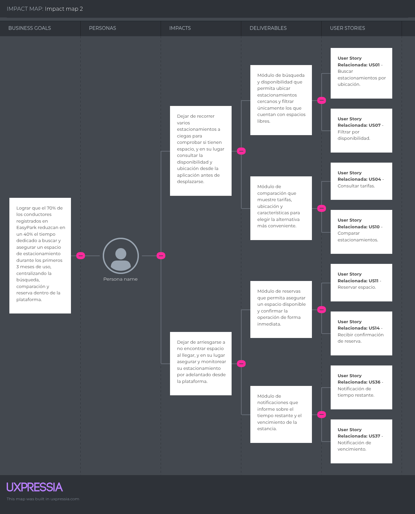
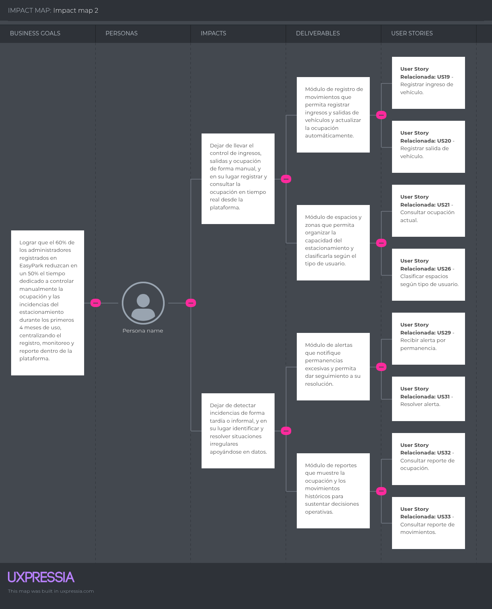

# Capítulo III: Requirements Specification

## 3.1. User Stories

### US01 - Registrar datos personales

| Campo | Detalle |
|---|---|
| **User Story ID** | US01 |
| **Epic ID** | EP01 |
| **Título** | Registrar datos personales |
| **Descripción** | Como Voluntario espontáneo, deseo registrar mis datos personales para poder participar en una actividad de apoyo ambiental. |
| **Criterio de aceptación 1** | Dado que completo los datos obligatorios, cuando confirmo el registro, entonces mi información queda registrada. |
| **Criterio de aceptación 2** | Dado que falta información obligatoria, cuando intento continuar, entonces se indican los datos pendientes. |

### US02 - Registrar experiencia previa

| Campo | Detalle |
|---|---|
| **User Story ID** | US02 |
| **Epic ID** | EP01 |
| **Título** | Registrar experiencia previa |
| **Descripción** | Como Voluntario espontáneo, deseo indicar mi experiencia previa para que sea considerada al asignarme una tarea. |
| **Criterio de aceptación 1** | Dado que tengo experiencia previa, cuando la registro, entonces queda asociada a mi perfil. |
| **Criterio de aceptación 2** | Dado que no tengo experiencia, cuando lo indico, entonces puedo continuar con el registro. |

### US03 - Registrar habilidades

| Campo | Detalle |
|---|---|
| **User Story ID** | US03 |
| **Epic ID** | EP01 |
| **Título** | Registrar habilidades |
| **Descripción** | Como Voluntario espontáneo, deseo registrar mis habilidades para que el coordinador conozca qué actividades puedo realizar. |
| **Criterio de aceptación 1** | Dado que poseo determinadas habilidades, cuando las registro, entonces quedan asociadas a mi perfil. |
| **Criterio de aceptación 2** | Dado que actualizo una habilidad, cuando guardo el cambio, entonces mi perfil queda actualizado. |

### US04 - Registrar disponibilidad

| Campo | Detalle |
|---|---|
| **User Story ID** | US04 |
| **Epic ID** | EP01 |
| **Título** | Registrar disponibilidad |
| **Descripción** | Como Voluntario espontáneo, deseo indicar mi disponibilidad para que puedan asignarme actividades dentro del tiempo que puedo colaborar. |
| **Criterio de aceptación 1** | Dado que conozco mi disponibilidad, cuando registro el periodo, entonces queda almacenado. |
| **Criterio de aceptación 2** | Dado que mi disponibilidad cambia, cuando la actualizo, entonces se registra el nuevo periodo. |

### US05 - Consultar perfil

| Campo | Detalle |
|---|---|
| **User Story ID** | US05 |
| **Epic ID** | EP01 |
| **Título** | Consultar perfil |
| **Descripción** | Como Voluntario espontáneo, deseo consultar mi perfil para verificar la información que he registrado. |
| **Criterio de aceptación 1** | Dado que tengo un perfil registrado, cuando lo consulto, entonces puedo visualizar mis datos. |
| **Criterio de aceptación 2** | Dado que actualicé información, cuando vuelvo a consultarlo, entonces aparecen los datos actuales. |

### US06 - Actualizar información personal

| Campo | Detalle |
|---|---|
| **User Story ID** | US06 |
| **Epic ID** | EP01 |
| **Título** | Actualizar información personal |
| **Descripción** | Como Voluntario espontáneo, deseo actualizar mis datos para mantener correcta mi información durante la emergencia. |
| **Criterio de aceptación 1** | Dado que mi perfil existe, cuando ingreso información válida, entonces los cambios quedan registrados. |
| **Criterio de aceptación 2** | Dado que ingreso información inválida, cuando intento guardar, entonces se mantienen los datos anteriores. |

### US07 - Consultar voluntarios registrados

| Campo | Detalle |
|---|---|
| **User Story ID** | US07 |
| **Epic ID** | EP01 |
| **Título** | Consultar voluntarios registrados |
| **Descripción** | Como Coordinador de crisis, deseo consultar los voluntarios registrados para conocer quiénes se encuentran disponibles. |
| **Criterio de aceptación 1** | Dado que existen voluntarios registrados, cuando realizo la consulta, entonces obtengo la lista correspondiente. |
| **Criterio de aceptación 2** | Dado que no existen voluntarios, cuando consulto, entonces se informa que no hay participantes registrados. |

### US08 - Consultar perfil de voluntario

| Campo | Detalle |
|---|---|
| **User Story ID** | US08 |
| **Epic ID** | EP01 |
| **Título** | Consultar perfil de voluntario |
| **Descripción** | Como Coordinador de crisis, deseo consultar el perfil de un voluntario para conocer su experiencia y habilidades antes de asignarle una actividad. |
| **Criterio de aceptación 1** | Dado que el voluntario está registrado, cuando consulto su perfil, entonces obtengo su información. |
| **Criterio de aceptación 2** | Dado que el voluntario no existe, cuando intento consultarlo, entonces se informa que no fue encontrado. |

### US09 - Consultar capacitación inicial

| Campo | Detalle |
|---|---|
| **User Story ID** | US09 |
| **Epic ID** | EP02 |
| **Título** | Consultar capacitación inicial |
| **Descripción** | Como Voluntario espontáneo, deseo recibir una capacitación básica para conocer los riesgos antes de iniciar mis actividades. |
| **Criterio de aceptación 1** | Dado que debo participar en una actividad, cuando accedo a la capacitación, entonces puedo revisar las indicaciones de seguridad. |
| **Criterio de aceptación 2** | Dado que no la he completado, cuando intento continuar, entonces se informa que está pendiente. |

### US10 - Visualizar instrucciones de seguridad

| Campo | Detalle |
|---|---|
| **User Story ID** | US10 |
| **Epic ID** | EP02 |
| **Título** | Visualizar instrucciones de seguridad |
| **Descripción** | Como Voluntario espontáneo, deseo consultar instrucciones visuales para comprender rápidamente las medidas de seguridad. |
| **Criterio de aceptación 1** | Dado que existen instrucciones para mi actividad, cuando las consulto, entonces puedo conocer las principales medidas de seguridad. |
| **Criterio de aceptación 2** | Dado que una instrucción cambia, cuando vuelvo a consultarla, entonces aparece la versión actualizada. |

### US11 - Confirmar capacitación

| Campo | Detalle |
|---|---|
| **User Story ID** | US11 |
| **Epic ID** | EP02 |
| **Título** | Confirmar capacitación |
| **Descripción** | Como Voluntario espontáneo, deseo confirmar que completé mi capacitación para dejar constancia de que recibí las indicaciones necesarias. |
| **Criterio de aceptación 1** | Dado que revisé el contenido obligatorio, cuando confirmo la capacitación, entonces queda registrada como completada. |
| **Criterio de aceptación 2** | Dado que falta contenido obligatorio, cuando intento finalizarla, entonces permanece pendiente. |

### US12 - Consultar historial de capacitaciones

| Campo | Detalle |
|---|---|
| **User Story ID** | US12 |
| **Epic ID** | EP02 |
| **Título** | Consultar historial de capacitaciones |
| **Descripción** | Como Voluntario espontáneo, deseo revisar las capacitaciones realizadas para conocer qué indicaciones ya he recibido. |
| **Criterio de aceptación 1** | Dado que completé capacitaciones, cuando consulto mi historial, entonces obtengo los registros. |
| **Criterio de aceptación 2** | Dado que no tengo capacitaciones anteriores, cuando consulto, entonces se informa que no existen registros. |

### US13 - Verificar capacitación

| Campo | Detalle |
|---|---|
| **User Story ID** | US13 |
| **Epic ID** | EP02 |
| **Título** | Verificar capacitación |
| **Descripción** | Como Coordinador de crisis, deseo verificar la capacitación de un voluntario para evitar asignarlo a una actividad sin preparación. |
| **Criterio de aceptación 1** | Dado que el voluntario completó la capacitación, cuando consulto su estado, entonces aparece como completada. |
| **Criterio de aceptación 2** | Dado que no la completó, cuando consulto, entonces aparece como pendiente. |

### US14 - Registrar recomendaciones de seguridad

| Campo | Detalle |
|---|---|
| **User Story ID** | US14 |
| **Epic ID** | EP02 |
| **Título** | Registrar recomendaciones de seguridad |
| **Descripción** | Como Especialista ambiental, deseo registrar recomendaciones de seguridad para que sean conocidas antes de realizar una actividad. |
| **Criterio de aceptación 1** | Dado que identifico una recomendación, cuando la registro, entonces queda disponible. |
| **Criterio de aceptación 2** | Dado que falta información necesaria, cuando intento registrarla, entonces el proceso no se completa. |

### US15 - Actualizar recomendaciones

| Campo | Detalle |
|---|---|
| **User Story ID** | US15 |
| **Epic ID** | EP02 |
| **Título** | Actualizar recomendaciones |
| **Descripción** | Como Especialista ambiental, deseo actualizar las recomendaciones de seguridad cuando cambien las condiciones de una zona. |
| **Criterio de aceptación 1** | Dado que existe una recomendación, cuando la modifico, entonces queda actualizada. |
| **Criterio de aceptación 2** | Dado que el cambio no es válido, cuando intento guardarlo, entonces se conserva la información anterior. |

### US16 - Registrar zona afectada

| Campo | Detalle |
|---|---|
| **User Story ID** | US16 |
| **Epic ID** | EP03 |
| **Título** | Registrar zona afectada |
| **Descripción** | Como Especialista ambiental, deseo registrar una zona afectada para documentar dónde se realizarán las actividades. |
| **Criterio de aceptación 1** | Dado que cuento con los datos de la zona, cuando la registro, entonces queda disponible para evaluación. |
| **Criterio de aceptación 2** | Dado que faltan datos obligatorios, cuando intento registrarla, entonces el proceso no se completa. |

### US17 - Definir nivel de riesgo

| Campo | Detalle |
|---|---|
| **User Story ID** | US17 |
| **Epic ID** | EP03 |
| **Título** | Definir nivel de riesgo |
| **Descripción** | Como Especialista ambiental, deseo definir el nivel de riesgo de una zona para informar sobre las condiciones existentes. |
| **Criterio de aceptación 1** | Dado que evalué una zona, cuando registro su nivel de riesgo, entonces queda asociado a ella. |
| **Criterio de aceptación 2** | Dado que las condiciones cambian, cuando actualizo el riesgo, entonces queda registrado el nuevo nivel. |

### US18 - Registrar riesgos identificados

| Campo | Detalle |
|---|---|
| **User Story ID** | US18 |
| **Epic ID** | EP03 |
| **Título** | Registrar riesgos identificados |
| **Descripción** | Como Especialista ambiental, deseo registrar los riesgos encontrados para que los demás participantes puedan conocerlos. |
| **Criterio de aceptación 1** | Dado que identifico un riesgo, cuando lo registro, entonces queda asociado a la zona. |
| **Criterio de aceptación 2** | Dado que un riesgo deja de existir, cuando actualizo la evaluación, entonces se refleja el cambio. |

### US19 - Definir actividades permitidas

| Campo | Detalle |
|---|---|
| **User Story ID** | US19 |
| **Epic ID** | EP03 |
| **Título** | Definir actividades permitidas |
| **Descripción** | Como Especialista ambiental, deseo indicar qué actividades pueden realizarse en una zona para evitar trabajos inadecuados. |
| **Criterio de aceptación 1** | Dado que una zona fue evaluada, cuando defino actividades permitidas, entonces quedan registradas. |
| **Criterio de aceptación 2** | Dado que cambia el nivel de riesgo, cuando actualizo las actividades, entonces quedan vigentes las nuevas condiciones. |

### US20 - Definir experiencia requerida

| Campo | Detalle |
|---|---|
| **User Story ID** | US20 |
| **Epic ID** | EP03 |
| **Título** | Definir experiencia requerida |
| **Descripción** | Como Especialista ambiental, deseo indicar la experiencia necesaria para una actividad para evitar que participe una persona sin preparación suficiente. |
| **Criterio de aceptación 1** | Dado que una tarea requiere experiencia, cuando defino el requisito, entonces queda asociado. |
| **Criterio de aceptación 2** | Dado que el requisito cambia, cuando lo actualizo, entonces queda registrada la nueva condición. |

### US21 - Consultar riesgos de una zona

| Campo | Detalle |
|---|---|
| **User Story ID** | US21 |
| **Epic ID** | EP03 |
| **Título** | Consultar riesgos de una zona |
| **Descripción** | Como Coordinador de crisis, deseo consultar los riesgos de una zona para considerarlos antes de asignar voluntarios. |
| **Criterio de aceptación 1** | Dado que existen riesgos registrados, cuando consulto la zona, entonces puedo conocerlos. |
| **Criterio de aceptación 2** | Dado que no existe información de riesgos, cuando consulto, entonces se informa que aún no hay una evaluación disponible. |

### US22 - Consultar riesgos de mi zona

| Campo | Detalle |
|---|---|
| **User Story ID** | US22 |
| **Epic ID** | EP03 |
| **Título** | Consultar riesgos de mi zona |
| **Descripción** | Como Voluntario espontáneo, deseo conocer los riesgos de mi zona asignada para tomar las precauciones correspondientes. |
| **Criterio de aceptación 1** | Dado que tengo una zona asignada, cuando consulto sus condiciones, entonces puedo conocer los riesgos. |
| **Criterio de aceptación 2** | Dado que las condiciones cambian, cuando vuelvo a consultar, entonces observo la información actualizada. |

### US23 - Actualizar estado de una zona

| Campo | Detalle |
|---|---|
| **User Story ID** | US23 |
| **Epic ID** | EP03 |
| **Título** | Actualizar estado de una zona |
| **Descripción** | Como Especialista ambiental, deseo actualizar el estado de una zona para indicar si las actividades pueden continuar. |
| **Criterio de aceptación 1** | Dado que cambian las condiciones, cuando actualizo el estado, entonces queda registrada la nueva condición. |
| **Criterio de aceptación 2** | Dado que la zona deja de ser apta, cuando actualizo su estado, entonces los coordinadores pueden identificar la restricción. |

### US24 - Crear tarea

| Campo | Detalle |
|---|---|
| **User Story ID** | US24 |
| **Epic ID** | EP04 |
| **Título** | Crear tarea |
| **Descripción** | Como Coordinador de crisis, deseo registrar una tarea para organizar las actividades necesarias durante una emergencia. |
| **Criterio de aceptación 1** | Dado que existe una actividad necesaria, cuando registro sus datos, entonces la tarea queda creada. |
| **Criterio de aceptación 2** | Dado que faltan datos obligatorios, cuando intento crearla, entonces no queda registrada. |

### US25 - Asociar tarea a una zona

| Campo | Detalle |
|---|---|
| **User Story ID** | US25 |
| **Epic ID** | EP04 |
| **Título** | Asociar tarea a una zona |
| **Descripción** | Como Coordinador de crisis, deseo asociar una tarea con una zona para indicar dónde debe realizarse. |
| **Criterio de aceptación 1** | Dado que la tarea y la zona existen, cuando las relaciono, entonces la tarea queda asociada a esa zona. |
| **Criterio de aceptación 2** | Dado que la zona no permite la actividad, cuando intento asociarla, entonces se informa la restricción. |

### US26 - Asignar voluntario a una tarea

| Campo | Detalle |
|---|---|
| **User Story ID** | US26 |
| **Epic ID** | EP04 |
| **Título** | Asignar voluntario a una tarea |
| **Descripción** | Como Coordinador de crisis, deseo asignar un voluntario a una tarea para organizar las labores de apoyo. |
| **Criterio de aceptación 1** | Dado que el voluntario cumple los requisitos, cuando lo asigno, entonces queda relacionado con la tarea. |
| **Criterio de aceptación 2** | Dado que no cumple un requisito obligatorio, cuando intento asignarlo, entonces la asignación es rechazada. |

### US27 - Consultar tarea asignada

| Campo | Detalle |
|---|---|
| **User Story ID** | US27 |
| **Epic ID** | EP04 |
| **Título** | Consultar tarea asignada |
| **Descripción** | Como Voluntario espontáneo, deseo consultar mi tarea para saber qué actividad debo realizar. |
| **Criterio de aceptación 1** | Dado que tengo una tarea asignada, cuando la consulto, entonces puedo conocer sus detalles. |
| **Criterio de aceptación 2** | Dado que todavía no tengo una tarea, cuando consulto, entonces se informa que no existen asignaciones. |

### US28 - Consultar zona asignada

| Campo | Detalle |
|---|---|
| **User Story ID** | US28 |
| **Epic ID** | EP04 |
| **Título** | Consultar zona asignada |
| **Descripción** | Como Voluntario espontáneo, deseo conocer mi zona de trabajo para saber dónde debo realizar mi actividad. |
| **Criterio de aceptación 1** | Dado que mi tarea tiene una zona, cuando consulto la actividad, entonces puedo conocerla. |
| **Criterio de aceptación 2** | Dado que todavía no tiene una zona asociada, cuando consulto, entonces se informa que está pendiente. |

### US29 - Consultar requisitos de tarea

| Campo | Detalle |
|---|---|
| **User Story ID** | US29 |
| **Epic ID** | EP04 |
| **Título** | Consultar requisitos de tarea |
| **Descripción** | Como Voluntario espontáneo, deseo conocer los requisitos de mi tarea para saber qué preparación y protección necesito. |
| **Criterio de aceptación 1** | Dado que tengo una tarea asignada, cuando consulto sus requisitos, entonces puedo revisar experiencia, capacitación y EPP necesarios. |
| **Criterio de aceptación 2** | Dado que un requisito cambia, cuando vuelvo a consultar, entonces obtengo la información actualizada. |

### US30 - Reasignar voluntario

| Campo | Detalle |
|---|---|
| **User Story ID** | US30 |
| **Epic ID** | EP04 |
| **Título** | Reasignar voluntario |
| **Descripción** | Como Coordinador de crisis, deseo reasignar a un voluntario para responder a cambios en las necesidades de la emergencia. |
| **Criterio de aceptación 1** | Dado que el voluntario cumple los requisitos de otra tarea, cuando lo reasigno, entonces queda asociado a ella. |
| **Criterio de aceptación 2** | Dado que no cumple los requisitos, cuando intento reasignarlo, entonces el cambio no se realiza. |

### US31 - Consultar tareas por zona

| Campo | Detalle |
|---|---|
| **User Story ID** | US31 |
| **Epic ID** | EP04 |
| **Título** | Consultar tareas por zona |
| **Descripción** | Como Coordinador de crisis, deseo consultar las tareas de una zona para conocer las actividades que deben realizarse. |
| **Criterio de aceptación 1** | Dado que existen tareas asociadas, cuando consulto la zona, entonces obtengo sus actividades. |
| **Criterio de aceptación 2** | Dado que no existen tareas, cuando consulto, entonces se informa que no hay actividades registradas. |

### US32 - Iniciar tarea

| Campo | Detalle |
|---|---|
| **User Story ID** | US32 |
| **Epic ID** | EP04 |
| **Título** | Iniciar tarea |
| **Descripción** | Como Voluntario espontáneo, deseo indicar cuando comienzo una tarea para mantener actualizado el seguimiento de mi actividad. |
| **Criterio de aceptación 1** | Dado que tengo una tarea asignada, cuando la inicio, entonces cambia a estado en ejecución. |
| **Criterio de aceptación 2** | Dado que no soy responsable de la tarea, cuando intento iniciarla, entonces la operación es rechazada. |

### US33 - Finalizar tarea

| Campo | Detalle |
|---|---|
| **User Story ID** | US33 |
| **Epic ID** | EP04 |
| **Título** | Finalizar tarea |
| **Descripción** | Como Voluntario espontáneo, deseo indicar cuando termino una tarea para que el coordinador conozca que fue completada. |
| **Criterio de aceptación 1** | Dado que mi tarea está en ejecución, cuando confirmo su finalización, entonces queda completada. |
| **Criterio de aceptación 2** | Dado que no fue iniciada, cuando intento finalizarla, entonces se informa que primero debe comenzar. |

### US34 - Consultar avance de tareas

| Campo | Detalle |
|---|---|
| **User Story ID** | US34 |
| **Epic ID** | EP04 |
| **Título** | Consultar avance de tareas |
| **Descripción** | Como Coordinador de crisis, deseo consultar el avance de las tareas para identificar cuáles están pendientes, en ejecución o completadas. |
| **Criterio de aceptación 1** | Dado que existen tareas registradas, cuando consulto su avance, entonces obtengo su estado actual. |
| **Criterio de aceptación 2** | Dado que una tarea cambia de estado, cuando vuelvo a consultar, entonces el cambio queda reflejado. |

### US35 - Definir EPP requerido

| Campo | Detalle |
|---|---|
| **User Story ID** | US35 |
| **Epic ID** | EP05 |
| **Título** | Definir EPP requerido |
| **Descripción** | Como Especialista ambiental, deseo definir el EPP requerido para una actividad para proteger a los voluntarios frente a los riesgos existentes. |
| **Criterio de aceptación 1** | Dado que una actividad presenta riesgos, cuando registro los EPP requeridos, entonces quedan asociados. |
| **Criterio de aceptación 2** | Dado que los riesgos cambian, cuando actualizo los EPP, entonces quedan registrados los nuevos requisitos. |

### US36 - Registrar entrega de EPP

| Campo | Detalle |
|---|---|
| **User Story ID** | US36 |
| **Epic ID** | EP05 |
| **Título** | Registrar entrega de EPP |
| **Descripción** | Como Coordinador de crisis, deseo registrar los EPP entregados a un voluntario para saber qué protección recibió. |
| **Criterio de aceptación 1** | Dado que entrego un EPP, cuando registro la entrega, entonces queda asociado al voluntario. |
| **Criterio de aceptación 2** | Dado que falta un EPP obligatorio, cuando verifico la entrega, entonces aparece como pendiente. |

### US37 - Consultar EPP recibido

| Campo | Detalle |
|---|---|
| **User Story ID** | US37 |
| **Epic ID** | EP05 |
| **Título** | Consultar EPP recibido |
| **Descripción** | Como Voluntario espontáneo, deseo consultar los EPP que me fueron entregados para comprobar que cuento con la protección requerida. |
| **Criterio de aceptación 1** | Dado que recibí equipos, cuando consulto mi información, entonces puedo conocer los EPP registrados. |
| **Criterio de aceptación 2** | Dado que falta alguno, cuando consulto, entonces se identifica como pendiente. |

### US38 - Verificar EPP antes del ingreso

| Campo | Detalle |
|---|---|
| **User Story ID** | US38 |
| **Epic ID** | EP05 |
| **Título** | Verificar EPP antes del ingreso |
| **Descripción** | Como Coordinador de crisis, deseo verificar que el voluntario cuente con el EPP necesario antes de permitir su ingreso. |
| **Criterio de aceptación 1** | Dado que posee todos los EPP requeridos, cuando realizo la verificación, entonces puede continuar. |
| **Criterio de aceptación 2** | Dado que falta un EPP obligatorio, cuando verifico, entonces se informa qué elemento falta. |

### US39 - Registrar devolución de EPP

| Campo | Detalle |
|---|---|
| **User Story ID** | US39 |
| **Epic ID** | EP05 |
| **Título** | Registrar devolución de EPP |
| **Descripción** | Como Coordinador de crisis, deseo registrar la devolución de los equipos reutilizables para mantener control sobre los recursos. |
| **Criterio de aceptación 1** | Dado que el voluntario devuelve un equipo, cuando registro la devolución, entonces queda como devuelto. |
| **Criterio de aceptación 2** | Dado que todavía conserva un equipo, cuando consulto su registro, entonces aparece como pendiente de devolución. |

### US40 - Consultar entregas de EPP

| Campo | Detalle |
|---|---|
| **User Story ID** | US40 |
| **Epic ID** | EP05 |
| **Título** | Consultar entregas de EPP |
| **Descripción** | Como Coordinador de crisis, deseo consultar las entregas de EPP para conocer qué equipos tiene cada voluntario. |
| **Criterio de aceptación 1** | Dado que existen entregas registradas, cuando realizo la consulta, entonces obtengo los equipos y voluntarios relacionados. |
| **Criterio de aceptación 2** | Dado que no existen entregas, cuando consulto, entonces se informa que no hay registros. |

### US41 - Generar código QR

| Campo | Detalle |
|---|---|
| **User Story ID** | US41 |
| **Epic ID** | EP06 |
| **Título** | Generar código QR |
| **Descripción** | Como Voluntario espontáneo, deseo contar con un código QR asociado a mi registro para facilitar mi identificación. |
| **Criterio de aceptación 1** | Dado que mi registro está completo, cuando obtengo mi identificación, entonces se genera un código QR asociado a mi perfil. |
| **Criterio de aceptación 2** | Dado que faltan datos obligatorios, cuando intento obtenerlo, entonces se informa que debo completar mi registro. |

### US42 - Registrar ingreso con QR

| Campo | Detalle |
|---|---|
| **User Story ID** | US42 |
| **Epic ID** | EP06 |
| **Título** | Registrar ingreso con QR |
| **Descripción** | Como Coordinador de crisis, deseo registrar el ingreso de un voluntario mediante QR para saber quién se encuentra dentro de la zona. |
| **Criterio de aceptación 1** | Dado que el voluntario está autorizado, cuando escaneo su QR, entonces se registra su ingreso. |
| **Criterio de aceptación 2** | Dado que el código no es válido, cuando lo escaneo, entonces el ingreso no se registra. |

### US43 - Registrar salida con QR

| Campo | Detalle |
|---|---|
| **User Story ID** | US43 |
| **Epic ID** | EP06 |
| **Título** | Registrar salida con QR |
| **Descripción** | Como Coordinador de crisis, deseo registrar la salida de un voluntario mediante QR para mantener actualizada su permanencia. |
| **Criterio de aceptación 1** | Dado que tiene un ingreso activo, cuando escaneo su QR al salir, entonces se registra la salida. |
| **Criterio de aceptación 2** | Dado que no tiene un ingreso registrado, cuando intento registrar su salida, entonces se informa la inconsistencia. |

### US44 - Consultar estado de ingreso

| Campo | Detalle |
|---|---|
| **User Story ID** | US44 |
| **Epic ID** | EP06 |
| **Título** | Consultar estado de ingreso |
| **Descripción** | Como Voluntario espontáneo, deseo conocer si mi ingreso o salida fue registrado para verificar mi estado dentro de la actividad. |
| **Criterio de aceptación 1** | Dado que registré mi ingreso, cuando consulto mi estado, entonces aparece como activo. |
| **Criterio de aceptación 2** | Dado que registré mi salida, cuando consulto, entonces aparece como participación finalizada. |

### US45 - Consultar voluntarios dentro de la zona

| Campo | Detalle |
|---|---|
| **User Story ID** | US45 |
| **Epic ID** | EP06 |
| **Título** | Consultar voluntarios dentro de la zona |
| **Descripción** | Como Coordinador de crisis, deseo conocer qué voluntarios permanecen dentro de una zona para mantener control de las personas presentes. |
| **Criterio de aceptación 1** | Dado que existen voluntarios con ingreso activo, cuando consulto la zona, entonces obtengo sus registros. |
| **Criterio de aceptación 2** | Dado que no hay voluntarios activos, cuando consulto, entonces se informa que la zona no tiene participantes registrados. |

### US46 - Consultar historial de ingreso y salida

| Campo | Detalle |
|---|---|
| **User Story ID** | US46 |
| **Epic ID** | EP06 |
| **Título** | Consultar historial de ingreso y salida |
| **Descripción** | Como Coordinador de crisis, deseo consultar el historial de ingreso y salida para mantener trazabilidad de la participación de los voluntarios. |
| **Criterio de aceptación 1** | Dado que existen registros, cuando consulto el historial, entonces obtengo las fechas y horas correspondientes. |
| **Criterio de aceptación 2** | Dado que un voluntario no tiene movimientos, cuando consulto, entonces se informa que no existen registros. |

### US47 - Consultar resumen de voluntarios

| Campo | Detalle |
|---|---|
| **User Story ID** | US47 |
| **Epic ID** | EP07 |
| **Título** | Consultar resumen de voluntarios |
| **Descripción** | Como Coordinador de crisis, deseo consultar un resumen de voluntarios para conocer rápidamente cuántas personas están participando. |
| **Criterio de aceptación 1** | Dado que existen voluntarios registrados, cuando consulto el resumen, entonces obtengo la cantidad disponible, asignada y activa. |
| **Criterio de aceptación 2** | Dado que cambia el estado de un voluntario, cuando actualizo la consulta, entonces el resumen refleja el cambio. |

### US48 - Consultar grupos activos

| Campo | Detalle |
|---|---|
| **User Story ID** | US48 |
| **Epic ID** | EP07 |
| **Título** | Consultar grupos activos |
| **Descripción** | Como Coordinador de crisis, deseo consultar los grupos de voluntarios activos para supervisar cómo están distribuidas las personas. |
| **Criterio de aceptación 1** | Dado que existen grupos trabajando, cuando realizo la consulta, entonces puedo conocer sus miembros, tareas y zonas. |
| **Criterio de aceptación 2** | Dado que no hay grupos activos, cuando consulto, entonces se informa que no existen grupos trabajando. |

### US49 - Consultar actividades de un voluntario

| Campo | Detalle |
|---|---|
| **User Story ID** | US49 |
| **Epic ID** | EP07 |
| **Título** | Consultar actividades de un voluntario |
| **Descripción** | Como Coordinador de crisis, deseo conocer las actividades realizadas por un voluntario para revisar su participación durante la emergencia. |
| **Criterio de aceptación 1** | Dado que el voluntario realizó actividades, cuando consulto su historial, entonces puedo revisar sus tareas. |
| **Criterio de aceptación 2** | Dado que no realizó actividades, cuando consulto, entonces se informa que no existen registros. |

### US50 - Consultar estado general de zonas

| Campo | Detalle |
|---|---|
| **User Story ID** | US50 |
| **Epic ID** | EP07 |
| **Título** | Consultar estado general de zonas |
| **Descripción** | Como Coordinador de crisis, deseo consultar el estado de las zonas para saber dónde se están realizando actividades y cuáles presentan restricciones. |
| **Criterio de aceptación 1** | Dado que existen zonas registradas, cuando consulto su estado, entonces obtengo la condición de cada una. |
| **Criterio de aceptación 2** | Dado que el especialista actualiza una zona, cuando vuelvo a consultar, entonces observo el nuevo estado. |

### US51 - Consultar distribución de voluntarios

| Campo | Detalle |
|---|---|
| **User Story ID** | US51 |
| **Epic ID** | EP07 |
| **Título** | Consultar distribución de voluntarios |
| **Descripción** | Como Coordinador de crisis, deseo conocer cómo están distribuidos los voluntarios para evitar concentración excesiva o falta de apoyo en alguna zona. |
| **Criterio de aceptación 1** | Dado que existen voluntarios asignados, cuando consulto la distribución, entonces obtengo la cantidad por zona. |
| **Criterio de aceptación 2** | Dado que una zona no tiene voluntarios asignados, cuando consulto, entonces puedo identificarla. |

### US52 - Consultar resumen de la emergencia

| Campo | Detalle |
|---|---|
| **User Story ID** | US52 |
| **Epic ID** | EP07 |
| **Título** | Consultar resumen de la emergencia |
| **Descripción** | Como Coordinador de crisis, deseo consultar un resumen de las actividades para tener información general de la operación. |
| **Criterio de aceptación 1** | Dado que existen datos registrados, cuando consulto el resumen, entonces obtengo información sobre voluntarios, tareas y zonas. |
| **Criterio de aceptación 2** | Dado que existen nuevos registros, cuando actualizo la consulta, entonces aparecen los datos recientes. |

### US53 - Consultar información sin conexión

| Campo | Detalle |
|---|---|
| **User Story ID** | US53 |
| **Epic ID** | EP08 |
| **Título** | Consultar información sin conexión |
| **Descripción** | Como Voluntario espontáneo, deseo consultar mi tarea y las indicaciones básicas sin conexión para continuar orientado cuando no exista Internet. |
| **Criterio de aceptación 1** | Dado que la información fue almacenada previamente, cuando pierdo la conexión, entonces puedo seguir consultándola. |
| **Criterio de aceptación 2** | Dado que una información nunca fue almacenada, cuando intento consultarla sin Internet, entonces se informa que no está disponible. |

### US54 - Registrar ingreso sin conexión

| Campo | Detalle |
|---|---|
| **User Story ID** | US54 |
| **Epic ID** | EP08 |
| **Título** | Registrar ingreso sin conexión |
| **Descripción** | Como Coordinador de crisis, deseo registrar ingresos cuando no existe conexión para mantener el control de los voluntarios en campo. |
| **Criterio de aceptación 1** | Dado que no existe Internet, cuando registro un ingreso válido, entonces queda almacenado temporalmente. |
| **Criterio de aceptación 2** | Dado que recupero la conexión, cuando se sincronizan los datos, entonces el ingreso queda registrado de forma definitiva. |

### US55 - Registrar salida sin conexión

| Campo | Detalle |
|---|---|
| **User Story ID** | US55 |
| **Epic ID** | EP08 |
| **Título** | Registrar salida sin conexión |
| **Descripción** | Como Coordinador de crisis, deseo registrar salidas sin conexión para mantener actualizado el control de las personas que abandonan la zona. |
| **Criterio de aceptación 1** | Dado que no tengo Internet, cuando registro una salida, entonces queda almacenada temporalmente. |
| **Criterio de aceptación 2** | Dado que vuelve la conexión, cuando se realiza la sincronización, entonces la salida queda registrada. |

### US56 - Sincronizar información pendiente

| Campo | Detalle |
|---|---|
| **User Story ID** | US56 |
| **Epic ID** | EP08 |
| **Título** | Sincronizar información pendiente |
| **Descripción** | Como Coordinador de crisis, deseo sincronizar la información guardada durante una pérdida de conexión para evitar pérdida de registros. |
| **Criterio de aceptación 1** | Dado que existen datos pendientes y vuelve Internet, cuando comienza la sincronización, entonces los datos son enviados. |
| **Criterio de aceptación 2** | Dado que una sincronización falla, cuando vuelve a intentarse, entonces la información pendiente se conserva hasta completarse. |

### US57 - Recibir cambio de tarea

| Campo | Detalle |
|---|---|
| **User Story ID** | US57 |
| **Epic ID** | EP09 |
| **Título** | Recibir cambio de tarea |
| **Descripción** | Como Voluntario espontáneo, deseo recibir una notificación cuando cambie mi tarea para conocer rápidamente mi nueva actividad. |
| **Criterio de aceptación 1** | Dado que el coordinador cambia mi tarea, cuando se confirma la reasignación, entonces recibo el aviso correspondiente. |
| **Criterio de aceptación 2** | Dado que mi tarea no cambia, cuando consulto mis avisos, entonces no aparece una notificación de reasignación. |

### US58 - Recibir cambio de zona

| Campo | Detalle |
|---|---|
| **User Story ID** | US58 |
| **Epic ID** | EP09 |
| **Título** | Recibir cambio de zona |
| **Descripción** | Como Voluntario espontáneo, deseo recibir una notificación cuando cambie mi zona de trabajo para evitar dirigirme al lugar equivocado. |
| **Criterio de aceptación 1** | Dado que el coordinador cambia mi zona, cuando se confirma el cambio, entonces recibo la información actualizada. |
| **Criterio de aceptación 2** | Dado que la zona permanece igual, cuando reviso mis avisos, entonces no aparece un cambio de ubicación. |

### US59 - Recibir alerta de seguridad

| Campo | Detalle |
|---|---|
| **User Story ID** | US59 |
| **Epic ID** | EP09 |
| **Título** | Recibir alerta de seguridad |
| **Descripción** | Como Voluntario espontáneo, deseo recibir una alerta cuando exista un cambio importante de seguridad para tomar las precauciones necesarias. |
| **Criterio de aceptación 1** | Dado que el especialista registra un cambio importante en una zona, cuando se publica la actualización, entonces los voluntarios relacionados reciben una alerta. |
| **Criterio de aceptación 2** | Dado que una zona se declara no apta, cuando se actualiza su estado, entonces se informa a quienes se encuentren asignados. |

### US60 - Comunicar actualización de riesgo

| Campo | Detalle |
|---|---|
| **User Story ID** | US60 |
| **Epic ID** | EP09 |
| **Título** | Comunicar actualización de riesgo |
| **Descripción** | Como Especialista ambiental, deseo comunicar una actualización de riesgo para que coordinadores y voluntarios puedan responder ante nuevas condiciones. |
| **Criterio de aceptación 1** | Dado que identifico un cambio de riesgo, cuando registro y confirmo la actualización, entonces queda disponible para los usuarios relacionados. |
| **Criterio de aceptación 2** | Dado que no confirmo la actualización, cuando otros usuarios consultan la zona, entonces se mantiene la información vigente anterior. |

## 3.2. Impact Mapping

(oparafrasear)
El Impact Mapping es una herramienta de planificación estrategica que nos permite conectar los objetivos de negocio de FruitLogix con los comportamientos de cada segmento objetivo.

#### Impact Map - Segmento 1: Conductores (usuarios de estacionamientos)

#### Impact Map - Segmento 2: Administradores y el personal operativo de los estacionamientos

## 3.3. Product Backlog

