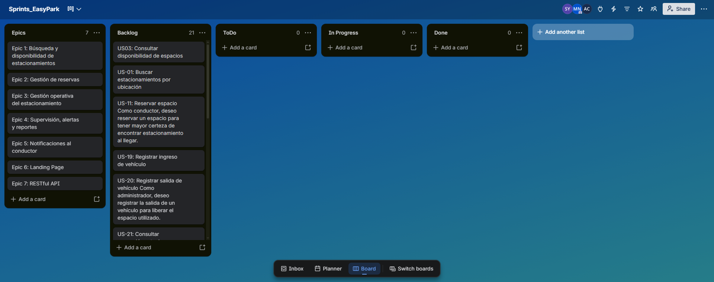

# Capítulo III: Requirements Specification

Este capítulo presenta la especificación de los requisitos de EasyPark a partir del análisis de la información obtenida en las investigaciones previas. Se detallan las User Stories y Technical Stories derivadas de los Epics identificados, el Impact Mapping que vincula los objetivos de negocio con los segmentos objetivo, y el Product Backlog priorizado para el desarrollo del producto.

## 3.1. User Stories

A continuación se presenta el conjunto de Epics y User Stories identificadas para EasyPark. Cada User Story incluye sus criterios de aceptación redactados en tiempo presente, tercera persona y bajo la estructura Gherkin (Given-When-Then). Se incluyen también las User Stories correspondientes al sitio web estático (Landing Page), redactadas con el rol *visitante* y sus variantes por segmento (*visitante conductor*, *visitante administrador*).

| Epic / Story ID | Título | Descripción | Criterios de Aceptación | Relacionado con (Epic ID) |
|---|---|---|---|---|
| EP-01 | Búsqueda y disponibilidad de estacionamientos | Épica que agrupa las historias relacionadas con la búsqueda, consulta y comparación de estacionamientos disponibles para el conductor. | - | - |
| EP-02 | Gestión de reservas | Épica que agrupa las historias relacionadas con la creación, consulta y cancelación de reservas de espacios de estacionamiento. | - | - |
| EP-03 | Gestión operativa del estacionamiento | Épica que agrupa las historias relacionadas con el registro de ingresos y salidas de vehículos, y la administración de espacios y zonas del estacionamiento. | - | - |
| EP-04 | Supervisión, alertas y reportes | Épica que agrupa las historias relacionadas con la supervisión remota del estacionamiento, las alertas operativas y los reportes de ocupación y movimientos. | - | - |
| EP-05 | Notificaciones al conductor | Épica que agrupa las historias relacionadas con las notificaciones enviadas al conductor sobre el estado de su estacionamiento o reserva. | - | - |
| EP-06 | Landing Page | Épica que agrupa las historias del sitio web estático dirigidas a los visitantes de EasyPark. | - | - |
| EP-07 | RESTful API | Épica que agrupa las Technical Stories que exponen las funcionalidades del sistema mediante el RESTful API consumido por las aplicaciones cliente. | - | - |
| US01 | Buscar estacionamientos por ubicación | Como conductor, quiero buscar estacionamientos según una ubicación para encontrar alternativas cercanas a mi destino. | 1. **Given** que existen estacionamientos registrados relacionados con la ubicación ingresada, **When** el conductor realiza la búsqueda indicando una ubicación, **Then** EasyPark muestra los estacionamientos encontrados. 2. **Given** que no existen estacionamientos relacionados con la ubicación ingresada, **When** el conductor realiza la búsqueda, **Then** EasyPark informa que no se encontraron resultados. | EP-01 |
| US02 | Consultar estacionamientos disponibles | Como conductor, quiero consultar estacionamientos disponibles para reducir el tiempo dedicado a buscar un espacio. | 1. **Given** que existen estacionamientos con al menos un espacio disponible, **When** el conductor consulta los estacionamientos disponibles, **Then** EasyPark muestra los establecimientos que actualmente poseen disponibilidad. 2. **Given** que ningún estacionamiento posee espacios disponibles, **When** el conductor realiza la consulta, **Then** EasyPark informa que actualmente no existen estacionamientos disponibles. | EP-01 |
| US03 | Consultar disponibilidad de espacios | Como conductor, quiero conocer la disponibilidad de espacios para decidir si dirigirme al estacionamiento. | 1. **Given** que el estacionamiento seleccionado posee espacios registrados, **When** el conductor consulta su disponibilidad, **Then** EasyPark muestra la cantidad de espacios disponibles. 2. **Given** que todos los espacios del estacionamiento se encuentran ocupados, **When** el conductor consulta su disponibilidad, **Then** EasyPark muestra que existen cero espacios disponibles. 3. **Given** que se registra correctamente el ingreso o salida de un vehículo, **When** cambia la ocupación del estacionamiento, **Then** EasyPark actualiza la cantidad de espacios disponibles. | EP-01 |
| US04 | Consultar tarifas | Como conductor, quiero conocer las tarifas para evaluar el costo antes de utilizar un estacionamiento. | 1. **Given** que el estacionamiento posee tarifas registradas, **When** el conductor consulta su información, **Then** EasyPark muestra las tarifas vigentes del establecimiento. 2. **Given** que la tarifa de un estacionamiento ha sido actualizada, **When** el conductor vuelve a consultarla, **Then** EasyPark muestra la tarifa vigente. | EP-01 |
| US05 | Consultar ubicación | Como conductor, quiero conocer la ubicación del estacionamiento para evaluar su cercanía a mi destino. | 1. **Given** que el estacionamiento posee una ubicación registrada, **When** el conductor consulta su información, **Then** EasyPark muestra la ubicación correspondiente. 2. **Given** que el estacionamiento no posee información de ubicación disponible, **When** el conductor realiza la consulta, **Then** EasyPark informa que dicha información no está disponible. | EP-01 |
| US06 | Consultar características del estacionamiento | Como conductor, quiero conocer las características de un estacionamiento para elegir una alternativa adecuada. | 1. **Given** que el estacionamiento posee características registradas, **When** el conductor consulta su información, **Then** EasyPark muestra las características disponibles del establecimiento. 2. **Given** que las características del estacionamiento han sido modificadas, **When** el conductor vuelve a consultarlas, **Then** EasyPark muestra la información actualizada. | EP-01 |
| US07 | Filtrar por disponibilidad | Como conductor, quiero filtrar estacionamientos con espacios disponibles para evitar revisar establecimientos ocupados. | 1. **Given** que la búsqueda contiene estacionamientos disponibles y ocupados, **When** el conductor aplica el filtro de disponibilidad, **Then** EasyPark muestra únicamente los estacionamientos que poseen espacios disponibles. 2. **Given** que ningún estacionamiento cumple con el filtro de disponibilidad, **When** el conductor aplica el filtro, **Then** EasyPark informa que no existen resultados. | EP-01 |
| US08 | Filtrar por tarifa | Como conductor, quiero filtrar estacionamientos según su tarifa para encontrar alternativas acordes con mi presupuesto. | 1. **Given** que existen estacionamientos con diferentes tarifas, **When** el conductor establece un rango de tarifa y aplica el filtro, **Then** EasyPark muestra únicamente los estacionamientos cuya tarifa se encuentra dentro del rango indicado. 2. **Given** que ningún estacionamiento posee una tarifa dentro del rango seleccionado, **When** el conductor aplica el filtro, **Then** EasyPark informa que no existen resultados. | EP-01 |
| US09 | Ordenar por cercanía | Como conductor, quiero ordenar estacionamientos según su cercanía para encontrar rápidamente los más próximos. | 1. **Given** que existen varios estacionamientos con información de ubicación, **When** el conductor selecciona la opción de ordenar por cercanía, **Then** EasyPark presenta los estacionamientos desde el más cercano hasta el más lejano. 2. **Given** que un estacionamiento no posee información suficiente para determinar su cercanía, **When** se realiza el ordenamiento, **Then** EasyPark evita utilizar dicho estacionamiento para calcular la proximidad. | EP-01 |
| US10 | Comparar estacionamientos | Como conductor, quiero comparar estacionamientos para seleccionar la alternativa que mejor se adapte a mis necesidades. | 1. **Given** que existen varios estacionamientos disponibles para consultar, **When** el conductor compara sus opciones, **Then** EasyPark proporciona información comparable de disponibilidad, tarifa y ubicación. 2. **Given** que alguno de los estacionamientos no posee determinada información, **When** el conductor realiza la comparación, **Then** EasyPark identifica los datos que no se encuentran disponibles. | EP-01 |
| US11 | Reservar espacio | Como conductor, quiero reservar un espacio para tener mayor certeza de encontrar estacionamiento al llegar. | 1. **Given** que existe disponibilidad para el periodo seleccionado, **When** el conductor confirma la reserva, **Then** EasyPark registra la reserva correctamente. 2. **Given** que no existen espacios disponibles para el periodo seleccionado, **When** el conductor intenta confirmar la reserva, **Then** EasyPark impide registrarla e informa que no existe disponibilidad. 3. **Given** que los datos requeridos para realizar la reserva están incompletos, **When** el conductor intenta confirmarla, **Then** EasyPark impide registrar la reserva hasta completar la información requerida. | EP-02 |
| US12 | Consultar reserva activa | Como conductor, quiero consultar mi reserva para comprobar que continúa vigente. | 1. **Given** que el conductor posee una reserva activa, **When** consulta sus reservas activas, **Then** EasyPark muestra la reserva vigente. 2. **Given** que el conductor no posee reservas activas, **When** realiza la consulta, **Then** EasyPark informa que actualmente no posee reservas activas. | EP-02 |
| US13 | Cancelar reserva | Como conductor, quiero cancelar una reserva que ya no utilizaré para liberar el espacio. | 1. **Given** que existe una reserva activa que puede ser cancelada, **When** el conductor confirma su cancelación, **Then** EasyPark cambia el estado de la reserva a cancelada y libera la disponibilidad asociada. 2. **Given** que la reserva ya se encuentra cancelada o finalizada, **When** el conductor intenta cancelarla, **Then** EasyPark rechaza la operación e informa que la reserva no puede cancelarse. | EP-02 |
| US14 | Recibir confirmación de reserva | Como conductor, quiero recibir una confirmación de mi reserva para saber que fue registrada correctamente. | 1. **Given** que una reserva se registra correctamente, **When** finaliza el proceso de reserva, **Then** EasyPark genera una confirmación indicando que la reserva fue registrada. 2. **Given** que la reserva no pudo registrarse, **When** finaliza el intento, **Then** EasyPark informa que la operación no fue confirmada. | EP-02 |
| US15 | Consultar historial de reservas | Como conductor, quiero consultar mis reservas anteriores para revisar los estacionamientos que he utilizado. | 1. **Given** que el conductor posee reservas anteriores, **When** consulta su historial, **Then** EasyPark muestra los registros de sus reservas anteriores. 2. **Given** que el conductor no posee reservas anteriores, **When** consulta su historial, **Then** EasyPark informa que no existen registros disponibles. | EP-02 |
| US16 | Consultar estado de reserva | Como conductor, quiero conocer el estado de mi reserva para saber si continúa activa, fue cancelada o finalizó. | 1. **Given** que existe una reserva registrada, **When** el conductor consulta su estado, **Then** EasyPark muestra si la reserva se encuentra activa, cancelada o finalizada. 2. **Given** que el estado de la reserva ha cambiado, **When** el conductor vuelve a consultarla, **Then** EasyPark muestra el estado actualizado. | EP-02 |
| US17 | Validar disponibilidad antes de reservar | Como conductor, quiero verificar que exista disponibilidad antes de confirmar una reserva para evitar inconsistencias. | 1. **Given** que existen espacios disponibles para el periodo seleccionado, **When** el conductor solicita continuar con la reserva, **Then** EasyPark permite continuar con el proceso. 2. **Given** que ya no existen espacios disponibles para el periodo seleccionado, **When** EasyPark valida la disponibilidad antes de confirmar, **Then** impide registrar la reserva e informa al conductor que no existe disponibilidad. | EP-02 |
| US18 | Consultar datos de la reserva | Como conductor, quiero consultar los datos de mi reserva para conocer las condiciones asociadas. | 1. **Given** que existe una reserva registrada, **When** el conductor consulta su detalle, **Then** EasyPark muestra el estacionamiento, estado y periodo asociados a la reserva. 2. **Given** que la reserva solicitada no existe, **When** el conductor intenta consultar sus datos, **Then** EasyPark informa que no se encontró el registro. | EP-02 |
| US19 | Registrar ingreso de vehículo | Como administrador, quiero registrar el ingreso de un vehículo para mantener actualizada la ocupación. | 1. **Given** que existe capacidad disponible en el estacionamiento, **When** el administrador registra un ingreso válido, **Then** EasyPark almacena el movimiento de ingreso. 2. **Given** que el ingreso fue registrado correctamente, **When** finaliza la operación, **Then** EasyPark actualiza la ocupación del estacionamiento. 3. **Given** que no existen espacios disponibles, **When** el administrador intenta registrar un nuevo ingreso, **Then** EasyPark impide completar la operación e informa que el estacionamiento no posee disponibilidad. | EP-03 |
| US20 | Registrar salida de vehículo | Como administrador, quiero registrar la salida de un vehículo para liberar el espacio utilizado. | 1. **Given** que el vehículo posee un ingreso activo, **When** el administrador registra su salida, **Then** EasyPark almacena el movimiento de salida. 2. **Given** que la salida fue registrada correctamente, **When** finaliza la operación, **Then** EasyPark libera el espacio asociado y actualiza la ocupación. 3. **Given** que el vehículo no posee un ingreso activo, **When** el administrador intenta registrar su salida, **Then** EasyPark rechaza la operación e informa que no existe un ingreso activo asociado. | EP-03 |
| US21 | Consultar ocupación actual | Como administrador, quiero conocer la ocupación actual para saber cuántos espacios se encuentran disponibles. | 1. **Given** que existen espacios y movimientos registrados, **When** el administrador consulta la ocupación actual, **Then** EasyPark muestra la cantidad de espacios disponibles y ocupados. 2. **Given** que se registra correctamente un nuevo ingreso o salida, **When** cambia la ocupación, **Then** EasyPark actualiza la información disponible para futuras consultas. | EP-03 |
| US22 | Consultar vehículo estacionado | Como administrador, quiero consultar un vehículo para conocer su ingreso y permanencia. | 1. **Given** que el vehículo posee un ingreso activo, **When** el administrador realiza su consulta, **Then** EasyPark muestra la información registrada sobre su ingreso y permanencia. 2. **Given** que el vehículo no posee un ingreso activo, **When** el administrador realiza la consulta, **Then** EasyPark informa que el vehículo no se encuentra registrado como estacionado. | EP-03 |
| US23 | Registrar espacios | Como administrador, quiero registrar los espacios de mi estacionamiento para mantener control sobre su capacidad. | 1. **Given** que el administrador proporciona los datos requeridos para un nuevo espacio, **When** confirma su registro, **Then** EasyPark incorpora el espacio al estacionamiento. 2. **Given** que el espacio ya se encuentra registrado, **When** el administrador intenta registrarlo nuevamente, **Then** EasyPark rechaza el registro duplicado. | EP-03 |
| US24 | Actualizar estado de espacio | Como administrador, quiero actualizar el estado de un espacio para reflejar correctamente su condición. | 1. **Given** que existe un espacio registrado, **When** el administrador selecciona un nuevo estado válido y confirma el cambio, **Then** EasyPark almacena el nuevo estado del espacio. 2. **Given** que el cambio de estado solicitado no es válido, **When** el administrador intenta actualizar el espacio, **Then** EasyPark rechaza la operación y conserva su estado anterior. | EP-03 |
| US25 | Gestionar zonas | Como administrador, quiero organizar los espacios por zonas para distribuir mejor los vehículos. | 1. **Given** que existen espacios registrados, **When** el administrador los asigna a una zona, **Then** EasyPark conserva la asociación entre los espacios y la zona seleccionada. 2. **Given** que una zona existente es modificada, **When** el administrador guarda los cambios, **Then** EasyPark actualiza las asociaciones correspondientes. | EP-03 |
| US26 | Clasificar espacios según tipo de usuario | Como administrador, quiero clasificar espacios según el tipo de usuario para mantener organizada su distribución. | 1. **Given** que existe un espacio registrado, **When** el administrador le asigna un tipo de usuario válido, **Then** EasyPark guarda la clasificación seleccionada. 2. **Given** que un espacio ya posee una clasificación, **When** el administrador modifica el tipo de usuario asociado, **Then** EasyPark actualiza la clasificación. | EP-03 |
| US27 | Reasignar vehículo | Como administrador, quiero reasignar un vehículo a otro espacio para resolver cambios operativos. | 1. **Given** que el vehículo se encuentra estacionado y existe otro espacio disponible, **When** el administrador confirma la reasignación, **Then** EasyPark actualiza el espacio asociado al vehículo. 2. **Given** que el espacio seleccionado para la reasignación se encuentra ocupado, **When** el administrador intenta confirmar el cambio, **Then** EasyPark rechaza la operación. | EP-03 |
| US28 | Consultar historial de movimientos | Como administrador, quiero consultar ingresos y salidas anteriores para disponer de un registro confiable de la operación. | 1. **Given** que existen movimientos registrados, **When** el administrador consulta el historial, **Then** EasyPark muestra los ingresos y salidas almacenados. 2. **Given** que el administrador selecciona un periodo de consulta, **When** solicita visualizar el historial, **Then** EasyPark muestra únicamente los movimientos pertenecientes al periodo seleccionado. 3. **Given** que no existen movimientos en el periodo seleccionado, **When** el administrador realiza la consulta, **Then** EasyPark informa que no existen registros para dicho periodo. | EP-03 |
| US29 | Recibir alerta por permanencia | Como administrador, quiero conocer cuando un vehículo excede el tiempo establecido para detectar situaciones irregulares. | 1. **Given** que un vehículo permanece en el estacionamiento por más tiempo del establecido, **When** EasyPark detecta que se excedió dicho límite, **Then** genera una alerta de permanencia. 2. **Given** que el vehículo todavía no supera el tiempo establecido, **When** EasyPark evalúa su permanencia, **Then** no genera una alerta. | EP-04 |
| US30 | Consultar alertas activas | Como administrador, quiero consultar las alertas activas para identificar situaciones que requieren atención. | 1. **Given** que existen alertas pendientes, **When** el administrador consulta las alertas activas, **Then** EasyPark muestra las alertas que todavía requieren atención. 2. **Given** que no existen alertas pendientes, **When** el administrador realiza la consulta, **Then** EasyPark informa que no existen alertas activas. | EP-04 |
| US31 | Resolver alerta | Como administrador, quiero marcar una alerta como resuelta para mantener actualizado el seguimiento de incidencias. | 1. **Given** que existe una alerta activa, **When** el administrador confirma que fue resuelta, **Then** EasyPark cambia su estado a resuelta. 2. **Given** que una alerta ya se encuentra resuelta, **When** el administrador vuelve a consultarla, **Then** EasyPark conserva y muestra su estado como resuelta. | EP-04 |
| US32 | Consultar reporte de ocupación | Como administrador, quiero consultar reportes de ocupación para analizar el uso de los espacios. | 1. **Given** que existen datos de ocupación registrados para el periodo seleccionado, **When** el administrador solicita el reporte, **Then** EasyPark muestra la información de ocupación correspondiente al periodo. 2. **Given** que no existen datos de ocupación para el periodo seleccionado, **When** el administrador solicita el reporte, **Then** EasyPark informa que no existen datos disponibles. | EP-04 |
| US33 | Consultar reporte de movimientos | Como administrador, quiero consultar reportes de ingresos y salidas para analizar el flujo de vehículos. | 1. **Given** que existen ingresos y salidas registrados, **When** el administrador solicita el reporte de movimientos, **Then** EasyPark muestra los movimientos correspondientes. 2. **Given** que el administrador selecciona un periodo determinado, **When** genera el reporte, **Then** EasyPark considera únicamente los movimientos registrados dentro de dicho periodo. 3. **Given** que no existen movimientos para el periodo seleccionado, **When** el administrador genera el reporte, **Then** EasyPark informa que no existen datos disponibles. | EP-04 |
| US34 | Consultar tiempos de permanencia | Como administrador, quiero consultar los tiempos de permanencia para comprender cuánto utilizan los clientes el estacionamiento. | 1. **Given** que existen ingresos y salidas registrados para los vehículos, **When** el administrador consulta los tiempos de permanencia, **Then** EasyPark muestra la duración correspondiente a cada estancia registrada. 2. **Given** que un vehículo todavía se encuentra dentro del estacionamiento, **When** el administrador consulta su permanencia, **Then** EasyPark muestra su tiempo de permanencia actual. | EP-04 |
| US35 | Supervisar estacionamiento remotamente | Como administrador, quiero consultar el estado del estacionamiento sin estar presente físicamente para mantener el control de la operación. | 1. **Given** que existe información operativa registrada, **When** el administrador consulta remotamente el estado del estacionamiento, **Then** EasyPark muestra la ocupación y los movimientos vigentes. 2. **Given** que se registra un nuevo ingreso o salida, **When** el administrador vuelve a consultar el estado del estacionamiento, **Then** EasyPark muestra la información operativa actualizada. | EP-04 |
| US36 | Notificación de tiempo restante | Como conductor, quiero conocer el tiempo restante de mi estacionamiento para evitar exceder el periodo previsto. | 1. **Given** que el conductor posee una estancia activa y se aproxima el final del periodo establecido, **When** se cumple la condición configurada para realizar el aviso, **Then** EasyPark genera una notificación de tiempo restante. 2. **Given** que todavía no se cumple la condición para enviar el aviso, **When** EasyPark evalúa la estancia activa, **Then** no genera la notificación de tiempo restante. | EP-05 |
| US37 | Notificación de vencimiento | Como conductor, quiero recibir un aviso cuando finalice mi periodo para evitar inconvenientes adicionales. | 1. **Given** que el conductor posee una estancia activa, **When** se alcanza el final del periodo establecido, **Then** EasyPark genera una notificación de vencimiento. 2. **Given** que la estancia finalizó antes del vencimiento originalmente previsto, **When** se alcanza la hora que había sido establecida como vencimiento, **Then** EasyPark no genera una nueva notificación. | EP-05 |
| US38 | Confirmación de ingreso | Como conductor, quiero recibir confirmación de mi ingreso para saber que mi vehículo fue registrado correctamente. | 1. **Given** que el ingreso del vehículo se registra correctamente, **When** finaliza el registro, **Then** EasyPark genera una confirmación de ingreso para el conductor. 2. **Given** que el ingreso no pudo ser registrado, **When** finaliza el intento, **Then** EasyPark informa que el ingreso no fue confirmado. | EP-05 |
| US39 | Confirmación de salida | Como conductor, quiero recibir confirmación de mi salida para saber que mi permanencia finalizó correctamente. | 1. **Given** que la salida del vehículo se registra correctamente, **When** finaliza el registro, **Then** EasyPark genera una confirmación de salida para el conductor. 2. **Given** que no existe una estancia activa asociada al vehículo, **When** se intenta registrar su salida, **Then** EasyPark informa que la operación no puede completarse. | EP-05 |
| US40 | Recordatorio de reserva | Como conductor, quiero recibir un recordatorio de una reserva próxima para no olvidar el espacio reservado. | 1. **Given** que el conductor posee una reserva futura activa y se aproxima el periodo reservado, **When** se cumple la condición establecida para enviar el recordatorio, **Then** EasyPark genera una notificación de recordatorio. 2. **Given** que la reserva fue cancelada antes del periodo reservado, **When** llega el momento en que se habría generado el recordatorio, **Then** EasyPark no envía la notificación. | EP-05 |
| US41 | Conocer EasyPark | Como visitante, quiero conocer qué es EasyPark para comprender el propósito de la solución. | 1. **Given** que el visitante accede al Landing Page, **When** consulta la sección informativa sobre EasyPark, **Then** encuentra una descripción del propósito de la solución. 2. **Given** que el visitante desea conocer la propuesta de valor, **When** revisa la información presentada, **Then** puede identificar el problema que EasyPark busca resolver. | EP-06 |
| US42 | Conocer beneficios para conductores | Como visitante conductor, quiero conocer los beneficios de EasyPark para evaluar si la solución satisface mis necesidades. | 1. **Given** que el visitante pertenece al segmento de conductores, **When** consulta la información sobre sus beneficios, **Then** encuentra información relacionada con búsqueda, disponibilidad y reservas. 2. **Given** que el visitante desea evaluar la utilidad de EasyPark, **When** revisa los beneficios para conductores, **Then** puede identificar las principales capacidades dirigidas a este segmento. | EP-06 |
| US43 | Conocer beneficios para administradores | Como visitante administrador, quiero conocer los beneficios de EasyPark para evaluar su utilidad en mi estacionamiento. | 1. **Given** que el visitante pertenece al segmento de administradores, **When** consulta la información sobre sus beneficios, **Then** encuentra información relacionada con gestión, supervisión y reportes. 2. **Given** que el visitante desea evaluar la utilidad de EasyPark para su estacionamiento, **When** revisa sus beneficios, **Then** puede identificar las capacidades dirigidas a administradores. | EP-06 |
| US44 | Conocer funcionalidades principales | Como visitante, quiero conocer las funcionalidades principales para comprender cómo EasyPark puede resolver el problema. | 1. **Given** que el visitante consulta la información del producto, **When** revisa la sección de funcionalidades, **Then** encuentra las principales capacidades disponibles en EasyPark. 2. **Given** que una funcionalidad no forma parte de la solución actual, **When** el visitante revisa las funcionalidades disponibles, **Then** EasyPark no la presenta como una capacidad actualmente disponible. | EP-06 |
| US45 | Conocer funcionamiento de reservas | Como visitante conductor, quiero conocer cómo funcionan las reservas para entender el proceso antes de utilizar EasyPark. | 1. **Given** que el visitante desea conocer la funcionalidad de reservas, **When** consulta la información correspondiente, **Then** encuentra una explicación sobre el propósito de realizar una reserva. 2. **Given** que el visitante desea conocer los beneficios de reservar un espacio, **When** revisa la información disponible, **Then** identifica que una reserva permite reducir la incertidumbre sobre la disponibilidad. | EP-06 |
| US46 | Conocer gestión digital para administradores | Como visitante administrador, quiero conocer cómo EasyPark digitaliza la operación para evaluar su adopción. | 1. **Given** que el visitante consulta información dirigida a administradores, **When** revisa la propuesta de EasyPark, **Then** encuentra información sobre registros, ocupación y supervisión. 2. **Given** que el administrador actualmente utiliza procesos manuales, **When** consulta las capacidades de EasyPark, **Then** puede identificar las alternativas de digitalización ofrecidas por la solución. | EP-06 |
| US47 | Conocer integración progresiva con IoT | Como visitante administrador, quiero conocer la posibilidad de incorporar IoT progresivamente para evaluar futuras mejoras de automatización. | 1. **Given** que el visitante desea conocer las posibilidades de integración tecnológica, **When** consulta la información relacionada con IoT, **Then** identifica que esta tecnología puede incorporarse progresivamente. 2. **Given** que el estacionamiento no dispone actualmente de sensores, **When** el visitante consulta los requisitos iniciales de EasyPark, **Then** identifica que el hardware especializado no es obligatorio para comenzar a utilizar la solución. | EP-06 |
| US48 | Consultar preguntas frecuentes | Como visitante, quiero consultar respuestas a preguntas frecuentes para resolver dudas antes de utilizar EasyPark. | 1. **Given** que el visitante posee una duda incluida dentro de las preguntas frecuentes, **When** consulta dicha sección, **Then** encuentra una respuesta relacionada con su consulta. 2. **Given** que el visitante desea conocer aspectos generales del servicio, **When** revisa las preguntas frecuentes, **Then** encuentra información sobre el funcionamiento general de EasyPark. | EP-06 |
| US49 | Contactar con EasyPark | Como visitante, quiero conocer los medios de contacto para comunicarme con el equipo responsable de EasyPark. | 1. **Given** que el visitante desea comunicarse con EasyPark, **When** consulta la información de contacto, **Then** encuentra los medios disponibles para comunicarse con el equipo responsable. 2. **Given** que el visitante pertenece a cualquiera de los segmentos objetivo, **When** busca la información de contacto, **Then** puede identificar al menos un medio disponible para comunicarse con EasyPark. | EP-06 |
| US50 | Acceder a la aplicación web | Como visitante, quiero acceder a la aplicación EasyPark para comenzar a utilizar el servicio. | 1. **Given** que la aplicación web se encuentra disponible, **When** el visitante selecciona la opción para acceder a EasyPark, **Then** puede continuar hacia la aplicación web. 2. **Given** que la aplicación web no se encuentra disponible, **When** el visitante intenta acceder, **Then** EasyPark informa que el acceso no puede completarse en ese momento. | EP-06 |
| TS01 | Servicio de búsqueda de estacionamientos | Como Developer, quiero obtener estacionamientos mediante el RESTful API para implementar las funcionalidades de búsqueda de EasyPark. | 1. **Given** que existen estacionamientos registrados que coinciden con los parámetros de búsqueda, **When** una aplicación cliente solicita los estacionamientos mediante el RESTful API, **Then** el servicio responde con los estacionamientos correspondientes. 2. **Given** que ningún estacionamiento coincide con los parámetros proporcionados, **When** la aplicación cliente realiza la consulta, **Then** el servicio responde sin resultados disponibles. | EP-07 |
| TS02 | Servicio de detalle de estacionamiento | Como Developer, quiero consultar los datos de un estacionamiento mediante el RESTful API para proporcionar su información a las aplicaciones cliente. | 1. **Given** que existe un estacionamiento registrado, **When** la aplicación cliente solicita su detalle utilizando su identificador, **Then** el servicio devuelve la información disponible del estacionamiento. 2. **Given** que el identificador solicitado no corresponde a un estacionamiento registrado, **When** la aplicación cliente realiza la consulta, **Then** el servicio informa que el recurso solicitado no fue encontrado. | EP-07 |
| TS03 | Servicio de disponibilidad | Como Developer, quiero consultar la disponibilidad mediante el RESTful API para proporcionar información actualizada sobre los espacios libres. | 1. **Given** que existe un estacionamiento con espacios registrados, **When** la aplicación cliente solicita su disponibilidad, **Then** el servicio devuelve la cantidad actual de espacios disponibles. 2. **Given** que todos los espacios del estacionamiento se encuentran ocupados, **When** se consulta la disponibilidad, **Then** el servicio devuelve una disponibilidad igual a cero. 3. **Given** que se registra correctamente un ingreso o salida, **When** se realiza una nueva consulta de disponibilidad, **Then** el servicio devuelve la cantidad actualizada de espacios libres. | EP-07 |
| TS04 | Servicio de tarifas | Como Developer, quiero consultar las tarifas mediante el RESTful API para proporcionar información económica de los estacionamientos. | 1. **Given** que un estacionamiento posee tarifas registradas, **When** la aplicación cliente solicita sus tarifas, **Then** el servicio devuelve las tarifas vigentes. 2. **Given** que un estacionamiento no posee tarifas disponibles, **When** se realiza la consulta, **Then** el servicio informa que no existe información de tarifas disponible. | EP-07 |
| TS05 | Servicio de ingreso de vehículos | Como Developer, quiero registrar ingresos de vehículos mediante el RESTful API para mantener actualizada la operación del estacionamiento. | 1. **Given** que existe capacidad disponible y los datos del vehículo son válidos, **When** la aplicación cliente solicita registrar su ingreso, **Then** el servicio almacena el movimiento de ingreso. 2. **Given** que no existen espacios disponibles, **When** se intenta registrar un nuevo ingreso, **Then** el servicio rechaza la operación e informa que no existe disponibilidad. 3. **Given** que el ingreso fue registrado correctamente, **When** finaliza la operación, **Then** el servicio actualiza la ocupación del estacionamiento. | EP-07 |
| TS06 | Servicio de salida de vehículos | Como Developer, quiero registrar salidas de vehículos mediante el RESTful API para liberar los espacios utilizados. | 1. **Given** que el vehículo posee un ingreso activo, **When** la aplicación cliente solicita registrar su salida, **Then** el servicio almacena el movimiento de salida. 2. **Given** que el vehículo no posee un ingreso activo, **When** se intenta registrar su salida, **Then** el servicio rechaza la operación. 3. **Given** que la salida fue registrada correctamente, **When** finaliza la operación, **Then** el servicio libera el espacio asociado y actualiza la ocupación. | EP-07 |
| TS07 | Servicio de ocupación | Como Developer, quiero consultar la ocupación mediante el RESTful API para obtener el estado actual del estacionamiento. | 1. **Given** que existen espacios registrados en el estacionamiento, **When** la aplicación cliente consulta la ocupación, **Then** el servicio devuelve la cantidad de espacios ocupados y disponibles. 2. **Given** que se registra un nuevo ingreso o salida, **When** se realiza posteriormente una consulta de ocupación, **Then** el servicio devuelve los valores actualizados. | EP-07 |
| TS08 | Servicio de creación de reservas | Como Developer, quiero crear reservas mediante el RESTful API después de validar la disponibilidad para permitir que los conductores aseguren un espacio. | 1. **Given** que la disponibilidad ya fue validada y los datos requeridos son correctos, **When** la aplicación cliente solicita crear una reserva, **Then** el servicio registra la reserva y devuelve su información. 2. **Given** que los datos necesarios para crear la reserva están incompletos o no son válidos, **When** se solicita crear la reserva, **Then** el servicio rechaza la operación e informa el error correspondiente. 3. **Given** que la disponibilidad cambió antes de registrar la reserva, **When** el servicio intenta completar la operación, **Then** la reserva no se registra. | EP-07 |
| TS09 | Servicio de consulta de reservas | Como Developer, quiero consultar reservas mediante el RESTful API para proporcionar su información a las aplicaciones cliente. | 1. **Given** que existen reservas asociadas al conductor, **When** la aplicación cliente solicita consultarlas, **Then** el servicio devuelve las reservas correspondientes. 2. **Given** que no existen reservas asociadas al conductor, **When** se realiza la consulta, **Then** el servicio responde sin reservas disponibles. 3. **Given** que existe una reserva específica, **When** la aplicación solicita su detalle mediante su identificador, **Then** el servicio devuelve sus datos y estado actual. | EP-07 |
| TS10 | Servicio de cancelación de reservas | Como Developer, quiero cancelar reservas mediante el RESTful API para liberar la disponibilidad asociada a reservas que ya no serán utilizadas. | 1. **Given** que existe una reserva activa que puede ser cancelada, **When** la aplicación cliente solicita su cancelación, **Then** el servicio actualiza su estado a cancelada. 2. **Given** que la reserva ya se encuentra cancelada o finalizada, **When** se intenta cancelarla nuevamente, **Then** el servicio rechaza la operación. 3. **Given** que una reserva fue cancelada correctamente, **When** finaliza la operación, **Then** el servicio libera la disponibilidad asociada. | EP-07 |
| TS11 | Servicio de gestión de espacios | Como Developer, quiero gestionar los espacios mediante el RESTful API para administrar la capacidad del estacionamiento. | 1. **Given** que se proporcionan los datos requeridos para un nuevo espacio, **When** la aplicación cliente solicita registrarlo, **Then** el servicio incorpora el espacio al estacionamiento. 2. **Given** que existe un espacio registrado, **When** la aplicación cliente solicita actualizar su estado, **Then** el servicio conserva el nuevo estado. 3. **Given** que un espacio ya existe, **When** se intenta registrar nuevamente con el mismo identificador, **Then** el servicio rechaza el registro duplicado. | EP-07 |
| TS12 | Servicio de gestión de zonas | Como Developer, quiero gestionar zonas mediante el RESTful API para soportar la organización de los espacios del estacionamiento. | 1. **Given** que existen espacios registrados, **When** la aplicación cliente solicita asociarlos a una zona, **Then** el servicio guarda las asociaciones correspondientes. 2. **Given** que existe una zona registrada, **When** la aplicación cliente solicita modificar su información, **Then** el servicio actualiza la zona y conserva sus asociaciones vigentes. 3. **Given** que la zona solicitada no existe, **When** la aplicación cliente intenta consultarla o modificarla, **Then** el servicio informa que el recurso no fue encontrado. | EP-07 |
| TS13 | Servicio de alertas | Como Developer, quiero consultar y actualizar alertas mediante el RESTful API para soportar la supervisión de situaciones que requieren atención. | 1. **Given** que existen alertas activas, **When** la aplicación cliente solicita consultarlas, **Then** el servicio devuelve las alertas pendientes. 2. **Given** que existe una alerta activa, **When** la aplicación cliente solicita marcarla como resuelta, **Then** el servicio actualiza su estado. 3. **Given** que no existen alertas activas, **When** la aplicación cliente realiza la consulta, **Then** el servicio responde sin alertas pendientes. | EP-07 |
| TS14 | Servicio de reportes de ocupación | Como Developer, quiero obtener información de ocupación mediante el RESTful API para generar reportes sobre el uso del estacionamiento. | 1. **Given** que existen datos de ocupación para el periodo solicitado, **When** la aplicación cliente solicita la información del reporte, **Then** el servicio devuelve los datos correspondientes al periodo. 2. **Given** que no existen datos de ocupación para el periodo solicitado, **When** se realiza la consulta, **Then** el servicio responde sin información disponible para dicho periodo. | EP-07 |
| TS15 | Servicio de reportes de movimientos | Como Developer, quiero obtener movimientos mediante el RESTful API para analizar los ingresos y salidas registrados en el estacionamiento. | 1. **Given** que existen movimientos registrados para el periodo solicitado, **When** la aplicación cliente solicita el reporte, **Then** el servicio devuelve los ingresos y salidas pertenecientes a dicho periodo. 2. **Given** que no existen movimientos para el periodo solicitado, **When** la aplicación cliente realiza la consulta, **Then** el servicio responde sin movimientos disponibles. | EP-07 |
| TS16 | Servicio de notificaciones | Como Developer, quiero obtener eventos de notificación mediante el RESTful API para informar a los conductores sobre eventos relacionados con su estacionamiento o reserva. | 1. **Given** que ocurre un evento que requiere informar al conductor, **When** el sistema genera el evento de notificación, **Then** el servicio lo pone a disposición de la aplicación cliente. 2. **Given** que no existe ningún evento pendiente de notificación, **When** la aplicación cliente consulta las notificaciones, **Then** el servicio responde sin notificaciones pendientes. 3. **Given** que una reserva fue cancelada o una estancia finalizó antes del evento programado, **When** llega el momento originalmente previsto para notificar, **Then** el sistema evita generar una notificación que ya no corresponde. | EP-07 |

## 3.2. Impact Mapping

El Impact Mapping es una técnica de planificación estratégica que permite relacionar los objetivos de negocio de EasyPark con los cambios de comportamiento esperados en cada segmento objetivo.

#### Impact Map - Segmento 1: Conductores (usuarios de estacionamientos)

#### Impact Map - Segmento 2: Administradores y el personal operativo de los estacionamientos

## 3.3. Product Backlog

Link del Trello: https://trello.com/b/KxGrDhN2/sprintseasypark

El orden del Product Backlog se estableció en función del valor para el negocio, priorizando las User Stories que habilitan las funcionalidades centrales de búsqueda, disponibilidad y reserva para el conductor, seguidas de las operaciones del administrador y, finalmente, las historias del sitio web estático (Landing Page).

| # Orden | User Story Id | Título | Descripción | Story Points (1 / 2 / 3 / 5 / 8) |
|---:|---|---|---|---:|
| 1 | US-03 | Consultar disponibilidad de espacios | Como conductor, quiero conocer la disponibilidad de espacios para decidir si dirigirme al estacionamiento. | 3 |
| 2 | US-01 | Buscar estacionamientos por ubicación | Como conductor, quiero buscar estacionamientos según una ubicación para encontrar alternativas cercanas a mi destino. | 5 |
| 3 | US-11 | Reservar espacio | Como conductor, quiero reservar un espacio para tener mayor certeza de encontrar estacionamiento al llegar. | 5 |
| 4 | US-19 | Registrar ingreso de vehículo | Como administrador, quiero registrar el ingreso de un vehículo para mantener actualizada la ocupación. | 5 |
| 5 | US-20 | Registrar salida de vehículo | Como administrador, quiero registrar la salida de un vehículo para liberar el espacio utilizado. | 5 |
| 6 | US-21 | Consultar ocupación actual | Como administrador, quiero conocer la ocupación actual para saber cuántos espacios se encuentran disponibles. | 3 |
| 7 | US-04 | Consultar tarifas | Como conductor, quiero conocer las tarifas para evaluar el costo antes de utilizar un estacionamiento. | 2 |
| 8 | US-05 | Consultar ubicación | Como conductor, quiero conocer la ubicación del estacionamiento para evaluar su cercanía a mi destino. | 3 |
| 9 | US-41 | Conocer EasyPark | Como visitante, quiero conocer qué es EasyPark para comprender el propósito de la solución. | 2 |
| 10 | US-42 | Conocer beneficios para conductores | Como visitante conductor, quiero conocer los beneficios de EasyPark para evaluar si satisface mis necesidades. | 2 |
| 11 | US-43 | Conocer beneficios para administradores | Como visitante administrador, quiero conocer los beneficios de EasyPark para evaluar su utilidad. | 2 |
| 12 | US-50 | Acceder a la aplicación web | Como visitante, quiero acceder a la aplicación EasyPark para comenzar a utilizar el servicio. | 2 |
| 13 | TS-03 | Servicio de disponibilidad | Como Developer, quiero consultar disponibilidad mediante el RESTful API para proporcionar información actualizada. | 3 |
| 14 | TS-05 | Servicio de ingreso de vehículos | Como Developer, quiero registrar ingresos mediante el RESTful API para mantener actualizada la operación. | 5 |
| 15 | TS-06 | Servicio de salida de vehículos | Como Developer, quiero registrar salidas mediante el RESTful API para liberar los espacios utilizados. | 5 |
| 16 | TS-08 | Servicio de creación de reservas | Como Developer, quiero crear reservas mediante el RESTful API para permitir que los conductores aseguren espacios. | 5 |
| 17 | US-17 | Validar disponibilidad antes de reservar | Como conductor, quiero verificar que exista disponibilidad antes de confirmar una reserva para evitar inconsistencias. | 3 |
| 18 | US-12 | Consultar reserva activa | Como conductor, quiero consultar mi reserva para comprobar que continúa vigente. | 3 |
| 19 | US-14 | Recibir confirmación de reserva | Como conductor, quiero recibir una confirmación de mi reserva para saber que fue registrada correctamente. | 3 |
| 20 | US-13 | Cancelar reserva | Como conductor, quiero cancelar una reserva que ya no utilizaré para liberar el espacio. | 5 |
| 21 | TS-09 | Servicio de consulta de reservas | Como Developer, quiero consultar reservas mediante el RESTful API para proporcionar su información a las aplicaciones cliente. | 3 |
| 22 | TS-10 | Servicio de cancelación de reservas | Como Developer, quiero cancelar reservas mediante el RESTful API para liberar espacios. | 5 |
| 23 | US-29 | Recibir alerta por permanencia | Como administrador, quiero conocer cuando un vehículo excede el tiempo establecido para detectar situaciones irregulares. | 5 |
| 24 | US-35 | Supervisar estacionamiento remotamente | Como administrador, quiero consultar el estado del estacionamiento sin estar presente físicamente para mantener el control de la operación. | 5 |
| 25 | US-36 | Notificación de tiempo restante | Como conductor, quiero conocer el tiempo restante de mi estacionamiento para evitar exceder el periodo previsto. | 3 |
| 26 | US-37 | Notificación de vencimiento | Como conductor, quiero recibir un aviso cuando finalice mi periodo para evitar inconvenientes adicionales. | 3 |
| 27 | US-32 | Consultar reporte de ocupación | Como administrador, quiero consultar reportes de ocupación para analizar el uso de los espacios. | 5 |
| 28 | US-33 | Consultar reporte de movimientos | Como administrador, quiero consultar reportes de ingresos y salidas para analizar el flujo de vehículos. | 5 |
| 29 | US-34 | Consultar tiempos de permanencia | Como administrador, quiero consultar los tiempos de permanencia para comprender cuánto utilizan los clientes el estacionamiento. | 3 |
| 30 | TS-13 | Servicio de alertas | Como Developer, quiero consultar y actualizar alertas mediante el RESTful API para soportar la supervisión. | 5 |
| 31 | TS-14 | Servicio de reportes de ocupación | Como Developer, quiero obtener información de ocupación mediante el RESTful API para generar reportes. | 5 |
| 32 | TS-15 | Servicio de reportes de movimientos | Como Developer, quiero obtener movimientos mediante el RESTful API para analizar ingresos y salidas. | 5 |
| 33 | US-22 | Consultar vehículo estacionado | Como administrador, quiero consultar un vehículo para conocer su ingreso y permanencia. | 3 |
| 34 | US-23 | Registrar espacios | Como administrador, quiero registrar los espacios de mi estacionamiento para mantener control sobre su capacidad. | 3 |
| 35 | US-24 | Actualizar estado de espacio | Como administrador, quiero actualizar el estado de un espacio para reflejar correctamente su condición. | 3 |
| 36 | US-25 | Gestionar zonas | Como administrador, quiero organizar los espacios por zonas para distribuir mejor los vehículos. | 5 |
| 37 | US-26 | Clasificar espacios según tipo de usuario | Como administrador, quiero clasificar espacios según el tipo de usuario para mantener organizada su distribución. | 5 |
| 38 | US-27 | Reasignar vehículo | Como administrador, quiero reasignar un vehículo a otro espacio para resolver cambios operativos. | 5 |
| 39 | US-28 | Consultar historial de movimientos | Como administrador, quiero consultar ingresos y salidas anteriores para disponer de un registro confiable de la operación. | 3 |
| 40 | TS-07 | Servicio de ocupación | Como Developer, quiero consultar la ocupación mediante el RESTful API para obtener el estado actual del estacionamiento. | 3 |
| 41 | TS-11 | Servicio de gestión de espacios | Como Developer, quiero gestionar espacios mediante el RESTful API para administrar la capacidad. | 5 |
| 42 | TS-12 | Servicio de gestión de zonas | Como Developer, quiero gestionar zonas mediante el RESTful API para soportar la organización de espacios. | 5 |
| 43 | US-02 | Consultar estacionamientos disponibles | Como conductor, quiero consultar estacionamientos disponibles para reducir el tiempo dedicado a buscar un espacio. | 3 |
| 44 | US-06 | Consultar características del estacionamiento | Como conductor, quiero conocer las características de un estacionamiento para elegir una alternativa adecuada. | 2 |
| 45 | US-07 | Filtrar por disponibilidad | Como conductor, quiero filtrar estacionamientos con espacios disponibles para evitar revisar establecimientos ocupados. | 3 |
| 46 | US-08 | Filtrar por tarifa | Como conductor, quiero filtrar estacionamientos según su tarifa para encontrar alternativas acordes con mi presupuesto. | 3 |
| 47 | US-09 | Ordenar por cercanía | Como conductor, quiero ordenar estacionamientos según su cercanía para encontrar rápidamente los más próximos. | 5 |
| 48 | US-10 | Comparar estacionamientos | Como conductor, quiero comparar estacionamientos para seleccionar la alternativa que mejor se adapte a mis necesidades. | 5 |
| 49 | TS-01 | Servicio de búsqueda de estacionamientos | Como Developer, quiero obtener estacionamientos mediante el RESTful API para implementar las funcionalidades de búsqueda de EasyPark. | 5 |
| 50 | TS-02 | Servicio de detalle de estacionamiento | Como Developer, quiero consultar los datos de un estacionamiento mediante el RESTful API para proporcionar su información a las aplicaciones cliente. | 3 |
| 51 | TS-04 | Servicio de tarifas | Como Developer, quiero consultar las tarifas mediante el RESTful API para proporcionar información económica de los estacionamientos. | 3 |
| 52 | US-15 | Consultar historial de reservas | Como conductor, quiero consultar mis reservas anteriores para revisar los estacionamientos que he utilizado. | 3 |
| 53 | US-16 | Consultar estado de reserva | Como conductor, quiero conocer el estado de mi reserva para saber si continúa activa, fue cancelada o finalizó. | 2 |
| 54 | US-18 | Consultar datos de la reserva | Como conductor, quiero consultar los datos de mi reserva para conocer las condiciones asociadas. | 2 |
| 55 | US-30 | Consultar alertas activas | Como administrador, quiero consultar las alertas activas para identificar situaciones que requieren atención. | 3 |
| 56 | US-31 | Resolver alerta | Como administrador, quiero marcar una alerta como resuelta para mantener actualizado el seguimiento de incidencias. | 3 |
| 57 | US-38 | Confirmación de ingreso | Como conductor, quiero recibir confirmación de mi ingreso para saber que mi vehículo fue registrado correctamente. | 2 |
| 58 | US-39 | Confirmación de salida | Como conductor, quiero recibir confirmación de mi salida para saber que mi permanencia finalizó correctamente. | 2 |
| 59 | US-40 | Recordatorio de reserva | Como conductor, quiero recibir un recordatorio de una reserva próxima para no olvidar el espacio reservado. | 3 |
| 60 | TS-16 | Servicio de notificaciones | Como Developer, quiero obtener eventos de notificación mediante el RESTful API para informar a los conductores. | 5 |
| 61 | US-44 | Conocer funcionalidades principales | Como visitante, quiero conocer las funcionalidades principales para comprender cómo EasyPark puede resolver el problema. | 2 |
| 62 | US-45 | Conocer funcionamiento de reservas | Como visitante conductor, quiero conocer cómo funcionan las reservas para entender el proceso antes de utilizar EasyPark. | 2 |
| 63 | US-46 | Conocer gestión digital para administradores | Como visitante administrador, quiero conocer cómo EasyPark digitaliza la operación para evaluar su adopción. | 2 |
| 64 | US-47 | Conocer integración progresiva con IoT | Como visitante administrador, quiero conocer la posibilidad de incorporar IoT progresivamente para evaluar futuras mejoras de automatización. | 2 |
| 65 | US-48 | Consultar preguntas frecuentes | Como visitante, quiero consultar respuestas a preguntas frecuentes para resolver dudas antes de utilizar EasyPark. | 2 |
| 66 | US-49 | Contactar con EasyPark | Como visitante, quiero conocer los medios de contacto para comunicarme con el equipo responsable de EasyPark. | 2 |