# Capítulo IV: Product Design

En este capítulo se presenta la propuesta de diseño de EasyPark, tomando como base las User Stories y el Impact Map del Capítulo III. La sección inicia con las decisiones visuales y de interacción comunes a todos los productos digitales de la solución, continúa con la arquitectura de información, los wireframes, mock-ups y flujos del Landing Page y de la Web Application, y cierra con la arquitectura de software orientada al dominio, el diseño orientado a objetos y el diseño de la base de datos.

La solución está compuesta por tres productos que comparten un mismo lenguaje visual: el **Landing Page**, que comunica el modelo de negocio a los dos segmentos objetivo; la **Web Application**, que soporta los procesos de conductores y administradores; y el **RESTful API** de elaboración interna, que concentra la lógica de negocio. La consistencia entre el Landing Page y la Web Application es un requisito del proyecto: los call-to-action del sitio informativo dirigen a cada segmento a la vista correspondiente de la aplicación.

## 4.1. Style Guidelines

El equipo definió un repositorio central de decisiones visuales que se aplica de forma idéntica en el Landing Page y en la Web Application. El punto de partida es **Material Design**, adaptado a las necesidades del dominio y materializado con **PrimeVue** como biblioteca de componentes de interfaz. La adaptación consistió en conservar los principios de Material Design (jerarquía por elevación y color, retroalimentación inmediata de las acciones y áreas de toque generosas) y sustituir la paleta y la tipografía por un sistema propio de EasyPark, más sobrio y con mayor densidad de información, porque las vistas del administrador muestran tablas, indicadores y mapas de espacios en una misma pantalla.

### 4.1.1. General Style Guidelines

**Branding.** EasyPark se presenta como una plataforma de gestión de estacionamientos en tiempo real. El logotipo combina un isotipo cuadrado de esquinas redondeadas (radio de 8 px) en el azul de marca con el logotipo tipográfico "EasyPark" en peso 700. En las vistas del segmento administrador el logotipo se acompaña del descriptor "· Admin", que identifica el contexto de trabajo sin necesidad de una marca distinta. La promesa de marca, presente en el hero del Landing Page, es *"Menos vueltas buscando, más control al administrar"*, y resume los beneficios de los dos segmentos objetivo en una sola frase.

**Tono de comunicación y lenguaje.** El tono se definió sobre las cuatro dimensiones propuestas por Nielsen Norman Group:

| Dimensión | Posición adoptada | Sustento |
|---|---|---|
| Divertido ↔ Serio | Serio con matices cercanos | El producto administra dinero, capacidad y control de accesos; la interfaz debe transmitir confianza, pero sin sonar burocrática. |
| Formal ↔ Casual | Neutro, ligeramente casual | Se utiliza el tuteo ("Encuentra disponibilidad cerca de tu destino") para acercarse al conductor, conservando precisión en los datos operativos. |
| Respetuoso ↔ Irreverente | Respetuoso | Los mensajes de error y las alertas describen la situación y la acción siguiente, sin culpar a la persona usuaria. |
| Entusiasta ↔ Sereno | Sereno | En situaciones críticas (capacidad al 98 %, permanencia excedida) la interfaz informa con calma y jerarquiza por color y severidad. |

El lenguaje de la interfaz emplea verbos en infinitivo para las acciones ("Reservar espacio", "Cancelar reserva", "Exportar reporte") y sustantivos breves para las etiquetas de navegación. El idioma por defecto de la solución es inglés (en_US) y se ofrece español latinoamericano (es_419) mediante internacionalización; las capturas de este informe corresponden a la versión en es_419.

**Colores.** La paleta se organiza en tres grupos: color de marca e interacción, texto y superficies, y estados semánticos. El patrón semántico es consistente en todo el sistema: cada estado (disponibilidad de espacio, estado de reserva, estado de alerta, estado de movimiento) usa siempre el mismo par de color de texto y fondo, sin importar la vista en la que aparece.

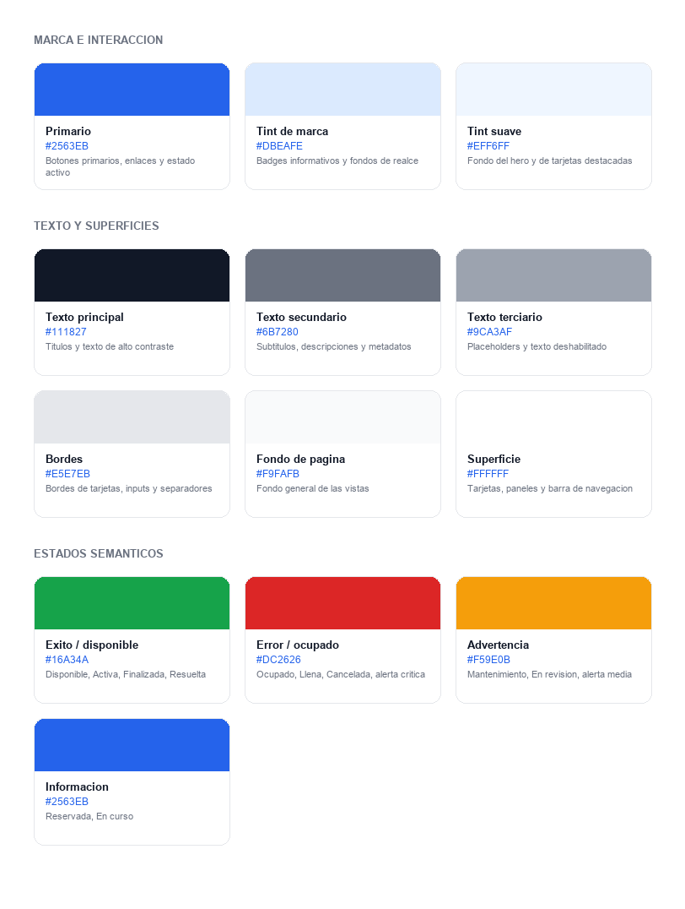

**Figura 4.1.** Muestras de color del sistema de diseño de EasyPark.

| Rol | Color | Hex | Uso |
|---|---|---|---|
| Primario / marca | Azul | `#2563EB` | Logotipo, botones primarios, enlaces activos y elementos interactivos |
| Fondo de marca (tint) | Azul claro | `#EFF6FF` / `#DBEAFE` | Badges informativos, hero y chips |
| Texto principal | Gris casi negro | `#111827` | Títulos y texto de alto contraste |
| Texto secundario | Gris medio | `#6B7280` | Subtítulos, descripciones y metadatos |
| Texto terciario | Gris claro | `#9CA3AF` | Placeholders, marcas de tiempo y texto deshabilitado |
| Bordes / divisores | Gris muy claro | `#E5E7EB` | Bordes de tarjetas, campos y separadores de tabla |
| Fondo de página | Gris hielo | `#F9FAFB` | Fondo general de las vistas de la aplicación |
| Superficie | Blanco | `#FFFFFF` | Tarjetas, paneles y barra de navegación |
| Éxito / disponible | Verde | `#16A34A` (texto) / `#DCFCE7` (fondo) | Estados Disponible, Activa, Finalizada y Resuelta |
| Error / ocupado | Rojo | `#DC2626` (texto) / `#FEE2E2` (fondo) | Estados Ocupado, Llena y Cancelada; alertas críticas |
| Advertencia | Ámbar | `#F59E0B` (texto) / `#FEF3C7` (fondo) | Estados Mantenimiento y En revisión; alertas medias |
| Información | Azul | `#2563EB` (texto) / `#DBEAFE` (fondo) | Estados Reservada y En curso |

**Tipografía.** La familia tipográfica es **Inter**, con `system-ui` como alternativa. Se emplean cinco pesos: 400 (regular), 500 (medium), 600 (semibold), 700 (bold) y 800 (extrabold), este último reservado para el hero del Landing Page. La escala tipográfica distingue con claridad la comunicación del sitio informativo, de mayor tamaño, de la densidad de datos de la aplicación.

| Estilo | Tamaño | Peso | Uso |
|---|---|---|---|
| Display (hero del Landing Page) | 48 px | 800 | Titular principal del sitio informativo |
| Título de sección (Landing Page) | 32 px | 800 | Encabezados de cada sección |
| Título de vista (aplicación) | 24 px | 700 | "Panel de control", "Mis reservas", "Alertas" |
| Título de panel o tarjeta | 15 px | 700 | Encabezados de tarjetas y paneles |
| Valor destacado (KPI) | 26 px | 700 | Cifras de los indicadores clave |
| Cuerpo | 13 px | 400–500 | Texto general, descripciones y navegación |
| Cuerpo pequeño | 12 px | 400–500 | Texto de tabla, metadatos y filtros |
| Micro / etiqueta | 11 px | 600–700 | Encabezados de tabla en mayúsculas (letter-spacing 0.02em), badges y eyebrows |

**Espaciado y grid.** El lienzo de trabajo es de 1440 px de ancho para escritorio, con un contenedor centrado de 1320 px en el Landing Page. La unidad base es de 4 px y todos los espacios son múltiplos de ella (4, 8, 12, 16, 20, 24, 28, 32, 40, 48, 60 y 80).

| Elemento | Espaciado |
|---|---|
| Barra de navegación | 16 px vertical / 40 px lateral |
| Cuerpo de página de la aplicación | 28 px superior, 40 px lateral, 48 px inferior |
| Secciones del Landing Page | 80 px vertical / 60 px lateral |
| Separación entre filtros | 12 px |
| Separación entre tarjetas o indicadores de una fila | 20 px |
| Separación entre columnas del Landing Page | 60 px |

Los radios de borde también responden a una escala fija: 8 px para botones, campos y badges de filtro; de 10 a 14 px para tarjetas, paneles y tarjetas de indicadores; de 16 a 20 px para los bloques grandes del Landing Page; y 999 px (pastilla) para badges de estado, chips y avatares.

**Iconografía.** Los iconos son vectores SVG lineales con trazo de 2 px, sin relleno sólido. No se emplean emoji ni tipografías de iconos: la decisión permite que cada icono se importe a Figma como forma editable y que herede el color semántico del contexto donde aparece; por ejemplo, el icono dentro de un chip de alerta crítica se dibuja en `#DC2626`. Cada icono se acompaña siempre de una etiqueta de texto, de modo que el significado no dependa únicamente de la forma ni del color.

**Accesibilidad del color.** Se verificaron las relaciones de contraste de las combinaciones del sistema frente al criterio 1.4.3 de las WCAG 2.1 (nivel AA):

| Combinación | Relación | Resultado |
|---|---|---|
| `#111827` sobre `#FFFFFF` | 17.74:1 | Cumple AAA |
| `#2563EB` sobre `#FFFFFF` | 5.17:1 | Cumple AA |
| `#FFFFFF` sobre `#2563EB` (botón primario) | 5.17:1 | Cumple AA |
| `#6B7280` sobre `#FFFFFF` | 4.83:1 | Cumple AA |
| `#2563EB` sobre `#DBEAFE` (badge informativo) | 4.24:1 | Cumple AA solo en texto de 11 px con peso 700 |
| `#16A34A` sobre `#DCFCE7` | 3.00:1 | No cumple para texto pequeño |
| `#DC2626` sobre `#FEE2E2` | 3.95:1 | No cumple para texto pequeño |
| `#F59E0B` sobre `#FEF3C7` | 1.93:1 | No cumple |
| `#9CA3AF` sobre `#FFFFFF` | 2.54:1 | Solo para texto deshabilitado |

A partir de esta verificación se adoptó una regla explícita: el color 600 de cada estado (`#16A34A`, `#DC2626`, `#F59E0B`) se reserva para elementos gráficos (iconos, barras de ocupación, puntos del mapa), donde el criterio aplicable es 1.4.11 con un mínimo de 3:1, mientras que el **texto** de los badges sobre fondo tintado usa la variante 700 del mismo matiz: `#15803D` sobre `#DCFCE7` (4.57:1), `#B91C1C` sobre `#FEE2E2` (5.33:1) y `#B45309` sobre `#FEF3C7` (4.51:1). El gris `#9CA3AF` se limita a placeholders y controles deshabilitados, exentos del requisito de contraste.

### 4.1.2. Web Style Guidelines

Las decisiones anteriores se materializan en estándares visuales y de interacción para interfaces web responsivas.

**Estructura y grid.** El Landing Page usa un grid de 12 columnas dentro de un contenedor de 1320 px con separación de 24 px, y alterna bloques de dos columnas (texto a la izquierda, elemento visual a la derecha) con bloques centrados de tres o cuatro tarjetas. La Web Application emplea un ancho fluido con un máximo de 1440 px y 40 px de espacio lateral; su patrón dominante es una fila superior de cuatro tarjetas de indicadores seguida de un área de contenido de dos columnas (2/3 y 1/3) que sostiene, por ejemplo, la tabla de movimientos junto al panel de alertas de acceso.

**Puntos de quiebre.** La interfaz se adapta a las dimensiones del dispositivo con cuatro puntos de quiebre:

| Punto de quiebre | Ancho | Comportamiento |
|---|---|---|
| Escritorio | ≥ 1280 px | Diseño completo: cuatro indicadores por fila y contenido a dos columnas. |
| Portátil | 1024–1279 px | Se conservan las dos columnas y se reduce el espacio lateral a 24 px. |
| Tableta | 768–1023 px | Los indicadores pasan a dos por fila y las columnas se apilan; el mapa se ubica debajo de los resultados. |
| Teléfono | < 768 px | Una sola columna, navegación colapsada en menú, filtros a ancho completo y tablas convertidas en tarjetas con pares etiqueta-valor. |

**Componentes.** El sistema define un conjunto reducido de componentes reutilizables, todos construidos sobre PrimeVue:

| Componente | Especificación |
|---|---|
| Botón primario | Fondo `#2563EB`, texto blanco 13 px peso 600, radio 8 px, relleno 12 px × 20 px. |
| Botón secundario | Fondo blanco, borde `#E5E7EB`, texto `#111827`; se usa para acciones reversibles como "Comparar" o "Cancelar reserva". |
| Campo de formulario | Altura 40 px, borde `#E5E7EB`, radio 8 px, placeholder en `#9CA3AF`, etiqueta superior de 12 px peso 600. |
| Tarjeta / panel | Superficie blanca, borde `#E5E7EB`, radio de 10 a 14 px, relleno de 20 a 24 px. |
| Tarjeta de indicador (KPI) | Etiqueta de 12 px en `#6B7280` y valor de 26 px peso 700, coloreado según la semántica del dato. |
| Tabla de datos | Encabezado de 11 px en mayúsculas sobre `#F9FAFB`, filas de 13 px separadas por líneas de 1 px en `#E5E7EB`. |
| Badge de estado | Pastilla de 999 px con el par de color semántico y texto de 11 px peso 700. |
| Chip de filtro | Pastilla con borde, etiqueta y valor seleccionado visible ("Zona: Todas", "Ordenar: Más cercano"). |
| Barra de ocupación | Riel de 6 px en `#E5E7EB` con relleno verde, ámbar o rojo según el umbral de ocupación. |

**Estados de interacción.** Cada elemento interactivo define cinco estados: normal; *hover*, que oscurece el fondo un 8 %; *focus*, con un anillo de 2 px en `#2563EB` separado 2 px del elemento, siempre visible para la navegación con teclado; *active*, con desplazamiento de 1 px; y *disabled*, con opacidad de 50 % y cursor no permitido. Las acciones que modifican datos muestran un estado de carga en el propio botón y confirman el resultado con un mensaje breve.

**Retroalimentación y estados vacíos.** Las confirmaciones se comunican con un mensaje flotante de 4 segundos ubicado en la esquina superior derecha; los errores de formulario se muestran bajo el campo afectado, en `#B91C1C`, acompañados de un icono y de la indicación de cómo corregirlos. Toda vista con contenido variable define su estado vacío con un texto que explica la situación y propone la acción siguiente, por ejemplo "Aún no tienes reservas registradas".

**Accesibilidad (a11y) e internacionalización (i18n).** La interfaz se construye con HTML semántico y se refuerza con atributos ARIA: `aria-label` en los controles que solo muestran icono, `aria-live="polite"` en los indicadores del panel de control y en la bandeja de notificaciones, `role="status"` en los mensajes de confirmación y `aria-sort` en las columnas ordenables. Toda la funcionalidad es accesible mediante teclado, con un orden de tabulación que sigue el orden visual y un enlace para saltar al contenido principal. Los textos residen en archivos de traducción para en_US y es_419, el atributo `lang` del documento cambia con el idioma seleccionado, y los formatos de fecha, hora y moneda (S/) se resuelven con la configuración regional activa, de modo que ninguna cadena queda escrita directamente en las vistas.

## 4.2. Information Architecture

La arquitectura de información define cómo se organiza, se nombra, se busca y se recorre el contenido en los dos productos de cara al usuario. El criterio rector es que cada segmento encuentre lo que necesita sin esfuerzo: el conductor resuelve una tarea puntual y urgente (encontrar un espacio antes de salir o al llegar a la zona), mientras que el administrador supervisa una operación completa y regresa varias veces al día a las mismas vistas.

### 4.2.1. Organization Systems

**Esquemas de organización visual.** Se aplican los tres esquemas según el tipo de contenido:

| Esquema | Dónde se aplica | Sustento |
|---|---|---|
| Jerárquico (visual hierarchy) | Landing Page y panel de control del administrador | En el Landing Page, el hero concentra la propuesta de valor y los call-to-action, y las secciones descienden en importancia hasta el contacto. En el panel de control, los cuatro indicadores encabezan la vista y debajo se despliega el detalle por zona. |
| Secuencial (step-by-step) | Registro de la cuenta, flujo de reserva y registro de acceso | La reserva avanza en pasos definidos: elegir estacionamiento, programar fecha, hora y duración, revisar el total estimado y confirmar. La sección "Reservas" del Landing Page anticipa esos mismos cuatro pasos numerados. |
| Matricial | Resultados de búsqueda, mapa de espacios, tablas de movimientos y reportes | Permiten recorrer el contenido por varios criterios a la vez: distancia, tarifa o disponibilidad en la búsqueda; fila y columna en el mapa de espacios; hora, zona, método y estado en el registro de accesos. |

**Esquemas de categorización del contenido.**

| Esquema | Aplicación |
|---|---|
| Por audiencia | Es el esquema principal. El Landing Page separa los bloques "Para conductores" y "Para administradores", y ofrece planes por rol; la Web Application presenta dos conjuntos de vistas distintos según el rol autenticado. |
| Por tópicos | La navegación de cada segmento agrupa el contenido por tema: Buscar, Mis reservas, Notificaciones y Perfil en el conductor; Dashboard, Accesos, Zonas y espacios, Alertas y Reportes en el administrador. |
| Cronológico | El historial de reservas, el registro de entradas y salidas, la bandeja de notificaciones (agrupada en "Hoy" y "Ayer") y el reporte de ingresos por día ordenan del evento más reciente al más antiguo. |
| Alfabético | Se reserva para listas auxiliares extensas y de valor equivalente, como el selector de distrito en los filtros de zonas. |

Adicionalmente, la información operativa se ordena por **severidad**: las alertas activas preceden a las resueltas y, dentro de las activas, las de severidad alta encabezan la lista.

### 4.2.2. Labeling Systems

Las etiquetas se redactan con el mínimo número de palabras, emplean el vocabulario del dominio definido en el Ubiquitous Language y se mantienen idénticas en todos los productos, de modo que el visitante que leyó "Reservas anticipadas" en el Landing Page encuentre "Mis reservas" en la aplicación sin ambigüedad.

| Etiqueta | Producto | Contenido que representa y asociación que produce |
|---|---|---|
| Buscar | Web Application (conductor) | Buscador por dirección o zona, resultados y mapa de disponibilidad. |
| Mis reservas | Web Application (conductor) | Reserva vigente en la parte superior e historial con sus estados. |
| Notificaciones | Web Application (conductor) | Avisos de confirmación, recordatorio, tiempo restante, ingreso y salida. |
| Perfil | Web Application (ambos) | Datos personales, rol, antigüedad y acciones de cuenta. |
| Dashboard | Web Application (administrador) | Indicadores del día y ocupación en vivo por zona. |
| Accesos | Web Application (administrador) | Registro digital de entradas y salidas y alertas de acceso. |
| Zonas y espacios | Web Application (administrador) | Alta y edición de zonas y mapa de estado de cada espacio. |
| Alertas | Web Application (administrador) | Situaciones que requieren atención y su resolución. |
| Reportes | Web Application (administrador) | Ocupación, ingresos, reservas completadas y exportación. |
| Zona | Ambos | Área de estacionamiento operada por un administrador, con dirección, tarifa y espacios propios (por ejemplo, "Zona A — Miraflores"). |
| Espacio | Ambos | Plaza individual identificada con un código ("P-14"). |
| Disponible / Ocupado / Mantenimiento | Web Application | Estado de un espacio en el mapa. |
| Activa / Llena / Mantenimiento | Web Application | Estado operativo de una zona. |
| Reservada / Finalizada / Cancelada | Web Application | Estado de una reserva. |
| Completado / En curso / Revisión / Rechazado | Web Application | Estado de un movimiento de acceso. |
| Quiénes somos, Beneficios, Funcionalidades, Precios, Testimonios, FAQ, Contacto | Landing Page | Secciones del sitio informativo, ancladas desde la barra superior. |
| Buscar estacionamiento / Soy administrador | Landing Page | Call-to-action que derivan a cada segmento a su vista inicial en la aplicación. |

Se evitan de forma deliberada los términos genéricos y las abreviaturas ambiguas; por ejemplo, se usa "Tiempo prom. de resolución" solo cuando la restricción de espacio lo exige y siempre acompañado del valor con su unidad ("6 min").

### 4.2.3. SEO Tags and Meta Tags

El Landing Page es el producto orientado a la captación, por lo que concentra el trabajo de posicionamiento; las vistas de la Web Application son privadas y se marcan como no indexables, conservando los metadatos necesarios para la correcta presentación en el navegador.

**Landing Page (`index.html`):**

```html
<title>EasyPark | Gestión de estacionamientos en tiempo real</title>
<meta name="description" content="EasyPark conecta a conductores que buscan espacio con administradores que necesitan controlar su ocupación, ingresos y reportes desde un solo lugar.">
<meta name="keywords" content="estacionamiento, parking, reserva de estacionamiento, disponibilidad en tiempo real, gestión de estacionamientos, control de accesos, Lima">
<meta name="author" content="ApexCode - EasyPark">
<meta name="robots" content="index, follow">
<meta property="og:title" content="EasyPark | Menos vueltas buscando, más control al administrar">
<meta property="og:description" content="Encuentra y reserva estacionamiento en segundos, o digitaliza la operación de tu estacionamiento con ocupación en vivo, alertas y reportes.">
<meta property="og:type" content="website">
<meta property="og:locale" content="es_PE">
<meta property="og:image" content="https://easypark.pe/assets/og-cover.png">
<meta name="twitter:card" content="summary_large_image">
<link rel="canonical" href="https://easypark.pe/">
```

| Página / vista | Title | Description | Keywords | Robots |
|---|---|---|---|---|
| Landing Page (inicio) | EasyPark \| Gestión de estacionamientos en tiempo real | EasyPark conecta a conductores que buscan espacio con administradores que necesitan controlar su ocupación, ingresos y reportes desde un solo lugar. | estacionamiento, reserva de estacionamiento, disponibilidad en tiempo real, gestión de estacionamientos | index, follow |
| Landing Page — Para conductores | Reserva tu estacionamiento en segundos \| EasyPark | Compara zonas cercanas por precio y disponibilidad, y asegura tu espacio con anticipación desde el navegador. | reservar estacionamiento, estacionamiento cerca de mí, tarifas de estacionamiento | index, follow |
| Landing Page — Para administradores | Digitaliza la gestión de tu estacionamiento \| EasyPark | Controla la ocupación en vivo, registra accesos sin papeleo y recibe alertas automáticas de capacidad y permanencia. | software de estacionamiento, control de accesos, reportes de ocupación | index, follow |
| Landing Page — Precios | Planes de EasyPark para conductores y administradores | La cuenta de conductor es gratuita; los administradores eligen el plan según el tamaño de su operación. | precios estacionamiento, plan starter, plan pro | index, follow |
| Web Application — Inicio de sesión | Iniciar sesión \| EasyPark | Accede a tu cuenta de conductor o administrador de EasyPark. | — | noindex, nofollow |
| Web Application — Buscar | Buscar estacionamientos \| EasyPark | Encuentra disponibilidad cerca de tu destino. | — | noindex, nofollow |
| Web Application — Mis reservas | Mis reservas \| EasyPark | Consulta tu reserva activa e historial. | — | noindex, nofollow |
| Web Application — Panel de control | Panel de control \| EasyPark Admin | Visión general de tu estacionamiento en tiempo real. | — | noindex, nofollow |
| Web Application — Reportes | Reportes y analítica \| EasyPark Admin | Desempeño de tus zonas de estacionamiento en el período seleccionado. | — | noindex, nofollow |

Complementan estas decisiones el atributo `lang` del documento, que acompaña al idioma activo (en_US o es_419), las etiquetas `hreflang` entre ambas versiones, el uso de un único `<h1>` por página y la incorporación de datos estructurados `schema.org/SoftwareApplication` en el Landing Page.

### 4.2.4. Searching Systems

La búsqueda es el corazón de la experiencia del conductor y un apoyo operativo para el administrador; en ambos casos el objetivo es evitar que la persona se pierda entre el volumen de información.

| Vista | Campo de búsqueda | Filtros | Presentación de resultados |
|---|---|---|---|
| Buscar estacionamientos (conductor) | "Buscar dirección o zona… (Ej. Miraflores)" | Disponibilidad, Tarifa y Ordenar (Más cercano, Menor tarifa, Mejor calificación) | Lista de tarjetas con nombre, distancia, espacios libres, calificación y tarifa por hora, sincronizada con los marcadores del mapa; el encabezado informa el total ("12 estacionamientos encontrados"). |
| Mis reservas (conductor) | — | Estado de la reserva y rango de fechas | Reserva activa destacada en la parte superior e historial en tabla ordenada de la más reciente a la más antigua. |
| Accesos (administrador) | "Buscar por placa o usuario…" | Zona y rango de fechas (con "Hoy" por defecto) | Tabla de movimientos con hora, tipo, zona y espacio, usuario y placa, método y estado. |
| Zonas y espacios (administrador) | "Buscar zona por nombre o distrito…" | Estado y Distrito | Tabla de zonas con capacidad, ocupados, estado y acciones, más el mapa de espacios de la zona seleccionada. |
| Alertas (administrador) | — | Estado, Zona y Tipo | Lista ordenada por severidad y antigüedad, con la acción "Resolver" en cada fila. |
| Reportes (administrador) | — | Rango de fechas y Zona | Indicadores del período, gráficos de ocupación e ingresos y resumen por zona. |

El comportamiento común a todas las búsquedas es el siguiente: los filtros se aplican de inmediato y muestran el valor seleccionado en el propio chip; la combinación de filtros y término de búsqueda se refleja en la URL, de modo que un resultado pueda compartirse o recuperarse al volver; cuando no existen coincidencias se presenta un estado vacío que explica el motivo y ofrece la acción de limpiar los filtros; y la búsqueda del conductor tolera errores menores de escritura y acentuación en los nombres de zona y distrito.

### 4.2.5. Navigation Systems

**Landing Page.** La navegación es horizontal y persistente. La barra superior fija contiene el logotipo, las anclas a las siete secciones del sitio y dos acciones de cuenta: "Iniciar sesión" (secundaria) y "Regístrate gratis" (primaria). El recorrido está diseñado para descender desde la propuesta de valor general hacia el contenido específico de cada segmento y cerrar en la conversión: hero, quiénes somos, beneficios comunes, bloque para conductores, bloque para administradores, funcionalidades, flujo de reserva, gestión para administradores, tecnología, testimonios, precios, preguntas frecuentes, contacto y llamado final a la acción. El pie de página repite los enlaces agrupados en Producto, Compañía y Cuenta, e incluye los términos y la política de privacidad.

**Vínculo entre productos.** Todos los call-to-action dirigen al usuario a la vista correspondiente de la Web Application según su segmento: "Buscar estacionamiento" y el plan Conductor conducen a la vista Buscar; "Soy administrador", "Empezar ahora" y "Hablar con ventas" conducen al Panel de control o al registro del plan elegido; "Iniciar sesión" y "Acceder a la aplicación" conducen al inicio de sesión. Tras autenticarse, la aplicación resuelve la vista inicial según el rol de la cuenta.

**Web Application.** La navegación principal también es horizontal y se mantiene fija en la parte superior, con un máximo de cinco elementos por segmento para reducir la carga cognitiva. El elemento activo se distingue por color primario y peso 600. A la derecha aparece la identidad de la persona autenticada y su avatar, que da acceso al perfil y al cierre de sesión.

| Segmento | Elementos de navegación | Vista inicial |
|---|---|---|
| Conductor | Buscar · Mis reservas · Notificaciones · Perfil | Buscar estacionamientos |
| Administrador y personal operativo | Dashboard · Accesos · Zonas y espacios · Alertas · Reportes | Panel de control |

Complementan la navegación principal tres mecanismos: la **navegación contextual**, que enlaza elementos relacionados entre vistas (una alerta del panel abre la vista Alertas filtrada por esa zona; una zona del mapa abre su detalle); la **navegación de retorno**, con el control "← Volver a resultados" en el detalle del estacionamiento, que preserva los filtros aplicados; y los **atajos de acción** situados en el encabezado de cada vista ("Escanear código", "+ Nueva zona", "Exportar reporte", "Marcar todas como leídas"), que anticipan la tarea más frecuente. En teléfono, la navegación principal se colapsa en un menú desplegable y las acciones del encabezado se mantienen visibles por ser el objetivo principal de la visita.

## 4.3. Landing Page UI Design

El Landing Page traduce las decisiones de estilo y de arquitectura de información en una página única de catorce secciones. La estructura responde a dos necesidades simultáneas: explicar el modelo de negocio a un visitante que no conoce el producto y separar con claridad la propuesta para cada segmento objetivo, de modo que el call-to-action correcto esté siempre a la vista. Por eso el recorrido alterna secciones comunes (beneficios, funcionalidades, testimonios) con secciones dirigidas a un solo segmento ("Para conductores", "Para administradores"), y ofrece dos acciones distintas desde el hero.

### 4.3.1. Landing Page Wireframe

El wireframe de baja fidelidad define la retícula, el orden de lectura y la jerarquía de cada sección antes de introducir color y tipografía definitivos.


**Figura 4.2.** Wireframe del Landing Page (escritorio, 1440 px).

La propuesta se apoya en los principios y elementos de diseño de la siguiente manera:

- **Jerarquía visual.** El hero ocupa la primera pantalla completa con un titular de dos líneas, un párrafo de apoyo, dos botones de distinto peso visual y tres cifras de respaldo. La acción primaria ("Buscar estacionamiento") se distingue de la secundaria ("Soy administrador") por relleno sólido frente a contorno, no solo por color.
- **Proximidad y agrupación.** Cada bloque de beneficio agrupa icono, título y descripción a menos de 12 px de separación interna, mientras que las secciones se separan 80 px entre sí, lo que permite reconocer los grupos sin recurrir a líneas divisorias.
- **Alineación y retícula.** Todo el contenido se alinea a un grid de 12 columnas dentro de un contenedor de 1320 px. Las secciones de dos columnas mantienen el texto a la izquierda y el elemento visual a la derecha, y alternan el orden en "Para administradores" para evitar la monotonía sin romper la retícula.
- **Repetición.** Las secciones comparten la misma estructura: eyebrow en pastilla, título, subtítulo y contenido. Esa repetición permite que el visitante anticipe dónde encontrar la información en cada bloque.
- **Contraste y ritmo.** Los fondos alternan entre blanco y gris hielo, y las secciones de tecnología y del llamado final utilizan fondo oscuro y fondo azul de marca respectivamente, marcando el cierre del recorrido.
- **Diseño inclusivo.** El wireframe reserva espacio para textos alternativos y descripciones visibles junto a cada elemento gráfico, define un solo `<h1>` y un orden de encabezados descendente, evita transmitir información únicamente por color (los planes se distinguen además por la etiqueta "Más elegido" y por el borde) y contempla áreas de toque de al menos 44 × 44 px en los controles.
- **Arquitectura de información.** El orden de las secciones refleja el esquema jerárquico descrito en 4.2.1 y la barra superior repite las mismas etiquetas definidas en 4.2.2, de modo que el ancla y la sección de destino coincidan siempre en su denominación.

En anchos menores a 768 px, el mismo wireframe se resuelve en una sola columna: la navegación se colapsa en un menú desplegable, el elemento visual de cada bloque de dos columnas se ubica debajo del texto, las tarjetas de beneficios y funcionalidades pasan a una por fila, el comparativo de planes se apila comenzando por el plan destacado, y los dos call-to-action del hero ocupan el ancho completo, apilados y separados 12 px.

### 4.3.2. Landing Page Mock-up

El mock-up incorpora el sistema de diseño completo: paleta, tipografía Inter, escala de espaciado, radios e iconografía lineal.

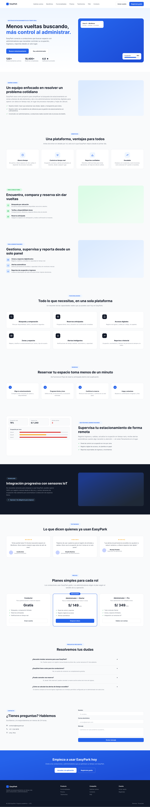

**Figura 4.3.** Mock-up del Landing Page (escritorio, 1440 px).

Las decisiones visibles en la propuesta de alta fidelidad son las siguientes:

- **Hero.** El titular combina el peso 800 a 48 px con un cambio de color en la segunda línea (`#111827` y `#2563EB`), que separa visualmente la promesa dirigida al conductor de la dirigida al administrador. A la derecha, una representación del producto sobre el azul de marca muestra una tarjeta de zona y un indicador de ocupación, anticipando la interfaz real de la aplicación.
- **Prueba de valor.** Las cifras "120+ estacionamientos activos", "18,400+ reservas completadas" y "4.8 de calificación promedio" se presentan bajo los botones, en tamaño 26 px con descriptor en gris secundario.
- **Secciones por segmento.** El bloque "Para conductores" utiliza tintes verdes para su elemento visual y el bloque "Para administradores" tintes azules, reforzando la separación de audiencias sin introducir colores ajenos al sistema.
- **Funcionalidades y flujo de reserva.** Seis tarjetas resumen las capacidades reales del producto, y una secuencia de cuatro pasos numerados explica el flujo de reserva con la misma redacción que después encuentra el usuario en la aplicación.
- **Transparencia sobre la tecnología.** La sección "Integración progresiva con sensores IoT", sobre fondo oscuro, aclara que la solución opera al 100 % con registro manual desde el primer día y que los sensores son opcionales. Esta decisión responde directamente a una de las objeciones detectadas en las entrevistas con administradores.
- **Testimonios y planes.** Los testimonios identifican el segmento de cada persona; el comparativo de planes marca el plan recomendado con la etiqueta "Más elegido", borde azul y botón primario, mientras que los otros dos usan botones secundarios.
- **Preguntas frecuentes y contacto.** El acordeón resuelve las dudas más frecuentes (necesidad de sensores, costo para conductores, cancelación de reservas y cálculo de alertas) y el formulario de contacto pide únicamente nombre, correo y mensaje.
- **Cierre y pie de página.** El bloque final, sobre azul de marca, repite las dos acciones de conversión, y el pie agrupa los enlaces en Producto, Compañía y Cuenta, con los datos de contacto y los enlaces a términos y privacidad.

## 4.4. Web Applications UX/UI Design

Esta sección presenta la propuesta visual y de interacción de la Web Application. La aplicación es única y resuelve los dos segmentos mediante rutas protegidas por rol: al autenticarse, el conductor llega a "Buscar estacionamientos" y el administrador al "Panel de control". Ambas experiencias comparten el mismo sistema de diseño, la misma barra de navegación superior y los mismos patrones de tabla, tarjeta y badge de estado; cambian las tareas, no el lenguaje visual.

### 4.4.1. Web Applications Wireframes

Los wireframes de baja fidelidad definen la estructura de once vistas. Se presentan primero las vistas comunes y del segmento conductor, y luego las del segmento administrador.


**Figura 4.4.** Wireframe — Inicio de sesión (vista compartida).

Tarjeta centrada de 380 px con marca, título, campos de correo y contraseña, opción de recordar sesión, recuperación de contraseña y acceso al registro. Al ser el punto de entrada para los dos segmentos, no anticipa ninguna navegación de rol.


**Figura 4.5.** Wireframe — Buscar estacionamientos (conductor).

Encabezado con título y descriptor, buscador a ancho completo y tres filtros alineados a la derecha. El contenido se divide en dos columnas: resultados en lista a la izquierda y mapa a la derecha, ambos a la misma altura para que la persona relacione cada resultado con su ubicación.


**Figura 4.6.** Wireframe — Programar reserva (conductor).

Formulario a la izquierda con la zona seleccionada, fecha, hora de inicio, duración y placa; resumen de la reserva a la derecha con el total estimado y la confirmación. La disposición mantiene visible el costo mientras la persona modifica los datos.


**Figura 4.7.** Wireframe — Mis reservas (conductor).

Panel superior destacado para la reserva vigente, con su acción de cancelación, y tabla inferior con el historial. La separación evita confundir lo que está en curso con lo ya ocurrido.


**Figura 4.8.** Wireframe — Notificaciones (conductor).

Lista de avisos con icono, título, descripción y hora, agrupada por día, y acción "Marcar todas como leídas" en el encabezado.


**Figura 4.9.** Wireframe — Mi perfil (vista compartida).

Tarjeta de identidad, panel de información personal en dos columnas y barra inferior de acciones. La vista es común a los dos segmentos y solo varía el contenido del rol.


**Figura 4.10.** Wireframe — Panel de control (administrador).

Fila de cuatro indicadores, panel de ocupación por zona con barras de progreso y panel lateral de alertas activas. Responde a la pregunta operativa inicial: qué tan lleno está, cuánto se ha recaudado y qué requiere atención.


**Figura 4.11.** Wireframe — Accesos y registro digital (administrador).

Indicadores del día, buscador por placa o usuario con filtros de zona y fecha, tabla de entradas y salidas y panel lateral de alertas de acceso. La acción "Escanear código" se ubica en el encabezado por ser la tarea más frecuente.


**Figura 4.12.** Wireframe — Zonas y espacios (administrador).

Buscador y filtros, tabla de zonas con capacidad, ocupados, estado y acciones, y mapa de espacios de la zona seleccionada en una cuadrícula de diez columnas.


**Figura 4.13.** Wireframe — Alertas (administrador).

Tres indicadores de gestión, filtros por estado, zona y tipo, y lista de alertas con la acción "Resolver" en cada fila.


**Figura 4.14.** Wireframe — Reportes y analítica (administrador).

Filtros de período y zona, cuatro indicadores del período, dos áreas reservadas para gráficos y tabla de resumen por zona, con la acción de exportación en el encabezado.

La vista "Detalle del estacionamiento" no cuenta con wireframe independiente porque reutiliza la estructura de dos columnas ya validada en "Programar reserva"; su especificación se resolvió directamente en alta fidelidad (Figura 4.24). En todos los wireframes se aplican los mismos criterios de diseño inclusivo descritos para el Landing Page: etiquetas visibles en cada campo, información de estado acompañada de texto, orden de lectura coincidente con el orden de tabulación y áreas de acción suficientemente amplias.

### 4.4.2. Web Applications Wireflow Diagrams

Los wireflows encadenan los wireframes de baja fidelidad siguiendo la ruta típica de cada objetivo de usuario. Cada paso corresponde a una pantalla y cada flecha indica la interacción que provoca la transición. Antes de construirlos, el equipo definió los *task flows* de cada objetivo para acordar la secuencia de pasos, y luego los representó con las pantallas ya diseñadas.

**WF-01. Reservar un espacio con anticipación.** *User goal:* como conductor, asegurar un espacio antes de salir hacia el destino.

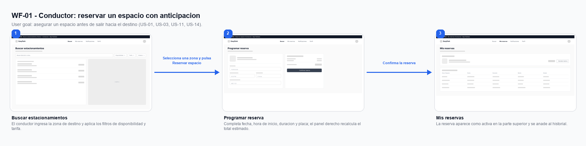

**Figura 4.15.** WF-01 — Conductor: reservar un espacio con anticipación.

El flujo parte de la búsqueda por zona con los filtros aplicados, continúa en el formulario de programación —donde el resumen recalcula el total estimado cada vez que cambia la duración— y termina en "Mis reservas", pantalla que refleja el nuevo estado con la reserva vigente en la parte superior. El cambio de estado se representa con una pantalla adicional, no con una anotación sobre la pantalla anterior.

**WF-02. Cancelar una reserva vigente.** *User goal:* como conductor, liberar el espacio que ya no se utilizará.

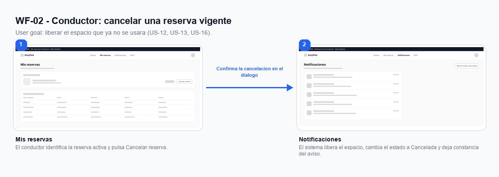

**Figura 4.16.** WF-02 — Conductor: cancelar una reserva vigente.

La cancelación se confirma en un diálogo intermedio para evitar acciones accidentales; al aceptar, el espacio se libera, la reserva pasa al historial con estado "Cancelada" y el aviso correspondiente queda registrado en la bandeja de notificaciones.

**WF-03. Iniciar sesión y revisar la cuenta.** *User goal:* como conductor, entrar a la aplicación y verificar los datos del perfil.

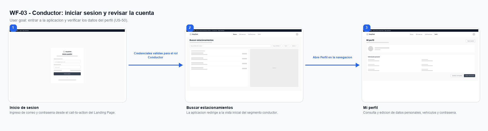

**Figura 4.17.** WF-03 — Conductor: iniciar sesión y revisar la cuenta.

El flujo evidencia la continuidad entre el Landing Page y la aplicación: el call-to-action del sitio informativo conduce al inicio de sesión y, una vez validadas las credenciales, la aplicación resuelve la vista inicial según el rol de la cuenta.

**WF-04. Registrar el ingreso de un vehículo.** *User goal:* como administrador o personal operativo, mantener actualizada la ocupación al recibir un vehículo.

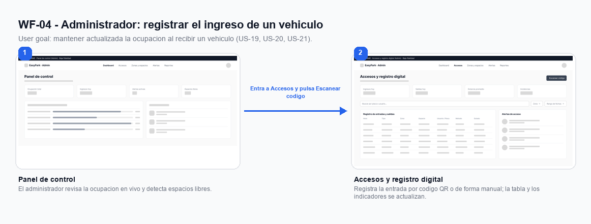

**Figura 4.18.** WF-04 — Administrador: registrar el ingreso de un vehículo.

Desde el panel de control se accede a "Accesos", se escanea el código o se registra el movimiento de forma manual, y tanto la tabla como los indicadores del día y la ocupación de la zona quedan actualizados.

**WF-05. Administrar zonas y espacios.** *User goal:* como administrador, mantener al día la capacidad y la clasificación de los espacios.

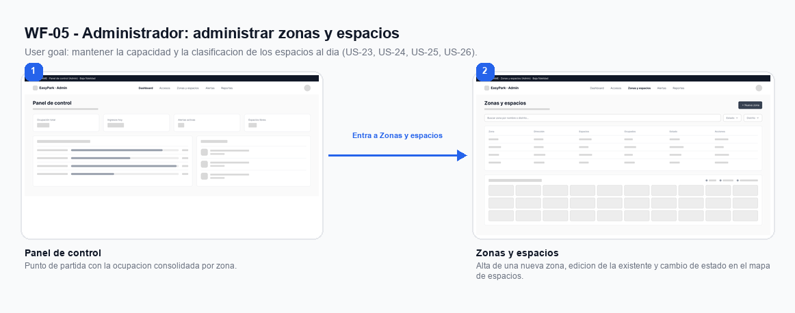

**Figura 4.19.** WF-05 — Administrador: administrar zonas y espacios.

**WF-06. Atender una alerta activa.** *User goal:* como administrador, resolver las situaciones que requieren atención.

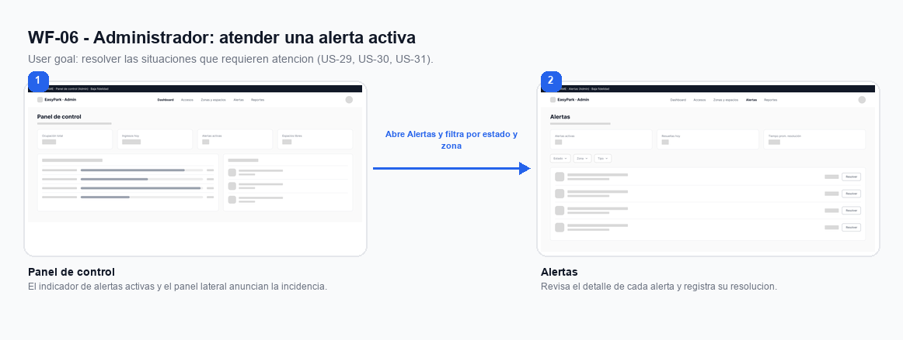

**Figura 4.20.** WF-06 — Administrador: atender una alerta activa.

**WF-07. Analizar el desempeño y exportar el reporte.** *User goal:* como administrador, sustentar decisiones con datos históricos.

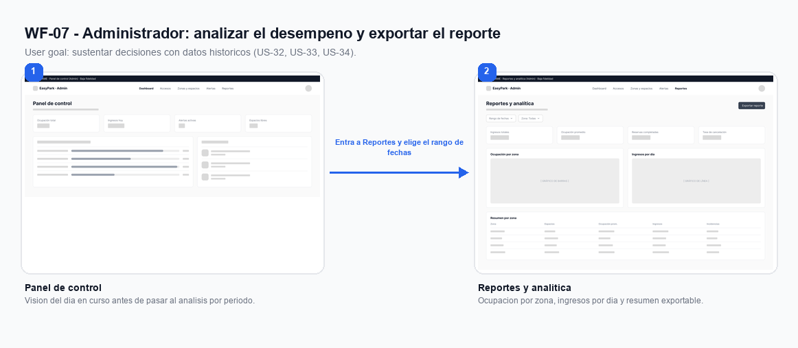

**Figura 4.21.** WF-07 — Administrador: analizar el desempeño y exportar el reporte.

En los tres últimos flujos se repite un mismo patrón de navegación: el panel de control funciona como punto de partida y origen de la navegación contextual, y cada vista especializada resuelve la tarea completa sin exigir pasos adicionales fuera de ella.

### 4.4.3. Web Applications Mock-ups

Los mock-ups aplican el sistema de diseño a cada una de las vistas especificadas. Se conservan la estructura y la jerarquía definidas en los wireframes, y se incorporan color semántico, tipografía, iconografía lineal y datos representativos del dominio.


**Figura 4.22.** Mock-up — Inicio de sesión.

El descriptor "Accede a tu cuenta de conductor o administrador" anticipa que una sola puerta de entrada sirve a los dos segmentos. El botón primario ocupa el ancho de la tarjeta y el enlace de recuperación se diferencia por color y peso, no solo por subrayado.


**Figura 4.23.** Mock-up — Buscar estacionamientos (conductor).

Cada resultado muestra distancia, espacios libres, calificación y tarifa por hora. La disponibilidad se codifica con un punto de color acompañado siempre de texto ("12 libres", "Zona llena"), y los marcadores del mapa replican ese mismo color, de modo que lista y mapa se leen como un solo conjunto.


**Figura 4.24.** Mock-up — Detalle del estacionamiento (conductor).

La vista resuelve la decisión de compra: precio, distancia y disponibilidad se presentan como tres datos destacados; las características se expresan en chips con icono y texto; y el panel derecho ofrece alternativas comparables antes de la acción principal "Reservar espacio".


**Figura 4.25.** Mock-up — Programar reserva (conductor).

El resumen desglosa tarifa por hora, duración y total estimado con el valor en 26 px, y la leyenda "Recibirás una confirmación al instante" fija la expectativa del resultado antes de confirmar.


**Figura 4.26.** Mock-up — Mis reservas (conductor).

La reserva vigente se distingue por una superficie con tinte azul y el badge "Reservada"; el historial emplea los badges "Finalizada" y "Cancelada" con el par de color semántico correspondiente, y los campos sin valor se representan con un guion en lugar de dejarse vacíos.


**Figura 4.27.** Mock-up — Notificaciones (conductor).

Los avisos se agrupan bajo los encabezados "Hoy" y "Ayer", y el icono de cada uno adopta el color del tipo de evento: ámbar para el tiempo restante, verde para las confirmaciones de ingreso y salida, y azul para la reserva y el recordatorio.


**Figura 4.28.** Mock-up — Mi perfil.

El rol se comunica con un badge azul junto al nombre y se repite como dato dentro de la información personal. Las acciones se ubican en una barra inferior, separadas del contenido de solo lectura.


**Figura 4.29.** Mock-up — Panel de control (administrador).

Cada indicador adopta el color de su significado: la recaudación en color neutro de alto contraste, las alertas activas en rojo y los espacios libres en verde. Las barras de ocupación por zona cambian de verde a ámbar y a rojo según el umbral, y el porcentaje se muestra siempre en texto junto a la barra.


**Figura 4.30.** Mock-up — Accesos y registro digital (administrador).

La tabla distingue el método de registro con icono y etiqueta ("QR" o "Manual") y el estado con los badges "Completado", "En curso", "Revisión" y "Rechazado". El panel lateral describe cada incidencia y su antigüedad, con un punto de color que codifica la severidad.


**Figura 4.31.** Mock-up — Zonas y espacios (administrador).

El mapa de espacios muestra el código de cada plaza sobre un fondo tintado según su estado y va acompañado de una leyenda explícita (Libre, Ocupado, Mantenimiento), de modo que el estado nunca dependa solo del color.


**Figura 4.32.** Mock-up — Alertas (administrador).

Cada alerta presenta icono, título, zona y espacio afectados, antigüedad, badge de estado y la acción "Resolver". Las alertas ya resueltas permanecen en la lista con su badge verde y sin acción disponible, lo que deja constancia de la gestión realizada.


**Figura 4.33.** Mock-up — Reportes y analítica (administrador).

El gráfico de barras reutiliza el color semántico de ocupación por zona y el gráfico de línea muestra la evolución de ingresos del período. La tabla inferior consolida espacios, ocupación promedio, ingresos e incidencias por zona, y el botón "Exportar reporte" se mantiene en el encabezado.

### 4.4.4. Web Applications User Flow Diagrams

Los user flows se derivan de los wireflows y los completan en dos aspectos: emplean los mock-ups de alta fidelidad y explicitan, junto a la ruta esperada (*happy path*), las rutas alternativas (*unhappy paths*) que el sistema debe resolver. Cada diagrama enuncia el objetivo de usuario, la secuencia de pantallas y la condición que desvía el flujo.

**UF-01. Buscar, comparar y elegir un estacionamiento.** *User goal:* como conductor, encontrar un espacio disponible cerca del destino y comparar alternativas antes de decidir.

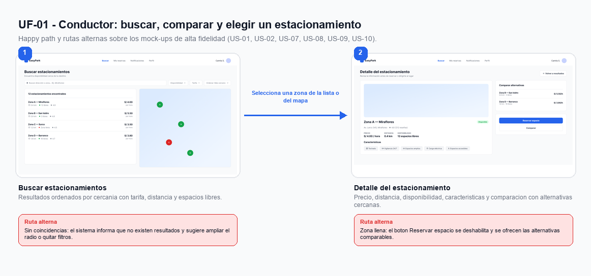

**Figura 4.34.** UF-01 — Conductor: buscar, comparar y elegir un estacionamiento.

Ruta esperada: la persona ingresa la zona de destino, aplica los filtros de disponibilidad y tarifa, ordena por cercanía y abre el detalle de una zona. Rutas alternativas: si la búsqueda no arroja coincidencias, se muestra el estado vacío con la sugerencia de ampliar el radio o quitar filtros; si la zona elegida está llena, la acción de reserva se deshabilita y se ofrecen las alternativas comparables del panel derecho.

**UF-02. Reservar y confirmar un espacio.** *User goal:* como conductor, asegurar el espacio con anticipación y recibir la confirmación.

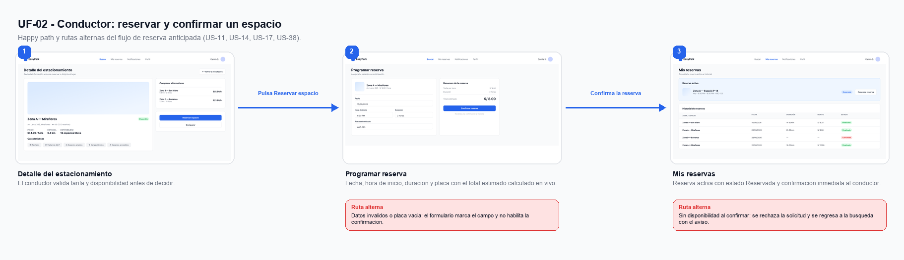

**Figura 4.35.** UF-02 — Conductor: reservar y confirmar un espacio.

Ruta esperada: detalle del estacionamiento, programación de fecha, hora, duración y placa, y confirmación con el total estimado. Rutas alternativas: datos incompletos o placa con formato inválido impiden habilitar la confirmación y marcan el campo afectado; si la disponibilidad se agota entre la consulta y la confirmación, la solicitud se rechaza y el sistema devuelve a la persona a la búsqueda con el aviso correspondiente.

**UF-03. Consultar, cancelar y seguir la reserva.** *User goal:* como conductor, verificar que la reserva sigue vigente, cancelarla si ya no la usará y mantenerse informado.

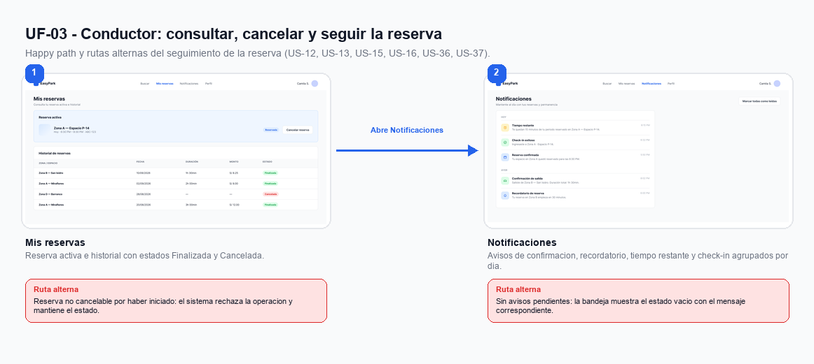

**Figura 4.36.** UF-03 — Conductor: consultar, cancelar y seguir la reserva.

Ruta esperada: consulta de la reserva vigente, cancelación con confirmación y revisión de los avisos de recordatorio, tiempo restante y vencimiento. Rutas alternativas: una reserva que ya inició no puede cancelarse y el sistema informa la restricción conservando el estado; si no existen avisos pendientes, la bandeja presenta su estado vacío.

**UF-04. Acceso a la aplicación y gestión de la cuenta.** *User goal:* como conductor, iniciar sesión y mantener actualizada su información.

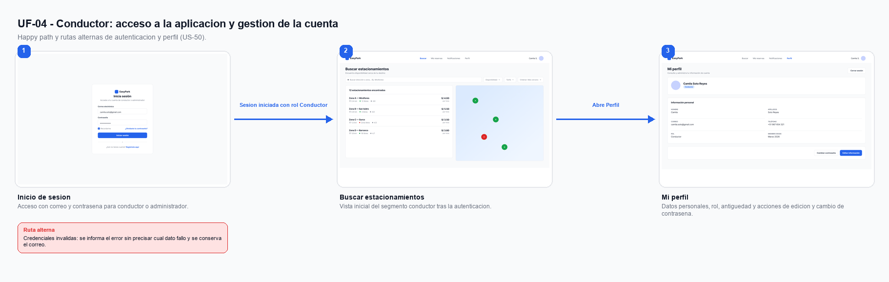

**Figura 4.37.** UF-04 — Conductor: acceso a la aplicación y gestión de la cuenta.

Ruta esperada: inicio de sesión, llegada a la vista inicial del rol y consulta o edición del perfil. Ruta alternativa: ante credenciales inválidas se informa el error sin precisar cuál de los dos datos falló, por seguridad, y se conserva el correo ingresado para no repetir el trabajo.

**UF-05. Supervisar la operación y registrar accesos.** *User goal:* como administrador o personal operativo, conocer el estado del estacionamiento y registrar el movimiento de los vehículos.

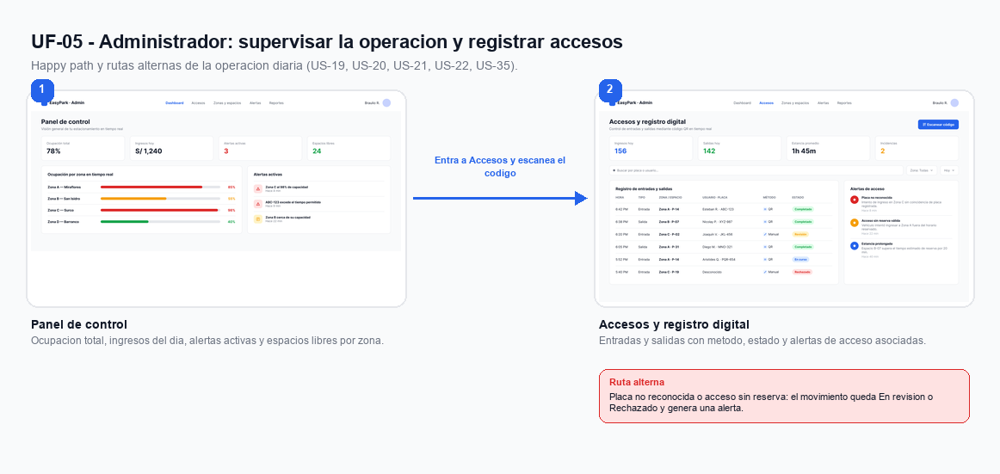

**Figura 4.38.** UF-05 — Administrador: supervisar la operación y registrar accesos.

Ruta esperada: lectura de los indicadores del panel, ingreso a "Accesos" y registro del movimiento por código QR. Rutas alternativas: si la placa no coincide con ninguna registrada, o si el vehículo intenta ingresar sin reserva vigente, el movimiento queda en estado "Revisión" o "Rechazado" y se emite la alerta de acceso correspondiente.

**UF-06. Administrar la capacidad y atender alertas.** *User goal:* como administrador, mantener la configuración de zonas y espacios y resolver las incidencias.

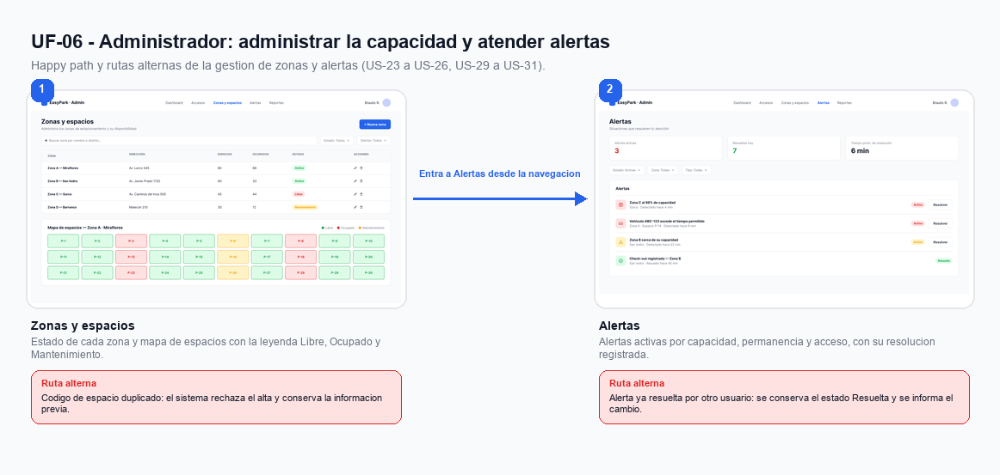

**Figura 4.39.** UF-06 — Administrador: administrar la capacidad y atender alertas.

Ruta esperada: alta o edición de una zona, actualización del estado de los espacios y resolución de las alertas activas. Rutas alternativas: un código de espacio duplicado dentro de la misma zona se rechaza conservando la información previa; una alerta ya resuelta por otra persona mantiene su estado y el sistema informa el cambio.

**UF-07. Analizar el desempeño por período.** *User goal:* como administrador, evaluar la operación con datos históricos y exportar el resultado.

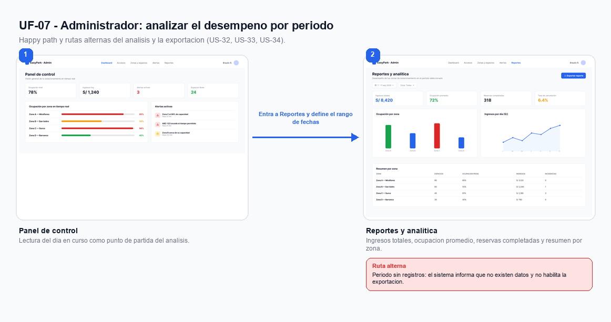

**Figura 4.40.** UF-07 — Administrador: analizar el desempeño por período.

Ruta esperada: selección del rango de fechas y de la zona, lectura de los indicadores y gráficos, y exportación del reporte. Ruta alternativa: un período sin registros presenta el estado vacío correspondiente y la exportación permanece deshabilitada.

## 4.5. Web Applications Prototyping

El prototipo de interfaz se construyó en Figma sobre los mock-ups descritos, con simulación de interacción y navegación para navegador de escritorio y de teléfono, siguiendo las rutas definidas en los user flows.

Los criterios que guiaron las decisiones de interacción fueron los siguientes:

- **Correspondencia con el sistema de navegación.** La barra superior se comporta como un componente persistente en todas las pantallas del prototipo; cada elemento conduce a la vista correspondiente del rol activo y refleja el estado activo, tal como se especificó en 4.2.5.
- **Transiciones que preservan el contexto.** El paso de la lista de resultados al detalle y el retorno mediante "← Volver a resultados" conservan los filtros aplicados, de modo que la comparación entre alternativas no obligue a rehacer la búsqueda.
- **Confirmación explícita de las acciones irreversibles.** La cancelación de una reserva y la eliminación de una zona se resuelven con un diálogo modal de confirmación; las demás acciones responden con un mensaje breve de resultado.
- **Retroalimentación inmediata.** Los cambios en la duración de la reserva actualizan el total estimado en el mismo momento, y el registro de un acceso actualiza la tabla y los indicadores sin recargar la vista.
- **Selección de tipos de interacción.** Se emplean desplegables para los filtros de valor único, entrada de texto con sugerencias para la búsqueda de zonas, cuadrícula seleccionable para el mapa de espacios y tablas con ordenamiento por columna para los registros históricos.
- **Equivalencia entre escritorio y teléfono.** El prototipo de teléfono conserva todas las tareas y reordena el contenido en una sola columna, con la navegación colapsada y las acciones principales fijas en el encabezado.

| Producto | Prototipo | Enlace |
|---|---|---|
| Landing Page (escritorio y teléfono) | Recorrido por las catorce secciones y verificación de los call-to-action hacia la aplicación | *(Por completar con el enlace público de Figma)* |
| Web Application — segmento conductor | Búsqueda, detalle, reserva, cancelación, notificaciones y perfil | *(Por completar con el enlace público de Figma)* |
| Web Application — segmento administrador | Panel de control, accesos, zonas y espacios, alertas y reportes | *(Por completar con el enlace público de Figma)* |

El video de demostración de los prototipos, con la explicación de los principales flujos de interacción de cada producto, se publica en Microsoft Stream y se referencia en el anexo de videos junto con la captura de video correspondiente.

## 4.6. Domain-Driven Software Architecture

Partiendo del Big Picture EventStorming del Capítulo II, el equipo profundizó el modelado del dominio hasta identificar agregados, comandos, eventos, políticas y modelos de lectura, y a partir de ellos delimitó los bounded contexts de la solución. Sobre esa base se elaboró la representación de la arquitectura de software aplicando el C4 Model. Los diagramas de esta sección se elaboraron como *diagram-as-code* con Mermaid; sus fuentes se versionan en la carpeta `diagrams/` del repositorio del informe, de modo que cada cambio en la arquitectura quede registrado con el mismo control de versiones que el código.

### 4.6.1. Design-Level EventStorming

El equipo realizó una sesión colaborativa de dos horas, organizada en cuatro momentos: revisión de la línea de tiempo de eventos obtenida en el Big Picture, incorporación de los comandos y actores que los provocan, identificación de los agregados que protegen las reglas de negocio, y descubrimiento de las políticas y los modelos de lectura que conectan un evento con el siguiente comando. Al cerrar la sesión se agruparon los elementos por afinidad de lenguaje y de reglas, y esa agrupación dio origen a los bounded contexts.

**Identity and Access Management:**


**Reservations:**

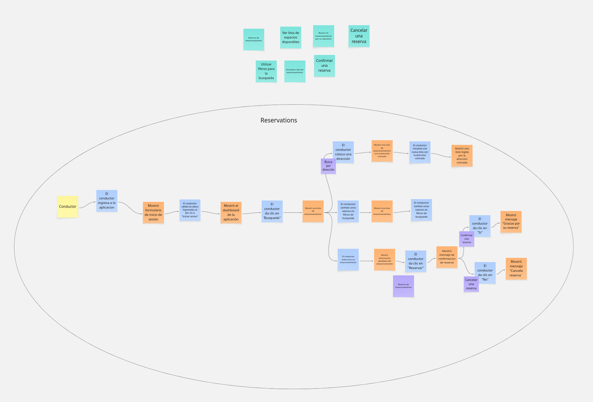


**Flujo del segmento conductor.** Cubre desde la búsqueda hasta la cancelación de la reserva.

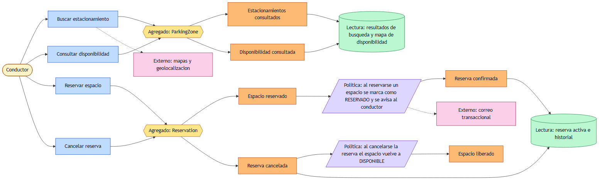

**Figura 4.41.** Design-Level EventStorming — flujo del conductor.

**Flujo del segmento administrador.** Cubre la configuración de zonas, el registro de accesos, la detección de alertas y la generación de reportes.

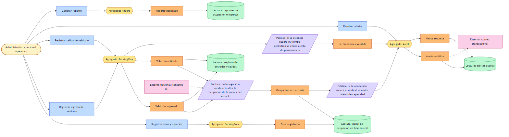

**Figura 4.42.** Design-Level EventStorming — flujo del administrador y del personal operativo.

Las políticas identificadas son el elemento que articula la solución y explican por qué la ocupación puede mantenerse en tiempo real sin sensores: cada movimiento de acceso actualiza el estado del espacio y de la zona; toda estancia que supera el tiempo permitido configurado por el administrador genera una alerta de permanencia; y toda ocupación que supera el umbral de la zona genera una alerta de capacidad. A su vez, las alertas y los cambios de estado de la reserva disparan las notificaciones dirigidas al conductor.

El siguiente cuadro resume, para cada bounded context, el agregado principal, los comandos que acepta, los eventos que publica y los modelos de lectura que alimenta.

| Bounded context | Agregado principal | Comandos | Eventos de dominio | Modelos de lectura |
|---|---|---|---|---|
| Identity and Access Management | UserAccount | Registrar cuenta, Iniciar sesión, Renovar token, Cerrar sesión | Cuenta registrada, Sesión iniciada, Sesión cerrada | Sesión vigente y rol |
| Profiles and Vehicles | Profile | Actualizar datos personales, Registrar vehículo, Definir vehículo por defecto | Perfil actualizado, Vehículo registrado | Ficha de perfil, Lista de vehículos |
| Parking Management | ParkingZone | Registrar zona, Registrar espacio, Actualizar tarifa, Cambiar estado del espacio | Zona registrada, Ocupación actualizada, Espacio liberado | Resultados de búsqueda, Mapa de espacios |
| Reservations | Reservation | Reservar espacio, Confirmar reserva, Cancelar reserva | Espacio reservado, Reserva confirmada, Reserva cancelada, Reserva expirada | Reserva vigente, Historial de reservas |
| Access Control | ParkingStay | Registrar ingreso, Registrar salida, Reasignar espacio | Vehículo ingresado, Vehículo retirado, Permanencia excedida | Registro de entradas y salidas |
| Monitoring and Alerts | Alert | Configurar regla, Resolver alerta | Alerta emitida, Alerta resuelta | Alertas activas |
| Analytics and Reporting | Report | Generar reporte, Exportar reporte | Reporte generado | Panel de control, Resumen por zona |
| Notifications | Notification | Enviar aviso, Marcar como leído | Aviso enviado, Aviso leído | Bandeja de notificaciones |

**Mapa de bounded contexts.** La agrupación resultante distingue los subdominios core, de soporte y genéricos, y explicita el patrón de relación entre ellos.

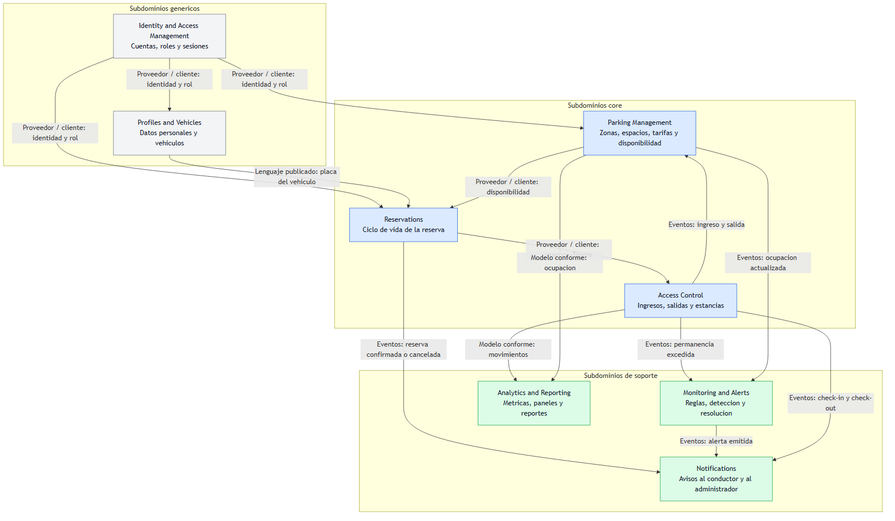

**Figura 4.43.** Mapa de bounded contexts y relaciones entre subdominios.

Los subdominios **core** concentran la ventaja competitiva de EasyPark: *Parking Management*, *Reservations* y *Access Control*. Los de **soporte** —*Monitoring and Alerts*, *Analytics and Reporting* y *Notifications*— reaccionan ante los eventos publicados por los anteriores. Los **genéricos** —*Identity and Access Management* y *Profiles and Vehicles*— resuelven necesidades comunes a cualquier plataforma de servicio. Las relaciones siguen tres patrones: proveedor/cliente entre *Parking Management* y *Reservations*, y entre *Reservations* y *Access Control*; publicación de eventos de dominio hacia los contextos de soporte; y modelo conforme en el caso de *Analytics and Reporting*, que consume la información de ocupación y movimientos tal como la publican los contextos core. La gestión de suscripciones y pagos de los planes comerciales, presente en el Landing Page, se reconoce como un subdominio de soporte previsto para una iteración posterior y por ello no forma parte del alcance modelado.

### 4.6.2. Software Architecture Context Diagram

El diagrama de contexto presenta EasyPark como una sola caja, rodeada por las personas que lo utilizan y los sistemas con los que intercambia información.

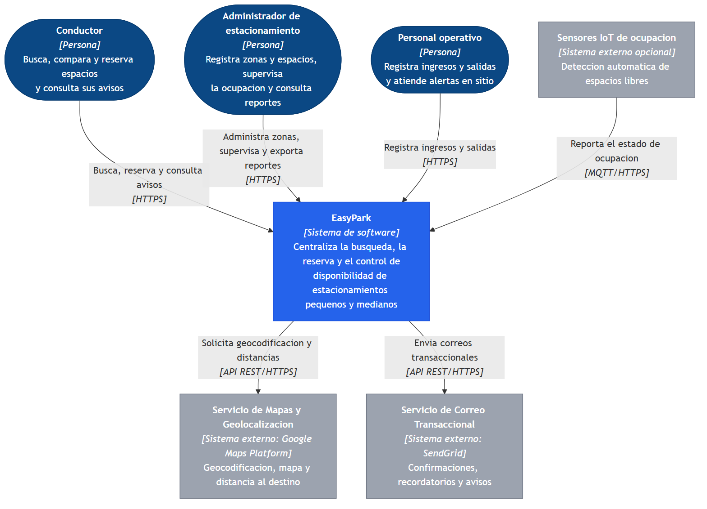

**Figura 4.44.** Diagrama de Contexto (C4, nivel 1).

Interactúan tres tipos de personas: el **conductor**, que busca, compara, reserva y consulta sus avisos; el **administrador de estacionamiento**, que configura zonas y espacios, supervisa la ocupación y consulta reportes; y el **personal operativo**, que registra ingresos y salidas en el punto de control. EasyPark se apoya en dos sistemas externos de terceros: un **servicio de mapas y geolocalización**, empleado para geocodificar las direcciones de las zonas, mostrar el mapa de resultados y calcular la distancia hasta el destino, y un **servicio de correo transaccional**, que entrega las confirmaciones, los recordatorios y los avisos de vencimiento. Se contempla, además, la integración opcional con **sensores IoT de ocupación** para las zonas que adopten esa tecnología; la solución opera de forma completa sin ellos, mediante registro digital manual o por código QR.

### 4.6.3. Software Architecture Container Diagrams

El diagrama de contenedores descompone el sistema en unidades desplegables de forma independiente y muestra las decisiones tecnológicas y los protocolos de comunicación.

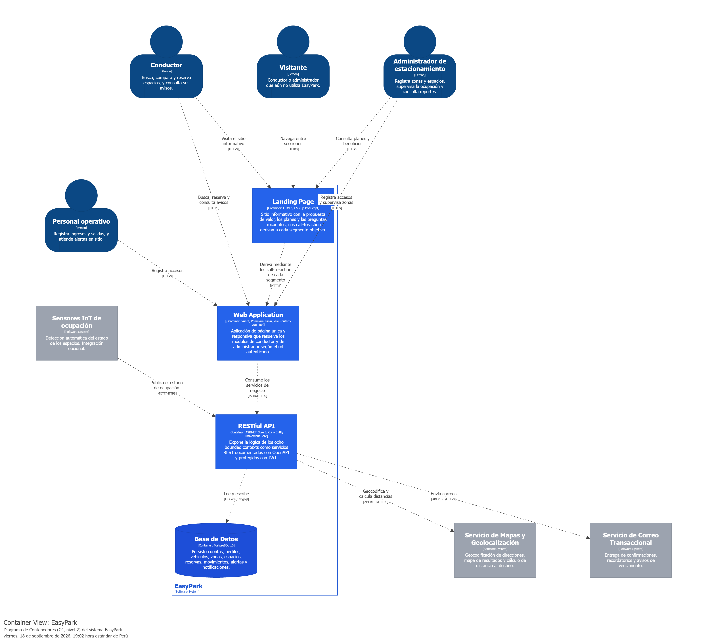

**Figura 4.45.** Diagrama de Contenedores (C4, nivel 2).

La solución se compone de cuatro contenedores:

| Contenedor | Tecnología | Responsabilidad |
|---|---|---|
| Landing Page | HTML5, CSS3 y JavaScript | Presentar el modelo de negocio a los dos segmentos y derivar a cada uno, mediante sus call-to-action, a la vista correspondiente de la aplicación. |
| Web Application | Vue 3, PrimeVue, Pinia, Vue Router y vue-i18n | Ofrecer la experiencia de usuario responsiva de los dos segmentos, resolviendo las rutas según el rol autenticado. |
| RESTful API | ASP.NET Core 8 con C# y Entity Framework Core | Concentrar la lógica de negocio de los ocho bounded contexts y exponerla como servicios REST documentados con OpenAPI y protegidos con JWT. |
| Base de Datos | PostgreSQL 16 | Persistir la información de todos los bounded contexts. |

La comunicación entre la Web Application y el API se realiza mediante JSON sobre HTTPS; el API accede a la base de datos a través de Entity Framework Core con el proveedor Npgsql, y consume los dos servicios externos mediante sus API REST. La separación entre el Landing Page y la Web Application responde a la naturaleza de cada producto: el primero es un sitio estático optimizado para posicionamiento y velocidad de carga, mientras que el segundo requiere estado de sesión y actualización frecuente de datos.

### 4.6.4. Software Architecture Components Diagrams

Cada contenedor se descompone en los bloques estructurales que lo conforman, con su responsabilidad y su tecnología.

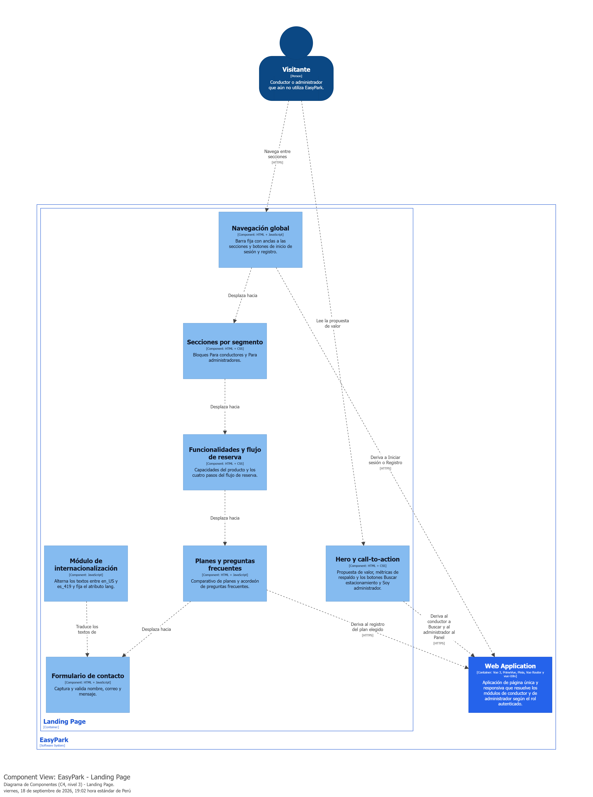

**Figura 4.46.** Diagrama de Componentes (C4, nivel 3) — Landing Page.

Los componentes del sitio informativo se corresponden con sus secciones y con dos elementos transversales: el módulo de internacionalización, que alterna entre en_US y es_419 y fija el atributo `lang`, y la navegación global, que además de desplazar el contenido resuelve la derivación hacia la Web Application.


**Figura 4.47.** Diagrama de Componentes (C4, nivel 3) — Web Application.

La aplicación organiza sus componentes en cuatro grupos: el núcleo (App Shell y Router, que aplica los guards por rol, y el módulo de autenticación), los módulos del segmento conductor, los módulos del segmento administrador y los servicios transversales (cliente HTTP con Axios, almacén de estado con Pinia y biblioteca de componentes de interfaz). Ningún módulo de vista accede directamente al API: todas las solicitudes pasan por el cliente HTTP, que adjunta el token y normaliza el tratamiento de errores.

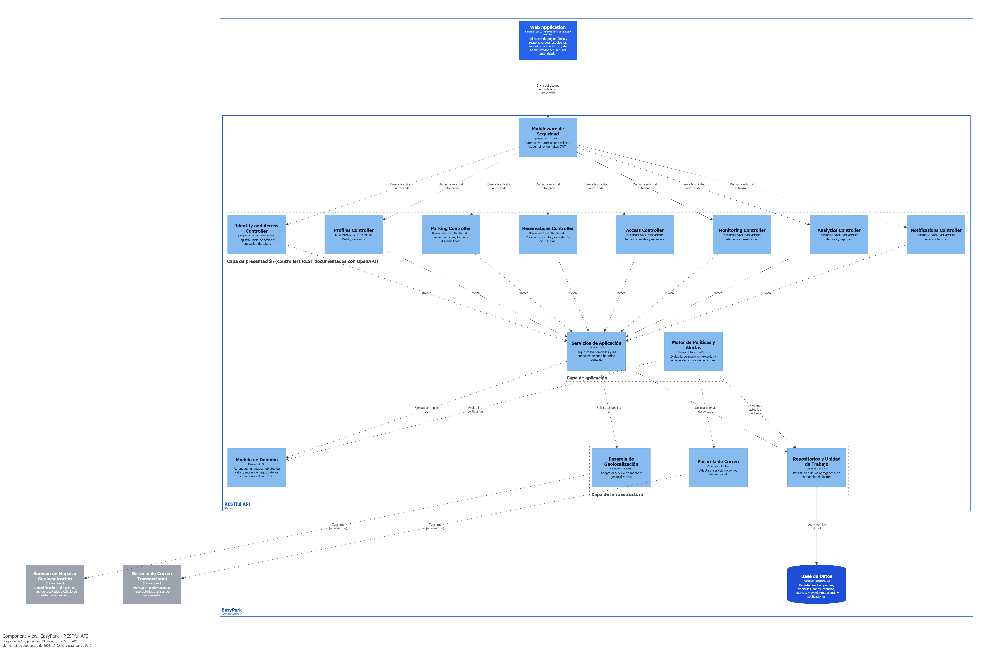

**Figura 4.48.** Diagrama de Componentes (C4, nivel 3) — RESTful API.

El API se estructura en cuatro capas. La **capa de presentación** agrupa un controller por bounded context, documentado con OpenAPI. La **capa de aplicación** contiene los servicios que orquestan comandos y consultas, junto con el motor de políticas, implementado como servicio en segundo plano, que evalúa la permanencia excedida y la capacidad crítica descritas en el EventStorming. La **capa de dominio** concentra agregados, entidades, objetos de valor y reglas de negocio, y no depende de ninguna otra capa. La **capa de infraestructura** implementa los repositorios con Entity Framework Core y las pasarelas hacia los servicios externos, de modo que un cambio de proveedor de mapas o de correo no afecte al dominio. El middleware de seguridad autentica y autoriza cada solicitud antes de que llegue a los controllers.

## 4.7. Software Object-Oriented Design

Esta sección detalla la implementación prevista de los componentes de cada bounded context. El diseño aplica los principios de Domain-Driven Design: cada contexto expone un agregado raíz que protege sus invariantes, los conceptos sin identidad propia se modelan como objetos de valor inmutables (`EmailAddress`, `PlateNumber`, `Money`, `GeoLocation`, `Address`, `DateRange`), y el acceso a la persistencia se declara mediante interfaces de repositorio en el dominio, cuya implementación reside en la capa de infraestructura. Las enumeraciones representan los estados que ya se comunican en la interfaz mediante badges, de modo que el lenguaje del código coincida con el del producto.

### 4.7.1. Class Diagrams

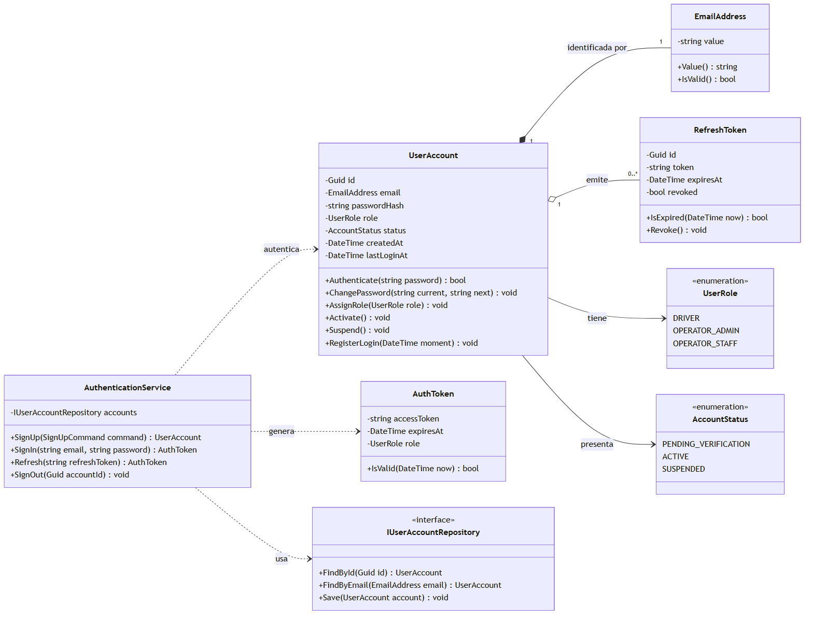

**Figura 4.49.** Diagrama de clases — Identity and Access Management.

`UserAccount` es el agregado raíz y concentra las reglas de autenticación y de cambio de estado de la cuenta. El rol determina la experiencia que resuelve la Web Application, y los `RefreshToken` permiten renovar la sesión sin volver a solicitar credenciales.

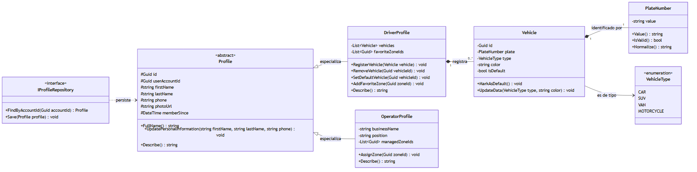

**Figura 4.50.** Diagrama de clases — Profiles and Vehicles.

`Profile` es una clase abstracta especializada en `DriverProfile` y `OperatorProfile`. El conductor administra sus vehículos, identificados por el objeto de valor `PlateNumber`, que normaliza y valida el formato de placa empleado luego en las reservas y en el control de accesos.

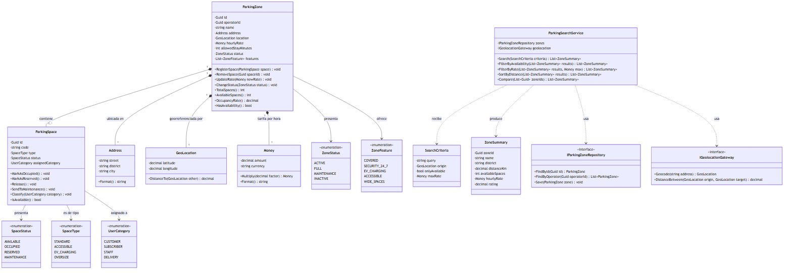

**Figura 4.51.** Diagrama de clases — Parking Management.

`ParkingZone` compone sus `ParkingSpace` y es responsable de calcular la ocupación y la disponibilidad, evitando que ese cálculo se disperse por la solución. `ParkingSearchService` resuelve la búsqueda, el filtrado y el ordenamiento de la vista del conductor, y delega el cálculo de distancias en la interfaz `IGeolocationGateway`, implementada por la pasarela del servicio de mapas.

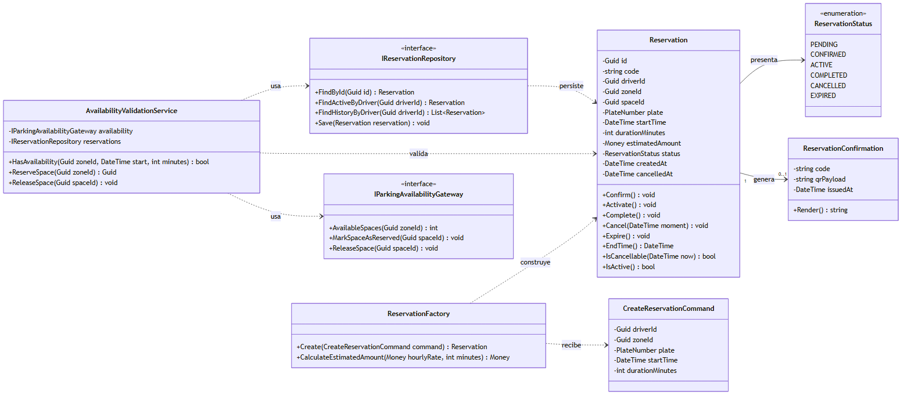

**Figura 4.52.** Diagrama de clases — Reservations.

`Reservation` controla su ciclo de vida completo (PENDING, CONFIRMED, ACTIVE, COMPLETED, CANCELLED y EXPIRED) y concentra la regla de cancelación: una reserva solo es cancelable mientras no haya iniciado. `AvailabilityValidationService` verifica la disponibilidad contra *Parking Management* mediante una interfaz, con lo que el contexto no depende de la implementación del otro.

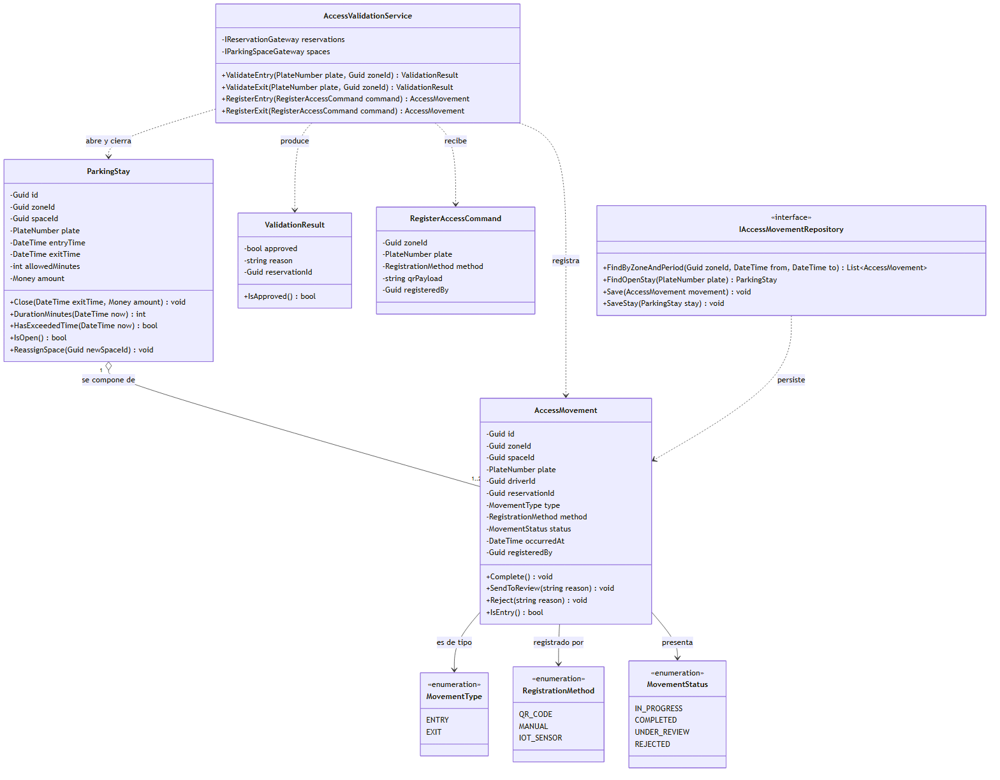

**Figura 4.53.** Diagrama de clases — Access Control.

`ParkingStay` representa la permanencia de un vehículo y se compone de uno o dos `AccessMovement` (ingreso y salida). La estancia calcula su duración y determina si excedió el tiempo permitido, condición que origina la alerta correspondiente. `AccessValidationService` resuelve la validación del ingreso y devuelve un `ValidationResult` que explica el motivo del rechazo cuando la placa no coincide o no existe reserva vigente.

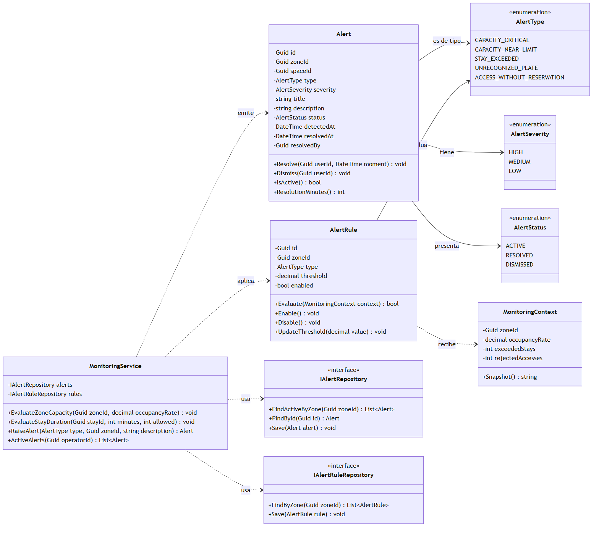

**Figura 4.54.** Diagrama de clases — Monitoring and Alerts.

`Alert` mantiene su estado y registra quién y cuándo la resolvió, dato que alimenta el indicador de tiempo promedio de resolución. `AlertRule` permite que cada administrador configure el umbral de capacidad de sus zonas sin modificar el código.

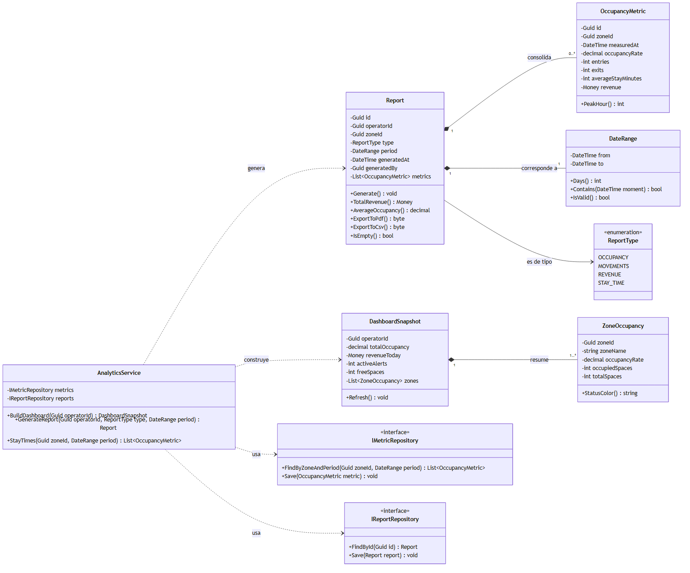

**Figura 4.55.** Diagrama de clases — Analytics and Reporting.

`Report` consolida las `OccupancyMetric` del período y expone las operaciones de exportación, mientras que `DashboardSnapshot` es el modelo de lectura que alimenta el panel de control en tiempo real.

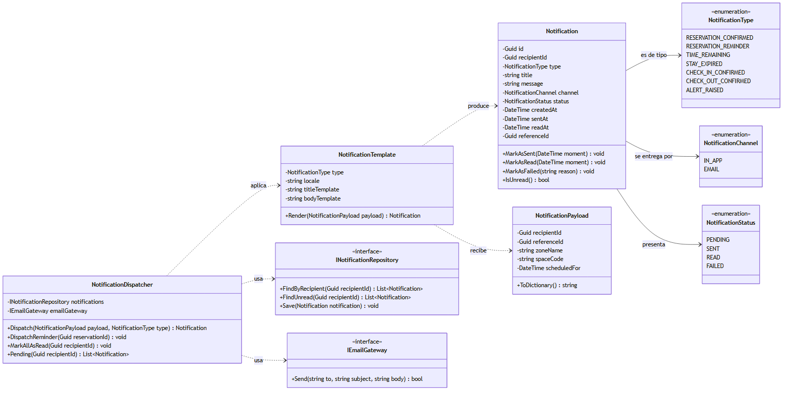

**Figura 4.56.** Diagrama de clases — Notifications.

`Notification` registra el canal, el estado y el momento de lectura de cada aviso. `NotificationTemplate` resuelve el contenido según el tipo de evento y la configuración regional, lo que permite entregar los avisos en en_US o es_419 sin duplicar la lógica de envío.

## 4.8. Database Design

La persistencia se resuelve sobre PostgreSQL 16 mediante Entity Framework Core. El diseño mantiene la separación por bounded context: cada contexto posee sus propias tablas y las referencias hacia otros contextos se establecen por identificador, sin compartir entidades. Las convenciones adoptadas son: nombres de tablas y columnas en inglés y en `snake_case`, tablas en plural, llave primaria `id` de tipo `uuid`, llaves foráneas con el patrón `<entidad>_id`, marcas de tiempo en `timestamp` con zona horaria, montos en `decimal` acompañados de su moneda, y estados almacenados como cadenas controladas que replican las enumeraciones del dominio. Se definen índices sobre las columnas de búsqueda frecuente (`plate`, `district`, `zone_id`, `occurred_at` y `status`) y restricciones de unicidad sobre `users.email`, `vehicles.plate`, `reservations.code` y la combinación de `zone_id` y `code` en los espacios.

### 4.8.1. Database Diagrams

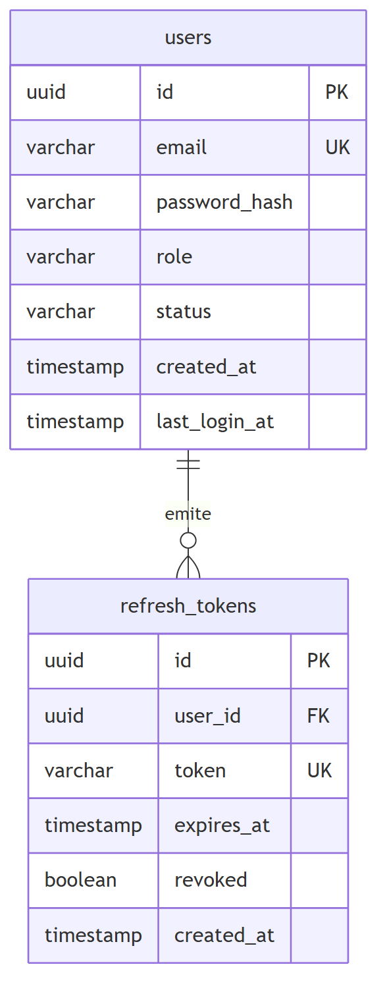

**Figura 4.57.** Diagrama de base de datos — Identity and Access Management.

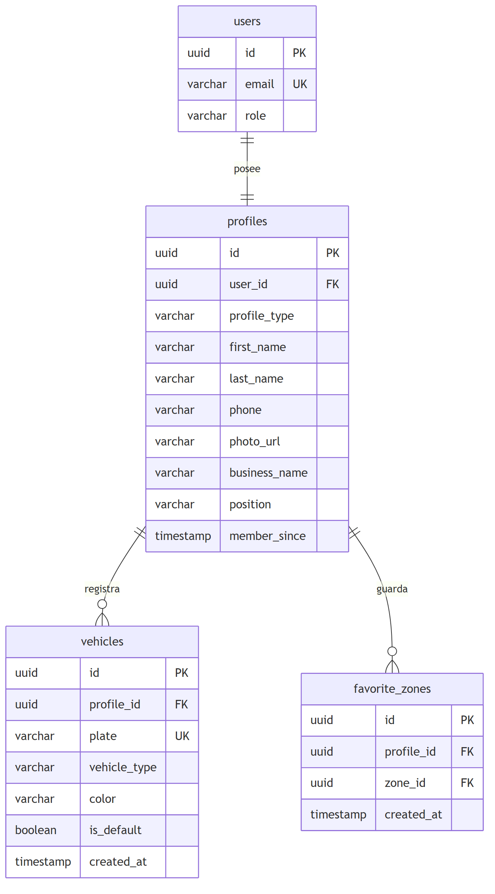

**Figura 4.58.** Diagrama de base de datos — Profiles and Vehicles.

La tabla `profiles` resuelve la especialización del dominio con la columna `profile_type`, que distingue el perfil de conductor del de administrador y mantiene en una sola tabla los atributos comunes.

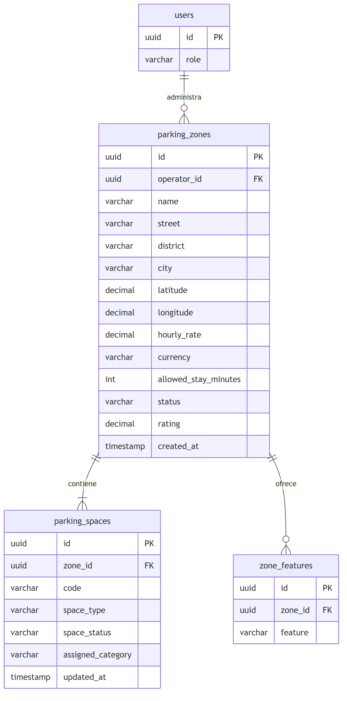

**Figura 4.59.** Diagrama de base de datos — Parking Management.

`parking_zones` almacena la dirección descompuesta y las coordenadas necesarias para el cálculo de distancia, junto con la tarifa y el tiempo de permanencia permitido que utiliza el motor de alertas. `parking_spaces` conserva el estado que se refleja en el mapa de espacios.

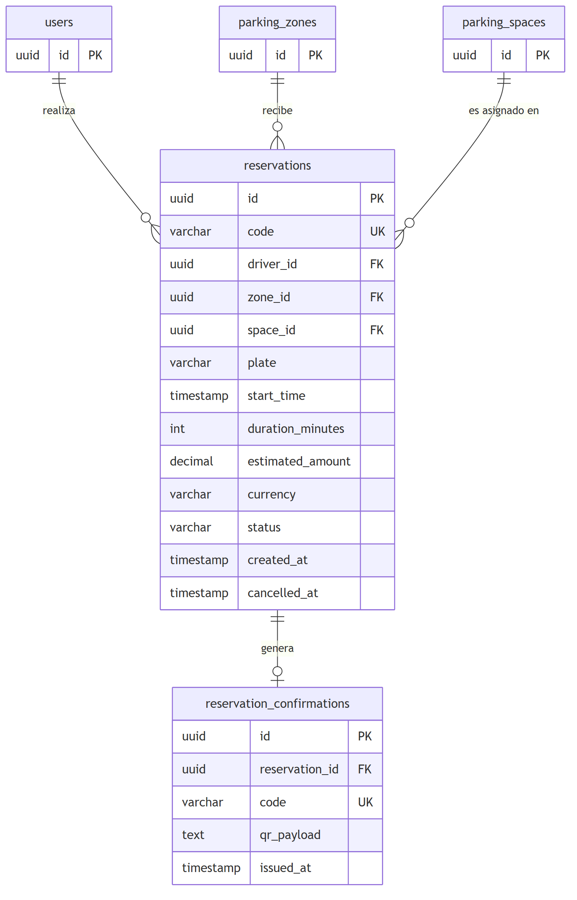

**Figura 4.60.** Diagrama de base de datos — Reservations.

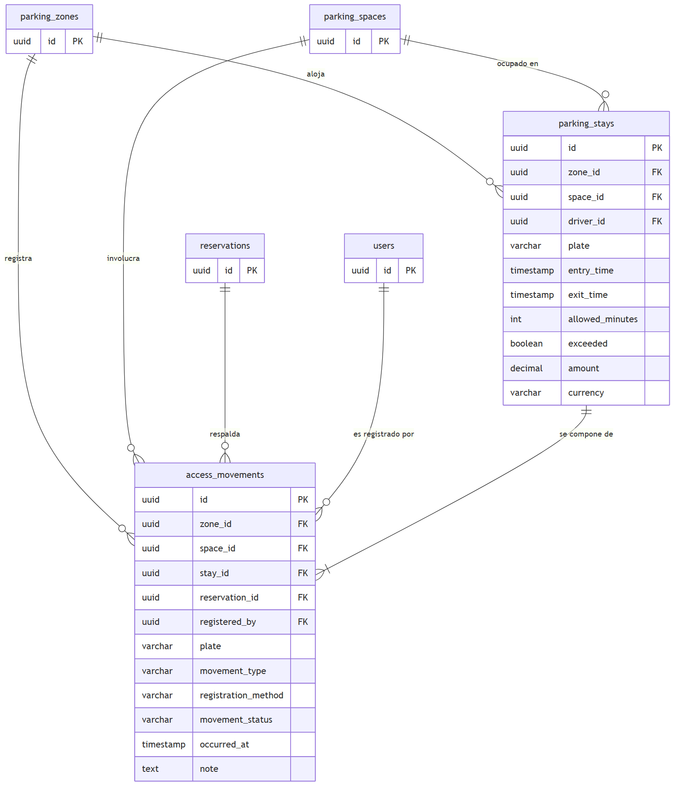

**Figura 4.61.** Diagrama de base de datos — Access Control.

`parking_stays` agrupa los movimientos de una misma permanencia; mantener la estancia como tabla propia permite calcular tiempos promedio y detectar permanencias excedidas sin recorrer todo el historial de movimientos.

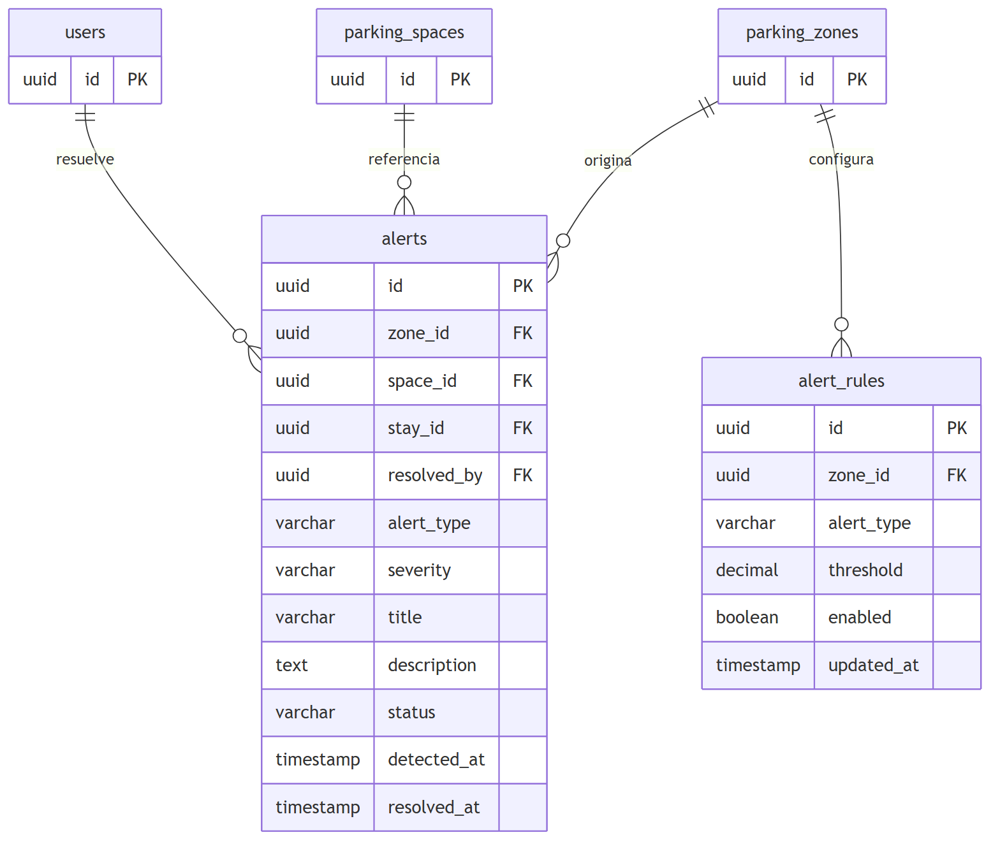

**Figura 4.62.** Diagrama de base de datos — Monitoring and Alerts.

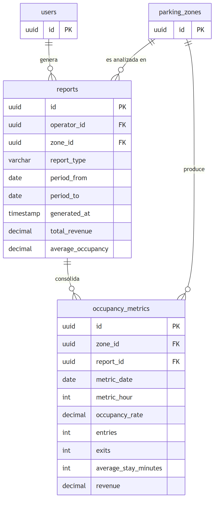

**Figura 4.63.** Diagrama de base de datos — Analytics and Reporting.

`occupancy_metrics` almacena las mediciones consolidadas por zona, fecha y hora, lo que evita recalcular los reportes sobre el historial completo de movimientos cada vez que se consulta un período.

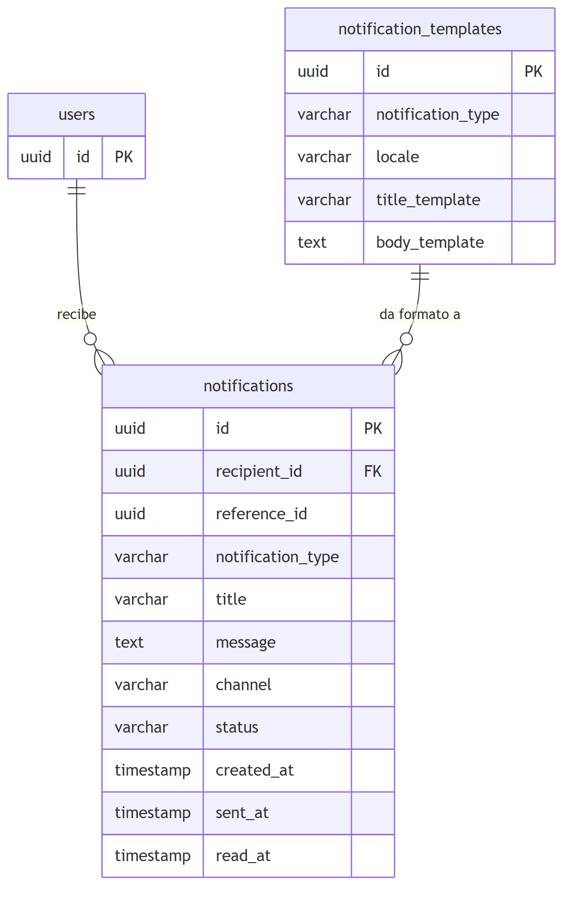

**Figura 4.64.** Diagrama de base de datos — Notifications.

Finalmente, el siguiente diagrama integra las diecisiete tablas de la solución y evidencia las relaciones entre los bounded contexts.

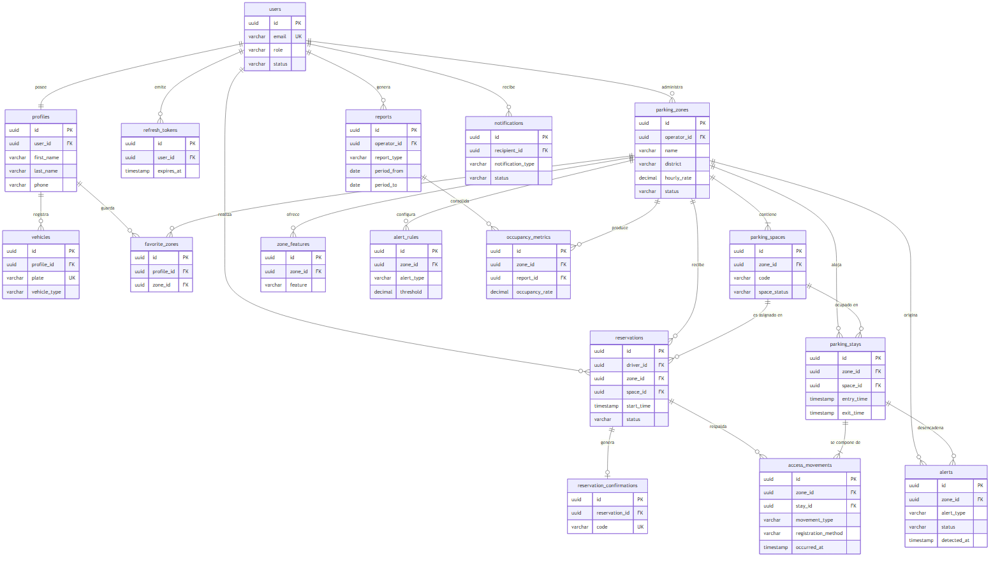

**Figura 4.65.** Diagrama de base de datos integrado de EasyPark.
